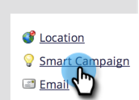

# Aktivieren von Personenbeschränkungen für intelligente Kampagnen {#enable-person-restrictions-for-smart-campaigns}

In Marketo gibt es eine Funktion, mit der die _(maximale_ Anzahl von Personen, die sich für eine intelligente Kampagne qualifizieren können, begrenzt wird. Dadurch wird vermieden, dass versehentlich eine E-Mail an die gesamte Datenbank gesendet wird.

>[!NOTE]
>
>**Administratorberechtigungen erforderlich**

>[!CAUTION]
>
>Dies gilt nur für Batch-Kampagnen und E-Mail-Programme.

1. Navigieren Sie zum Bereich **[!UICONTROL Admin]**.

   

1. Klicken Sie auf **[!UICONTROL Smart-Kampagne]**.

   

1. Klicken Sie auf **[!UICONTROL Bearbeiten]**.

   

   >[!CAUTION]
   >
   >Wenn die Anzahl der Personen, die für eine intelligente Kampagne qualifiziert sind, das festgelegte Limit überschreitet, wird sie überhaupt nicht ausgeführt.

1. Geben Sie ein Limit ein und klicken Sie auf **[!UICONTROL Speichern]**.

   

   >[!TIP]
   >
   >Deaktivieren Sie diese Funktion, indem Sie dieses Feld leer lassen.

   >[!CAUTION]
   >
   >Diese Beschränkung gilt für alle Smart-Kampagnen, kann jedoch auf Kampagnenebene überschrieben werden. Erfahren Sie, wie [&#x200B; Personenbeschränkungen in einer intelligenten Kampagne überschreiben &#x200B;](/help/marketo/product-docs/core-marketo-concepts/smart-campaigns/using-smart-campaigns/override-person-restrictions-in-a-smart-campaign.md).

Fertig! Sie haben gerade den Sicherheitsschalter eingeschaltet.

>[!MORELIKETHIS]
>
>[Überschreiben von Personenbeschränkungen in einer intelligenten Kampagne](/help/marketo/product-docs/core-marketo-concepts/smart-campaigns/using-smart-campaigns/override-person-restrictions-in-a-smart-campaign.md)
