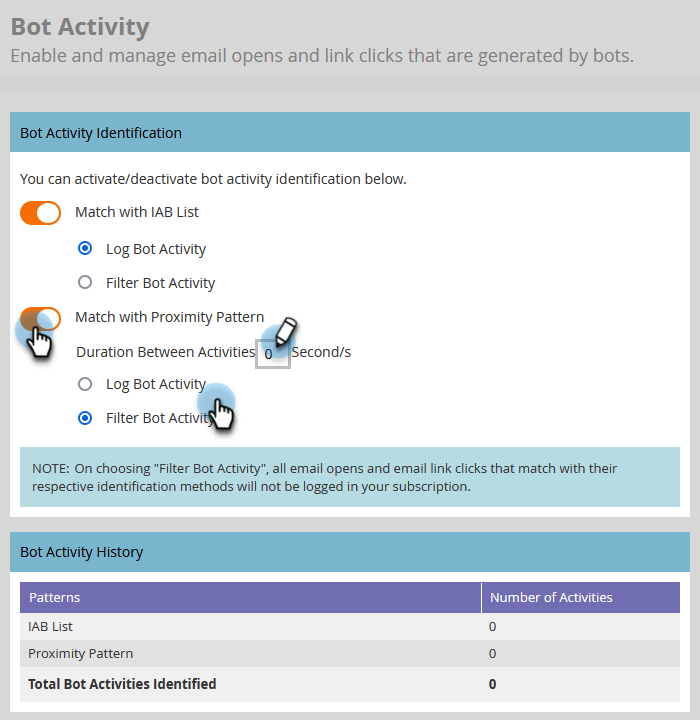

# Filtern der E-Mail-Bot-Aktivität {#filtering-email-bot-activity}

Manchmal kann die E-Mail-Bot-Aktivität fälschlicherweise die Daten Ihrer E-Mail-Öffnungen und Klicks verfälschen. Führen Sie die folgenden Schritte aus, um dies zu beheben.

Zur Bestätigung der Bot-Aktivität werden zwei verschiedene Methoden verwendet:

* Übereinstimmung mit [Bot-Liste des Interactive Advertising Bureau](https://www.iab.com/guidelines/iab-abc-international-spiders-bots-list/){target="_blank"}: Aktivitäten, die mit irgendetwas in der Liste &quot;IAB UA/IP&quot;(Benutzeragent/IP-Adresse) übereinstimmen, werden als Bots markiert.
* Übereinstimmung mit dem Annäherungsmuster: Wenn mehrere Aktivitäten gleichzeitig stattfinden (in einer Sekunde), werden sie als Bots identifiziert. Beim Vergleich berücksichtigte Attribute sind:
   * Lead-ID (sollte identisch sein)
   * E-Mail-Asset (sollte identisch sein)
   * Link-Klick oder E-Mail-Öffnung
   * Zeitdifferenz (sollte weniger als eine Sekunde betragen)

Bei der Aktivität E-Mail-Link-Klick und E-Mail-Öffnung werden neue Attribute mit den folgenden Werten ausgefüllt:

* Aktivitäten, die als Bots identifiziert werden, haben &quot;Bot Activity&quot;als &quot;True&quot;und &quot;Bot Activity Pattern&quot;als identifiziertes Muster/Methode
* Aktivitäten, die als nicht &quot;bots&quot;gekennzeichnet sind, haben &quot;Bot Activity&quot;als &quot;False&quot;und &quot;Bot Activity Pattern&quot;als &quot;K/A&quot;.
* Aktivitäten, die vor der Einführung dieser Attribute stattgefunden haben, haben &quot;Bot Activity&quot;als &quot;&quot;(leer) und &quot;Bot Activity Pattern&quot;als &quot;&quot;(leer).

## Filtertyp auswählen {#select-filter-type}

1. Klicks **[!UICONTROL Admin]**.

   

1. Klicks **[!UICONTROL Email]**.

   

1. Klicken Sie auf **[!UICONTROL Bot-Aktivität]** Registerkarte.

   

1. Es gibt zwei Regler, aus denen Sie wählen können. Sie können nur eine oder beide aktivieren. Wenn Sie **[!UICONTROL Übereinstimmung mit IAB-Liste]** auswählen, ob [!UICONTROL Logbot-Aktivität] _oder_ [!UICONTROL Bot-Aktivität filtern].

   

1. Wenn Sie **[!UICONTROL Übereinstimmung mit Näherungsmuster]** auswählen, ob [!UICONTROL Logbot-Aktivität] _oder_ [!UICONTROL Bot-Aktivität filtern]. Sie können auch die Dauer von Sekunden für **Aktivitätsdauer** (Standard ist 0, max. 3).

   

>[!NOTE]
>
>Mit **Aktivitätsdauer** auf 0 Sekunden eingestellt ist, identifizieren wir E-Mail-Aktivitäten, die genau zur gleichen Sekunde stattfinden. Wenn innerhalb der festgelegten Dauer mehrere E-Mail-Aktivitäten stattfinden, wird dies als Bot-Aktivität identifiziert.

>[!IMPORTANT]
>
>* Wenn Sie [!UICONTROL Bot-Aktivität filtern]kann es zu einem Rückgang bei E-Mail-Öffnungen und Klicks kommen, da falsche Aktivitäten ausgeschaltet werden.

**OPTIONALER SCHRITT**: Um eine der Funktionen zu deaktivieren, deaktivieren Sie einfach den entsprechenden Schieberegler. Wenn Sie dies tun, werden die Daten nicht zurückgesetzt.

>[!TIP]
>
>Nutzen Sie Bot-Aktivitätsdaten in Smart-Listen über die booleschen Werte &quot;Is Bot Activity&quot;(Ja/Nein) und &quot;Bot Activity Pattern&quot;in den Filtern &quot;Clicked Link in Email&quot;und &quot;Open Email&quot;, sowie &quot;Clicks Link in Email&quot;und &quot;Opens Email&quot;.

## IP-Blockierungsliste {#ip-blocklist}

Wir haben eine Liste von IP-Adressen zusammengestellt, die für die Generierung von Millionen von gefälschten Interaktionen verantwortlich sind, da die Interaktion, die von einer der folgenden IPs empfangen wurde, automatisch herausgefiltert und nicht zu Ihrer Marketo Engage-Instanz hinzugefügt wird. Dies kann zu einer Verringerung von E-Mail-Öffnungen, Klicks und anderen damit zusammenhängenden Aktivitäten führen. Die nachstehende Liste kann regelmäßig aktualisiert werden.

* 40,94,34,52
* 40 94 34 86
* 52 34 76 65
* 54 70 53 60
* 54 71 187 124
* 60 28 2 248
* 64 235 150 252
* 64 235 153 10
* 64 235 153,2
* 64 235 154 105
* 64 235 154 109
* 64 235 154 140
* 64 74 215,1
* 64 74 215 100
* 64 74 215 138
* 64 74 215 139
* 64 74 215 142
* 64 74 215 146
* 64 74 215 150
* 64 74 215 154
* 64 74 215 158
* 64 74 215 162
* 64 74 215 164
* 64 74 215 166
* 64 74 215 170
* 64 74 215 174
* 64 74 215 176
* 64 74 215 178
* 64 74 215 51
* 64 74 215 56
* 64 74 215 58
* 64 74 215 59
* 64 74 215 86
* 64 74 215 98
* 65 154 226 101
* 66 249 91 149
* 70 42 131 106
* 74 125 217 116
* 74 217 90 250
* 104 129 41 44
* 104 47 55 126
* 104 47 58 126
* 104 47 70 126
* 104 47 73 126
* 104 47 73 254
* 104 47 74 126
* 128 220 160,1
* 155 70 39 101
* 162 129 251 14
* 162 129 251 42
* 208 52 157 204

>[!NOTE]
>
>Wir analysieren und überprüfen jede IP-Adresse sorgfältig, bevor sie dieser Liste hinzugefügt wird. Dadurch wird sichergestellt, dass nur die kritischsten und schädlichsten IP-Adressen blockiert werden.
