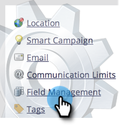
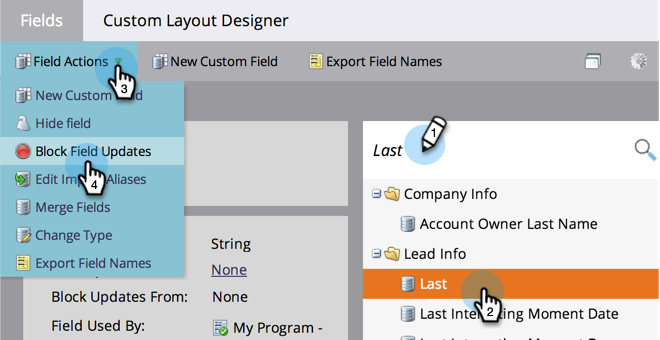
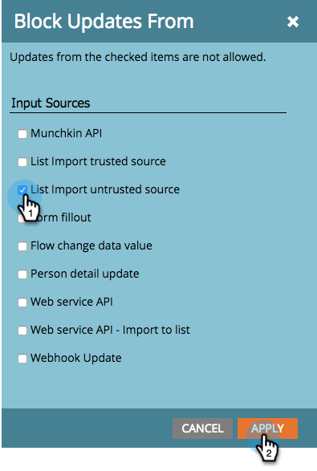
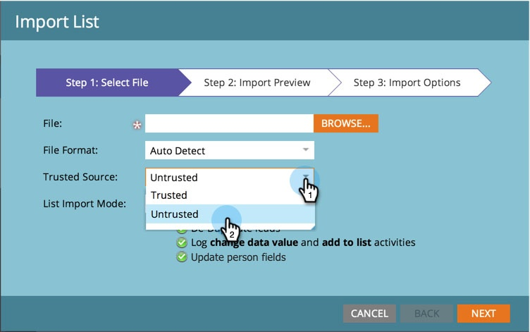

# Blockieren von Feldaktualisierungen während des Listenimports aus nicht vertrauenswürdigen Quellen {#block-field-updates-during-list-import-from-untrusted-sources}

Sie können den Daten in einigen Listen mehr vertrauen als in anderen. Manchmal gibt es fragwürdige Daten, und Sie möchten die Daten akzeptieren, wenn das Feld leer ist, aber nicht, wenn ein Wert vorhanden ist. Sie können dies erreichen, indem Sie Feldaktualisierungen in Schlüsselfeldern blockieren.

>[!NOTE]
>
>**Admin-Berechtigungen erforderlich**

## Blockieren von Feldaktualisierungen aus nicht vertrauenswürdigen Quellen {#blocking-field-updates-from-untrusted-sources}

1. Navigieren Sie zum Bereich **[!UICONTROL Admin]**.

   

1. Klicken Sie **[!UICONTROL Feldverwaltung]**.

   

1. Suchen Sie das gewünschte Feld, wählen Sie es aus und klicken Sie dann unter **[!UICONTROL Feldaktionen]** auf **[!UICONTROL Feldaktualisierungen blockieren]**.

   

1. Markieren Sie **[!UICONTROL Liste nicht vertrauenswürdige Quelle importieren]** und klicken Sie auf **[!UICONTROL Anwenden]**.

   

>[!TIP]
>
>Sie können Felder vor allen Listen (vertrauenswürdige und nicht vertrauenswürdige) schützen, indem Sie auch die Option **[!UICONTROL Vertrauenswürdige Quelle importieren]** aktivieren.

Wiederholen Sie die obigen Schritte für alle anderen Felder, die Sie vor nicht vertrauenswürdigen Listen schützen möchten.

## Ausführen eines nicht vertrauenswürdigen Listenimports {#running-an-untrusted-list-import}

1. Wählen Sie beim Import Ihrer Liste **[!UICONTROL Nicht vertrauenswürdig]**, wenn alle Felder, die Sie im vorherigen Schritt eingerichtet haben, sicher sein sollen.

   

Detaillierte Anweisungen zum Importieren von Listen finden Sie [Importieren einer Personenliste](/help/marketo/getting-started/quick-wins/import-a-list-of-people.md).

Schlüsselfelder sind jetzt vor nicht vertrauenswürdigen Listenimporten geschützt.
