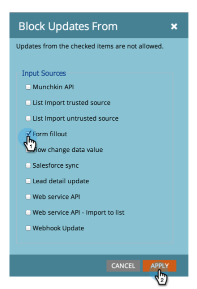

# Blockieren von Aktualisierungen eines Felds {#block-updates-to-a-field}

Wenn Sie Aktualisierungen an einem Feld blockieren, können Sie nur einmal in das Feld schreiben und dann den ursprünglichen Wert während der Lebensdauer des Datensatzes beibehalten. Dies kann für ein Feld wie „Person [!UICONTROL &quot; nützlich ].

>[!NOTE]
>
>**Admin-Berechtigungen erforderlich**

1. Navigieren Sie zum Bereich **[!UICONTROL Admin]**.

   

1. Klicken Sie **[!UICONTROL Feldverwaltung]**.

   

1. Suchen Sie das Feld, wählen Sie es aus und klicken Sie dann unter **[!UICONTROL Feldaktionen]** auf **[!UICONTROL Feldaktualisierungen blockieren]**.

   

   >[!NOTE]
   >
   >Sie können auch Aktualisierungen von [Benutzerdefinierte Felder für Programmteilnehmer](/help/marketo/product-docs/core-marketo-concepts/programs/working-with-programs/program-member-custom-fields.md) blockieren.

1. Wählen Sie die **[!UICONTROL Eingabequellen]** die Sie blockieren möchten, und klicken Sie auf **[!UICONTROL Anwenden]**.

   

   >[!CAUTION]
   >
   >Beim Import einer Liste wird der Status eines Felds, das in der Importvorschau blockiert wird, nur angezeigt, wenn das Feld automatisch von Marketo anhand des Namens des Felds erkannt wird, das _exakt_ entspricht (oder wenn Aliase erstellt wurden). Wenn das Feld manuell aus der Dropdown-Liste Marketo-Feld ausgewählt wird, wird der Status Blockiert in der Importvorschau nicht angezeigt, aber die Update-Blockierung für dieses Feld wird weiterhin implementiert.
