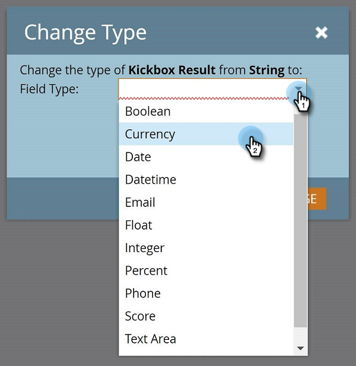

# Ändern des Typs eines benutzerdefinierten Marketo-Felds {#change-the-type-of-a-marketo-custom-field}

Erfahren Sie, wie Sie den Feldtyp eines benutzerdefinierten Felds ändern.

1. Navigieren Sie zum Bereich **[!UICONTROL Admin]**.

   

1. Klicken Sie **[!UICONTROL Feldverwaltung]**.

   

1. Suchen und wählen Sie das gewünschte Feld aus.

   

1. Klicken Sie in **[!UICONTROL Dropdown-]** Feldaktionen auf **[!UICONTROL Typ ändern]**.

   

1. Wählen Sie den neuen Typ aus.

   >[!NOTE]
   >
   >Werte- und Formelfelder können nicht geändert werden.

   

1. Lesen Sie die Warnung und klicken Sie **[!UICONTROL Ändern]** zur Bestätigung.

   

   >[!NOTE]
   >
   >Die angezeigte Warnmeldung variiert je nachdem, von welchem Feldtyp Sie wechseln.

   >[!MORELIKETHIS]
   >
   >[Erstellen eines benutzerdefinierten Felds in Marketo](/help/marketo/product-docs/administration/field-management/create-a-custom-field-in-marketo.md)
