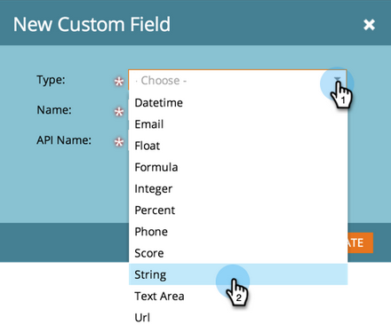

# Erstellen eines benutzerdefinierten Felds in Marketo {#create-a-custom-field-in-marketo}

Wenn Sie zum Speichern/Erfassen von Daten ein neues benutzerdefiniertes Feld im Marketo Engage benötigen, erfahren Sie, wie Sie eines erstellen.

1. Navigieren Sie zum Bereich **[!UICONTROL Admin]**.

   

1. Klicken Sie **[!UICONTROL Feldverwaltung]**.

   

   >[!TIP]
   >
   >Wenn Sie möchten, dass die Felder mit Ihrem CRM synchron bleiben, erstellen Sie sie im CRM und sie werden automatisch in Marketo erstellt.

1. Klicken Sie auf **[!UICONTROL Neues benutzerdefiniertes Feld]**.

   

1. Wählen Sie den Feldtyp aus. Dies ändert die Darstellung in Smart Lists und Formularen in Marketo.

   >[!TIP]
   >
   >Sehen Sie sich das [Glossar für benutzerdefinierte Feldtypen](/help/marketo/product-docs/administration/field-management/custom-field-type-glossary.md) an.

   

1. Geben Sie [!UICONTROL Name] so ein, wie er in Marketo angezeigt werden soll. Der [!UICONTROL API-Name] wird automatisch generiert. Sie können sie anpassen, sie kann jedoch nach dem Festlegen nicht mehr umbenannt werden. Klicken Sie **[!UICONTROL Erstellen]** wenn Sie fertig sind.

>[!CAUTION]
>
>Feldnamen dürfen nicht mit den folgenden Zeichen beginnen: **. &amp; +[]**

>[!NOTE]
>
>Der API-Name wird von der SOAP-API und anderen Backend-Prozessen verwendet.

Sie können dieses benutzerdefinierte Feld jetzt in Formularen, Flussschritten und Smart-Listen verwenden!
