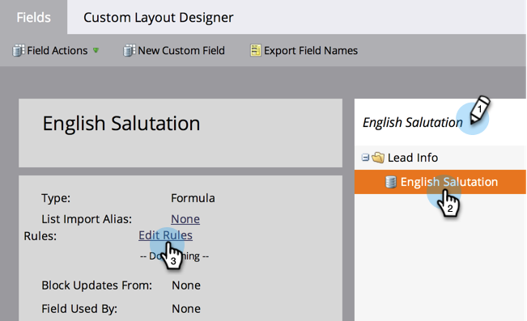

# Erstellen und Verwenden eines verketteten Zeichenfolgenfelds (Formel) {#create-and-use-a-concatenated-string-formula-field}

Sie können Werte aus mehreren Feldern kombinieren oder mithilfe eines Marketo Engage-Formelfelds einen bedingten Wert erstellen.

1. Navigieren Sie zum Bereich **[!UICONTROL Admin]**.

   

1. Klicken Sie **[!UICONTROL Feldverwaltung]**.

   

1. Klicken Sie auf **[!UICONTROL Neues benutzerdefiniertes Feld]**.

   

1. Wählen Sie **[!UICONTROL Formel]** für den **[!UICONTROL Typ]**.

   

1. Geben Sie einen **[!UICONTROL Namen]** für Ihr Feld ein und klicken Sie dann auf **[!UICONTROL Erstellen]**.

   

1. Suchen Sie Ihr Formelfeld, wählen Sie es aus und klicken Sie auf **[!UICONTROL Regeln bearbeiten]**.

   

1. Fügen Sie zwei Auswahlmöglichkeiten hinzu und definieren Sie sie wie den folgenden Screenshot.

   

   >[!TIP]
   >
   >Weitere Informationen zu [Token für Flussschritte](/help/marketo/product-docs/core-marketo-concepts/smart-campaigns/flow-actions/use-tokens-in-flow-steps.md).

1. Jetzt können Sie das Formelfeld als Token in einer E-Mail hinzufügen.

   

>[!NOTE]
>
>Formelfelder können in Landingpages, E-Mails und Smart-Listen-Spalten verwendet werden. E-Mails mit Formelfeldern können _nicht_ mithilfe einer Batch-Kampagne gesendet werden. Verwenden Sie in [ Szenario ein ](/help/marketo/product-docs/email-marketing/general/using-tokens/create-an-email-script-token.md)E-Mail-Skript-Token“.

Gute Arbeit! Jetzt haben Sie ein intelligentes Feld, das weiß, welche Anrede basierend auf dem Geschlecht enthalten sein soll. Viel Spaß damit und kreativ werden.
