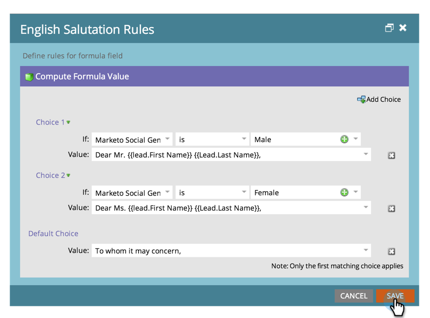

# Erstellen und Verwenden eines Felds mit verketteten Zeichenfolgen (Formel) {#create-and-use-a-concatenated-string-formula-field}

Sie können Werte aus mehreren Feldern kombinieren oder mithilfe eines Marketo Engage-Formelfelds einen bedingten Wert erstellen.

1. Navigieren Sie zu **[!UICONTROL Admin]** Bereich.

   

1. Klicks **[!UICONTROL Feldverwaltung]**.

   

1. Klicks **[!UICONTROL Neues benutzerdefiniertes Feld]**.

   

1. Auswählen **[!UICONTROL Formel]** für die **[!UICONTROL Typ]**.

   

1. Geben Sie einen **[!UICONTROL Name]** Klicken Sie für Ihr Feld auf **[!UICONTROL Erstellen]**.

   

1. Suchen und wählen Sie Ihr Formelfeld aus und klicken Sie auf **[!UICONTROL Regeln bearbeiten]**.

   

1. Fügen Sie zwei Auswahlmöglichkeiten hinzu und definieren Sie sie wie im folgenden Screenshot.

   

   >[!TIP]
   >
   >Weitere Informationen [Token für Flussschritte](/help/marketo/product-docs/core-marketo-concepts/smart-campaigns/flow-actions/use-tokens-in-flow-steps.md).

1. Jetzt können Sie das Formelfeld als Token in einer E-Mail hinzufügen.

   

>[!NOTE]
>
>Formelfelder können in den Spalten Landingpages, E-Mails und Smart-Listen verwendet werden. E-Mails mit Formelfeldern können _not_ mit einer Batch-Kampagne gesendet werden. Bitte verwenden Sie [email script token](/help/marketo/product-docs/email-marketing/general/using-tokens/create-an-email-script-token.md) in diesem Szenario.

Gute Arbeit! Jetzt haben Sie ein intelligentes Feld, das weiß, welche Anrede auf Grundlage des Geschlechts aufgenommen werden soll. Viel Spaß damit und kreativ.
