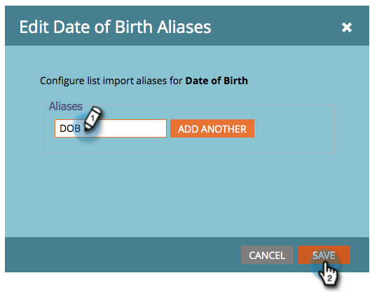

# Bearbeiten von Feldaliassen für den Listenimport {#edit-field-aliases-for-list-import}

Wenn Sie eine Liste mit unbekannten Kopfzeilen importieren, können Sie Feldaliase erstellen, um die Arbeit zu vereinfachen. Sie können diese Aliase auch in der Feldverwaltung bearbeiten. Schau es dir an.

>[!NOTE]
>
>**Administratorberechtigungen erforderlich**

1. Navigieren Sie zum Bereich **[!UICONTROL Admin]**.

   

1. Klicken Sie **[!UICONTROL Feldverwaltung]**.

   

1. Suchen Sie das Feld, dem Sie einen Alias hinzufügen möchten, und wählen Sie es aus.

   

1. Klicken Sie in **[!UICONTROL Dropdown-]** Feldaktionen auf **[!UICONTROL Importaliase bearbeiten]**.

   

1. Geben Sie einen Alias ein und klicken Sie auf **[!UICONTROL Speichern]**.

   

>[!TIP]
>
>Klicken Sie **[!UICONTROL Weitere hinzufügen]** und geben Sie bei Bedarf weitere Aliase ein.

Schau dir das an! Wenn Sie jetzt eine Tabelle mit einer Spalte namens „Geburtsdatum“ importieren, erkennt Marketo sie automatisch als „Geburtsdatum“ und importiert die Daten in das richtige Feld.

