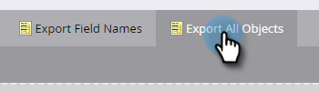

# Exportieren aller Objektmetadaten {#export-all-object-metadata}

Mit dieser Funktion können Sie alle Objekte und ihre Metadaten exportieren.

>[!NOTE]
>
>**Admin-Berechtigungen erforderlich**

## Objekte {#objects}

* Lead-Felder (Person/Firma)
* Benutzerdefinierte Marketo-Objekte
* Standardaktivitäten
* Eigene Aktivitäten
* Kanäle
* Tags

## Objekt-Metadaten exportieren {#export-object-metadata}

1. Navigieren Sie zum Bereich **[!UICONTROL Admin]**.

   

1. Klicken Sie **[!UICONTROL Feldverwaltung]**.

   

1. Klicken Sie **[!UICONTROL Alle Objekte exportieren]**.

   

>[!NOTE]
>
>Vergewissern Sie sich, dass Ihr Browser Popups in Marketo nicht blockiert.

Die Daten werden als CSV exportiert.

