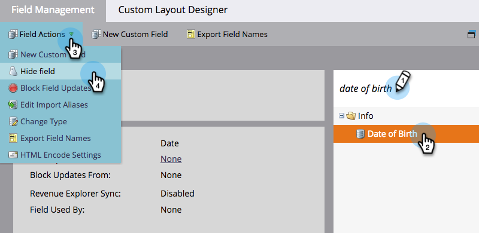
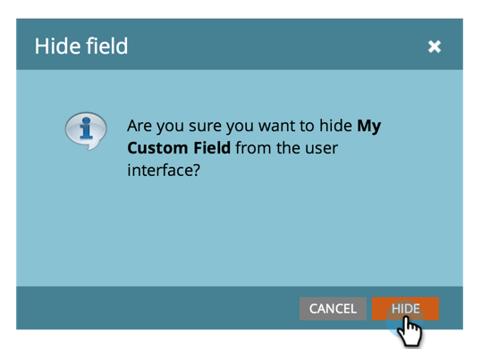
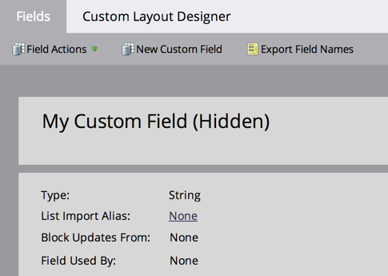
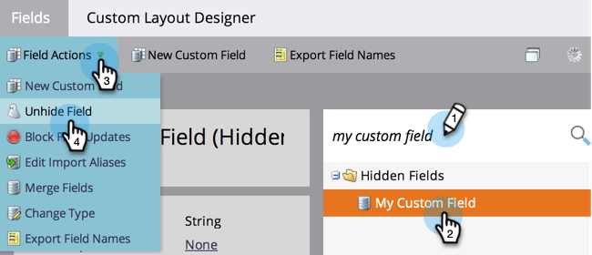

# Ein- und Ausblenden eines Felds {#hide-and-unhide-a-field}

Wenn Sie ein Feld in Marketo Engage nicht mehr benötigen, können Sie es in der Benutzeroberfläche ausblenden, damit es nicht mehr in der Anwendung angezeigt wird.

## Feld ausblenden {#hide-a-field}

>[!NOTE]
>
>**Admin-Berechtigungen erforderlich**

1. Navigieren Sie zum Bereich **[!UICONTROL Admin]**.

   

1. Klicken Sie **[!UICONTROL Feldverwaltung]**.

   

1. Suchen Sie das Feld, wählen Sie es aus und klicken Sie dann unter **[!UICONTROL Feldaktionen]** auf **[!UICONTROL Feld ausblenden]**.

   

   >[!NOTE]
   >
   >* Um ein Feld auszublenden, darf es mit keinem anderen Asset (einschließlich archivierter Assets) verknüpft sein. Entfernen Sie das Feld aus allen Smart-Listen, Flussschritt-Auswahlmöglichkeiten, Formularen, E-Mails usw., bevor Sie es ausblenden.
   >* Sie können keine Standardfelder (System) ausblenden.
   >* Informationsfelder für Opportunities können nicht ausgeblendet werden.

1. Klicken Sie zum **[!UICONTROL auf]** Ausblenden“.

   

   Jetzt wissen Sie, wie Sie ein Feld in der Benutzeroberfläche von Marketo ausblenden.

   

## Ein Feld einblenden {#unhide-a-field}

1. Navigieren Sie zum Bereich **[!UICONTROL Admin]**.

   

1. Klicken Sie **[!UICONTROL Feldverwaltung]**.

   

1. Suchen Sie das Feld und wählen Sie es aus. Klicken Sie in [!UICONTROL &#x200B; Dropdown]Liste Feldaktionen“ auf **[!UICONTROL Feld einblenden]**.

   

   Jetzt wissen Sie, wie Sie Felder einblenden und wieder sichtbar machen können.
