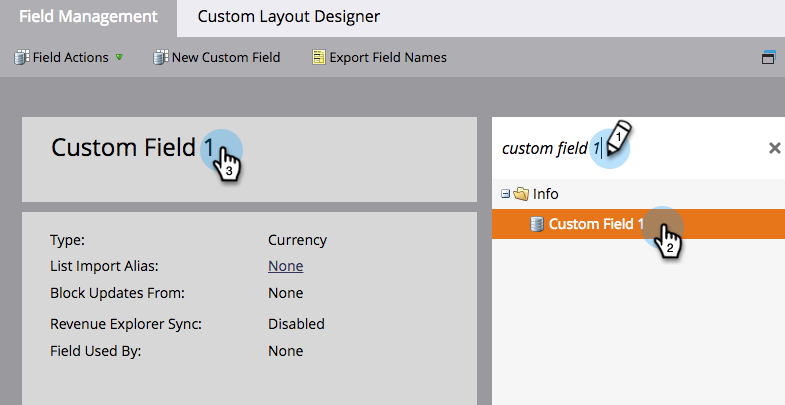

# Umbenennen eines Felds {#rename-a-field}

>[!NOTE]
>
>Sie können ein benutzerdefiniertes Feld in Marketo umbenennen. Sie müssen jedoch zuerst alle Verwendungen im System entfernen. Dazu gehören Formulare, Smart Lists und Smart-Kampagnen.

>[!NOTE]
>
>**Admin-Berechtigungen erforderlich**

1. Navigieren Sie zum Bereich **[!UICONTROL Admin]**.

   

1. Klicken Sie **[!UICONTROL Feldverwaltung]**.

   

1. Suchen Sie das Feld, das Sie umbenennen möchten, wählen Sie es aus und klicken Sie dann auf der Arbeitsfläche auf den Feldnamen.

   

   >[!TIP]
   >
   >Klicken Sie auf den **[!UICONTROL Verwendet von]**, um Assets zu finden, die auf dieses Feld verweisen.

1. Benennen Sie das Feld um und klicken Sie auf **[!UICONTROL Speichern]**.

   

Sie wissen jetzt, wie Sie Felder in Marketo umbenennen.

>[!CAUTION]
>
>Wenn Sie den API-Namen in [!DNL Salesforce] umbenennen, erstellt Marketo ein brandneues Feld und lässt das alte Feld liegen.
