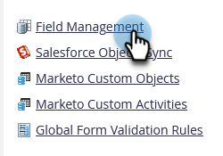

# Anzeigen von Feldzuordnungen zwischen Marketo und [!DNL Salesforce] {#view-field-mappings-between-marketo-and-salesforce}

Möglicherweise möchten Sie wissen, mit welchen [!DNL Salesforce] ein bestimmtes Marketo-Feld verknüpft ist. So können Sie das überprüfen.

>[!NOTE]
>
>**Admin-Berechtigungen erforderlich**

1. Navigieren Sie zum Bereich **[!UICONTROL Admin]**.

   

1. Klicken Sie **[!UICONTROL Feldverwaltung]**.

   

1. Suchen Sie das Feld, das Sie sehen möchten, und klicken Sie auf das **+**, um die Zuordnung zu erweitern.

   

>[!NOTE]
>
>Dadurch wird der [!DNL Salesforce] API-Name angezeigt, nicht der Bezeichnungsname.

>[!IMPORTANT]
>
>Die aufgelisteten Felder spiegeln nur Daten aus der ersten Zuordnung wider. Sie werden nach der Marketo-/[!DNL Salesforce]-Synchronisierung nicht aktualisiert.
