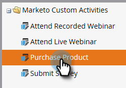

# Benutzerdefinierte Marketo-Aktivitätsfelder hinzufügen/bearbeiten/löschen {#add-edit-delete-marketo-custom-activity-fields}

Möglicherweise müssen Sie ein benutzerdefiniertes Aktivitätsfeld hinzufügen, ändern oder sogar entfernen. So geht&#39;s.

## Benutzerdefiniertes Aktivitätsfeld hinzufügen {#add-a-custom-activity-field}

1. Navigieren Sie zum Bereich **[!UICONTROL Admin]**.

   

1. Klicken Sie auf **[!UICONTROL Benutzerdefinierte Marketo-Aktivitäten]**.

   

1. Klicken Sie auf **[!UICONTROL Felder]**.

   

1. Wählen Sie die benutzerdefinierte Aktivität aus, der Sie ein Feld hinzufügen möchten.

   

1. Klicken Sie auf **[!UICONTROL Neues Feld]**.

   

1. Wählen Sie den (Datentyp[!UICONTROL  des Felds ].

   

   >[!TIP]
   >
   >Nicht sicher, was ausgewählt werden soll? Wir haben Sie im Griff! Alle verfügbaren Datentypen werden in [diesem Artikel) ](/help/marketo/product-docs/administration/field-management/custom-field-type-glossary.md).

1. Benennen Sie das Feld. Der API-Name wird automatisch ausgefüllt. Wenn Sie fertig sind, klicken Sie auf **[!UICONTROL Speichern]**.

   

   Das ist alles! Das neue Feld wurde hinzugefügt.

## Benutzerdefiniertes Aktivitätsfeld bearbeiten {#edit-a-custom-activity-field}

1. Navigieren Sie zum Bereich **[!UICONTROL Admin]**.

   

1. Klicken Sie auf **[!UICONTROL Benutzerdefinierte Marketo-Aktivitäten]**.

   

1. Klicken Sie auf **[!UICONTROL Felder]**.

   

1. Wählen Sie die benutzerdefinierte Aktivität aus, die das Feld enthält, das Sie bearbeiten möchten.

   

1. Wählen Sie das Feld aus, das Sie bearbeiten möchten, klicken Sie auf **[!UICONTROL Dropdown-]** Feldaktionen und wählen Sie **[!UICONTROL Feld bearbeiten]**.

   

   Das Popup-Fenster Feld bearbeiten wird angezeigt. In diesem Beispiel ändern wir den Namen des Felds.

   

1. Geben Sie den neuen Namen und den API-Namen ein und klicken Sie dann auf **[!UICONTROL Speichern]**.

   

   >[!NOTE]
   >
   >Der API-Name wird beim Bearbeiten eines Felds nicht automatisch ausgefüllt. Es ist zwar nicht erforderlich, dass der Feldname und der API-Name übereinstimmen, wir empfehlen jedoch, dies zu tun.

   >[!CAUTION]
   >
   >Sie können nur dann den API-Namen bearbeiten oder das Feld in &quot;Primär&quot; ändern, wenn die benutzerdefinierte Aktivität noch nie veröffentlicht wurde.

   >[!NOTE]
   >
   >Wenn Sie ändern möchten, welches Feld Primär ist, müssen Sie zunächst die Auswahl des vorhandenen Felds aufheben.

Ihr Feld ist jetzt bearbeitet!

## Benutzerdefiniertes Aktivitätsfeld löschen {#delete-a-custom-activity-field}

1. Navigieren Sie zum Bereich **[!UICONTROL Admin]**.

   

1. Klicken Sie auf **[!UICONTROL Benutzerdefinierte Marketo-Aktivitäten]**.

   

1. Klicken Sie auf **[!UICONTROL Felder]**.

   

1. Wählen Sie die benutzerdefinierte Aktivität aus, die das zu löschende Feld enthält.

   

1. Wählen Sie das zu löschende Feld aus, klicken Sie auf **[!UICONTROL Dropdown-]** Feldaktionen und wählen Sie **[!UICONTROL Feld löschen]**.

   
