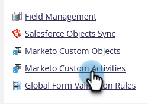
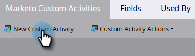
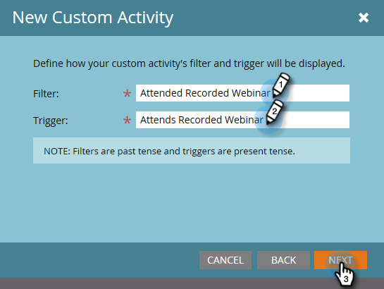

# Erstellen einer benutzerdefinierten Aktivität {#create-a-custom-activity}

Führen Sie die folgenden Schritte aus, um eine neue benutzerdefinierte Aktivität zu erstellen.

>[!NOTE]
>
>Die meisten Abonnements haben ein zugewiesenes Limit von 10 benutzerdefinierten Aktivitätstypen.

1. Navigieren Sie zum Bereich **[!UICONTROL Admin]**.

   

1. Klicken Sie auf **[!UICONTROL Benutzerdefinierte Marketo-Aktivitäten]**.

   

1. Klicken Sie auf **[!UICONTROL Neue benutzerdefinierte Aktivität]**.

   

1. Geben Sie einen Namen und optional [!UICONTROL Beschreibung] ein und klicken Sie dann auf **[!UICONTROL Weiter]**. Der API-Name wird automatisch ausgefüllt, kann jedoch angepasst werden.

   

   >[!CAUTION]
   >
   >Wenn Sie sich entscheiden, den [!UICONTROL API-Namen] zu ändern, stellen Sie sicher, dass der Name nicht mit Feldern in anderen benutzerdefinierten Aktivitäten kollidiert.

1. Definieren Sie [!UICONTROL Filter] und [!UICONTROL Trigger ] und klicken Sie auf **[!UICONTROL Weiter]**.

   

1. Geben Sie Ihrem primären Feld einen **[!UICONTROL Namen]**, der zusammenfasst, wozu die benutzerdefinierte Aktivität dient.

   

>[!MORELIKETHIS]
>
>[Grundlegendes zu benutzerdefinierten Aktivitäten](/help/marketo/product-docs/administration/marketo-custom-activities/understanding-custom-activities.md)
