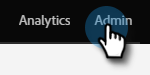

# Metadatenexport für benutzerdefinierte Aktivitäten {#custom-activity-metadata-export}

Gehen Sie wie folgt vor, um Ihr benutzerdefiniertes Aktivitäts-Metadatenschema zu exportieren.

1. Klicken Sie in My Marketo auf **[!UICONTROL Admin]**.

   

1. Klicken Sie auf **[!UICONTROL Benutzerdefinierte Marketo-Aktivitäten]**.

   

1. Wählen Sie die benutzerdefinierte Aktivität in Marketo aus, die Sie exportieren möchten.

   

1. Klicken Sie auf **[!UICONTROL Benutzerdefinierte Aktivitätsaktionen]** und wählen Sie **[!UICONTROL Aktivität exportieren]**.

   

>[!NOTE]
>
>Die benutzerdefinierte Aktivität muss den Status Genehmigt aufweisen, damit sie exportiert werden kann.

Jetzt verfügen Sie über eine Tabelle mit dem Schema der benutzerdefinierten Aktivität in drei Registerkarten.
