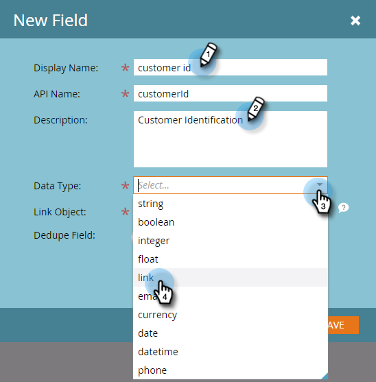

# Benutzerdefinierte Marketo-Objektverknüpfungsfelder hinzufügen {#add-marketo-custom-object-link-fields}

Wenn Sie benutzerdefinierte Objekte erstellen, müssen Sie Verknüpfungsfelder bereitstellen, um den benutzerdefinierten Objektdatensatz mit dem richtigen übergeordneten Datensatz zu verbinden.

* Verwenden Sie für eine 1:n-benutzerdefinierte Struktur das Linkfeld im benutzerdefinierten Objekt, um es mit einer Person oder einem Unternehmen zu verbinden.
* Für eine n:n-Struktur verwenden Sie zwei Verknüpfungsfelder, die mit einem separat erstellten Intermediär-Objekt verbunden sind (auch ein benutzerdefinierter Objekttyp). Eine Verknüpfung stellt eine Verbindung zu Personen oder Unternehmen in Ihrer Datenbank her, die andere eine Verbindung zum benutzerdefinierten Objekt. In diesem Fall befindet sich das Linkfeld nicht im benutzerdefinierten Objekt selbst.

## Erstellen eines Link-Felds für eine 1:n-Struktur {#create-a-link-field-for-a-one-to-many-structure}

So erstellen Sie ein Verknüpfungsfeld in einem benutzerdefinierten Objekt für eine 1:n-Struktur.

1. Navigieren Sie zum **Admin**-Bereich.

   

1. Klicken **Benutzerdefinierte Marketo-Objekte**.

   

1. Wählen Sie das benutzerdefinierte Objekt in der Liste aus.

   

1. Im **Felder** Registerkarte, klicken Sie auf **Neues Feld**.

   

1. Benennen Sie das Link-Feld und fügen Sie eine optionale Beschreibung hinzu. Wählen Sie unbedingt den Datentyp Link aus.

   

   >[!CAUTION]
   >
   >Sobald das benutzerdefinierte Objekt genehmigt wurde, können Sie einen Link oder ein Deduplizierungsfeld nicht mehr erstellen, bearbeiten oder löschen.

1. Wählen Sie aus, ob das Link-Objekt für einen Lead (eine Person) oder ein Unternehmen bestimmt ist.

   

   >[!NOTE]
   >
   >Wenn Sie &quot;Lead&quot;auswählen, werden in der Liste &quot;ID&quot;, &quot;E-Mail-Adresse&quot;und alle benutzerdefinierten Felder angezeigt.
   >
   >Wenn Sie &quot;company&quot;auswählen, werden die ID und alle benutzerdefinierten Felder in der Liste angezeigt.

1. Wählen Sie das Verknüpfungsfeld aus, mit dem Sie eine Verbindung herstellen möchten, als übergeordnetes Element des neuen Felds.

   

   >[!NOTE]
   >
   >Im Linkfeld werden nur Zeichenfolgenfeldtypen unterstützt.

1. Klicken **Speichern.**

   

## Erstellen eines Verknüpfungsfelds für eine Viele-zu-viele-Struktur {#create-a-link-field-for-a-many-to-many-structure}

So erstellen Sie ein Verknüpfungsfeld in einem zwischengeschalteten Objekt zur Verwendung in einer n:n-Struktur.

>[!PREREQUISITES]
>
>Sie müssen das Zwischenobjekt und alle benutzerdefinierten Objekte, mit denen Sie es verknüpfen möchten, bereits erstellt haben.

1. Navigieren Sie zum **Admin**-Bereich.

   

1. Klicken **Benutzerdefinierte Marketo-Objekte**.

   

1. Wählen Sie das zwischengeschaltete Objekt aus, dem Sie das Feld hinzufügen möchten.

   

1. Im **Felder** Registerkarte, klicken Sie auf **Neues Feld**.

   

1. Sie müssen zwei Verknüpfungsfelder erstellen. Erstellen Sie sie einzeln. Benennen Sie zunächst das Feld für die Mitglieder Ihrer Datenbankliste (z. B. leadID). Fügen Sie eine optionale Beschreibung hinzu. Wählen Sie unbedingt den Linkdatentyp aus.

   

   >[!CAUTION]
   >
   >Sobald das benutzerdefinierte Objekt genehmigt wurde, können Sie einen Link oder ein Deduplizierungsfeld nicht mehr erstellen, bearbeiten oder löschen.

1. Wählen Sie das Link-Objekt aus Ihrer Datenbank, in diesem Fall Lead.

   

1. Wählen Sie das Link-Feld aus, mit dem Sie eine Verbindung herstellen möchten, in diesem Fall &quot;ID&quot;.

   

   >[!NOTE]
   >
   >Im Linkfeld werden nur Zeichenfolgenfeldtypen unterstützt.

1. Klicken **Speichern.**

   

1. Wiederholen Sie diesen Vorgang für den zweiten Link zu Ihrem benutzerdefinierten Objekt, in diesem Beispiel &quot;kursID&quot;. Der Link-Objektname lautet natürlich und das Link-Feld lautet kursID. Da Sie das benutzerdefinierte Kursobjekt bereits erstellt und genehmigt haben, sind diese Auswahlmöglichkeiten in den Dropdown-Menüs verfügbar.

   

1. Erstellen Sie alle anderen Felder, die Sie in Ihrem Zwischenobjekt verwenden möchten, z. B. enrollmentID oder grade.

## Verwenden benutzerdefinierter Objekte {#using-custom-objects}

Der nächste Schritt besteht darin, diese benutzerdefinierten Objekte in Filtern in Ihren Smart-Kampagnen zu verwenden. Mit einer n:n-Beziehung können Sie mehrere Personen/Unternehmen und mehrere benutzerdefinierte Objekte auswählen. Im folgenden Beispiel wird jeder Benutzer in Ihrer Datenbank aufgelistet, der diese Kriterien erfüllt. Das Feld coursename stammt aus dem benutzerdefinierten Kurs-Objekt und die Registrierungsstufe stammt aus dem Zwischenobjekt.

>[!MORELIKETHIS]
>
>* [Benutzerdefinierte Marketo-Objektfelder hinzufügen](/help/marketo/product-docs/administration/marketo-custom-objects/add-marketo-custom-object-fields.md)
>* [Bearbeiten und Löschen eines benutzerdefinierten Marketo-Objekts](/help/marketo/product-docs/administration/marketo-custom-objects/edit-and-delete-a-marketo-custom-object.md)
>* [Grundlegendes zu benutzerdefinierten Marketo-Objekten](/help/marketo/product-docs/administration/marketo-custom-objects/understanding-marketo-custom-objects.md)
>* [Benutzerdefinierte Marketo-Objektfelder bearbeiten und löschen](/help/marketo/product-docs/administration/marketo-custom-objects/edit-and-delete-marketo-custom-object-fields.md)

