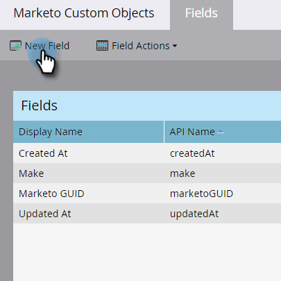
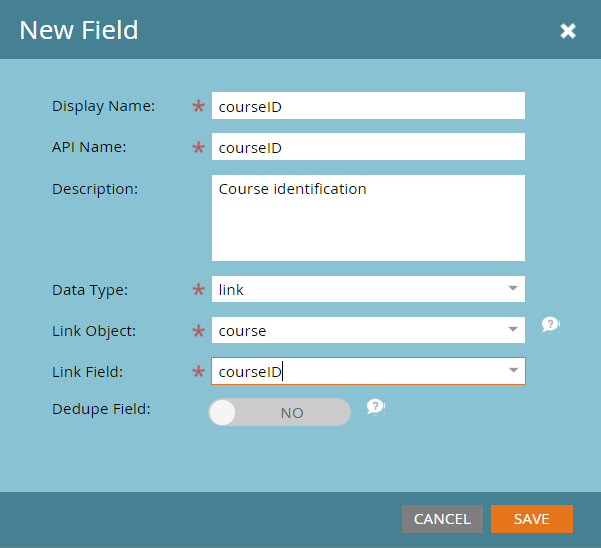

# Benutzerdefinierte Objektverknüpfungsfelder für Marketo hinzufügen {#add-marketo-custom-object-link-fields}

Beim Erstellen benutzerdefinierter Objekte müssen Sie Verknüpfungsfelder bereitstellen, um den benutzerdefinierten Objektdatensatz mit dem richtigen übergeordneten Datensatz zu verbinden.

* Bei einer Eins-zu-viele-Struktur können Sie das Verknüpfungsfeld im benutzerdefinierten Objekt verwenden, um es mit einer Person oder einem Unternehmen zu verbinden.
* Bei einer n:n-Struktur verwenden Sie zwei Verknüpfungsfelder, die mit einem separat erstellten Zwischenobjekt verbunden sind (bei dem es sich auch um eine Art von benutzerdefiniertem Objekt handelt). Eine Verknüpfung stellt eine Verbindung zu Personen oder Unternehmen in Ihrer Datenbank her, die andere eine Verbindung zum benutzerdefinierten Objekt. In diesem Fall befindet sich das Verknüpfungsfeld nicht im benutzerdefinierten Objekt selbst.

>[!IMPORTANT]
>
>Marketo Engage unterstützt in der Viele-zu-Viele-Beziehung nur ein einziges Edge-Objekt für jedes Bridge-Objekt. In der unten angegebenen Stichprobe kann jede Registrierung nur mit einem einzelnen Kurs verknüpft werden. Es kann jedoch viele Bridge-Objekte für jedes Edge-Objekt geben, genau wie es viele Studentenregistrierungen für jeden Kurs gibt (Viele-zu-eins-Beziehung). Wenn Ihre benutzerdefinierten Objektdaten so strukturiert sind, dass für jeden Bridge-Objektdatensatz mehr als ein Edge-Objektdatensatz vorhanden ist (Eins-zu-Viele oder Viele-zu-Viele), können Sie mehrere Bridge-Objektdatensätze erstellen, die jeweils auf einen einzelnen Edge-Objektdatensatz verweisen, um diese Daten in Marketo darzustellen.

## Erstellen eines Verknüpfungsfelds für eine Eins-zu-Viele-Struktur {#create-a-link-field-for-a-one-to-many-structure}

Im Folgenden wird beschrieben, wie Sie ein Verknüpfungsfeld in einem benutzerdefinierten Objekt für eine Eins-zu-viele-Struktur erstellen.

1. Navigieren Sie zum Bereich **[!UICONTROL Admin]**.

   

1. Klicken Sie auf **[!UICONTROL Benutzerdefinierte Marketo-Objekte]**.

   

1. Wählen Sie das benutzerdefinierte Objekt in der Liste aus.

   

1. Klicken Sie auf **[!UICONTROL Registerkarte]** Felder **[!UICONTROL auf „Neues Feld]**.

   

1. Benennen Sie das Verknüpfungsfeld und fügen Sie eine optionale [!UICONTROL Beschreibung) ]. Stellen Sie sicher, dass Sie den [!UICONTROL Link]-Datentyp auswählen.

   

   >[!CAUTION]
   >
   >Sie können nicht mehr zurückgehen und ein „Link“- oder [!UICONTROL Deduplizierungsfeld“ erstellen] [!UICONTROL  bearbeiten oder löschen] sobald das benutzerdefinierte Objekt genehmigt wurde.

1. Wählen Sie aus, ob [!UICONTROL Verknüpfungsobjekt] für einen [!UICONTROL Lead] (Person) oder ein [!UICONTROL Unternehmen] ist.

   

   >[!NOTE]
   >
   >Wenn Sie [!UICONTROL Lead] auswählen, werden die ID, die E-Mail-Adresse und alle benutzerdefinierten Felder in der Liste angezeigt.
   >
   >Wenn Sie [!UICONTROL Unternehmen] auswählen, werden die ID und alle benutzerdefinierten Felder in der Liste angezeigt.

1. Wählen Sie das [!UICONTROL Verknüpfungsfeld], mit dem Sie eine Verbindung als übergeordnetes Element des neuen Felds herstellen möchten.

   

   >[!NOTE]
   >
   >Im (Link-Feld) werden nur [!UICONTROL  Feldtypen vom Typ „Zeichenfolge] unterstützt.

1. Klicken Sie auf **[!UICONTROL Speichern]**.

   

## Verknüpfungsfeld für eine n:n-Struktur erstellen {#create-a-link-field-for-a-many-to-many-structure}

Im Folgenden wird beschrieben, wie Sie ein Verknüpfungsfeld in einem Zwischenobjekt erstellen, das in einer n:n-Struktur verwendet werden kann.

>[!PREREQUISITES]
>
>Sie müssen bereits das Zwischenobjekt und alle benutzerdefinierten Objekte erstellt haben, mit denen Sie es verknüpfen möchten.

1. Navigieren Sie zum Bereich **[!UICONTROL Admin]**.

   

1. Klicken Sie auf **[!UICONTROL Benutzerdefinierte Marketo-Objekte]**.

   

1. Wählen Sie das Zwischenobjekt aus, dem Sie das Feld hinzufügen möchten.

   

1. Klicken Sie auf **[!UICONTROL Registerkarte]** Felder **[!UICONTROL auf „Neues Feld]**.

   

1. Es müssen zwei Verknüpfungsfelder erstellt werden. Erstellen Sie sie einzeln. Benennen Sie zunächst das Feld für die Mitglieder Ihrer Datenbankliste (z. B. leadID ). Fügen Sie eine optionale [!UICONTROL Beschreibung) ]. Wählen Sie unbedingt [!UICONTROL link]Datentyp.

   

   >[!CAUTION]
   >
   >Sie können nicht mehr zurückgehen und ein „Link“- oder [!UICONTROL Deduplizierungsfeld“ erstellen] [!UICONTROL  bearbeiten oder löschen] sobald das benutzerdefinierte Objekt genehmigt wurde.

1. Wählen Sie das [!UICONTROL Verknüpfungsobjekt] aus Ihrer Datenbank aus. In diesem Fall [!UICONTROL Lead].

   

1. Wählen Sie das [!UICONTROL Verknüpfungsfeld], mit dem Sie eine Verbindung herstellen möchten, in diesem Fall [!UICONTROL ID].

   

   >[!NOTE]
   >
   >Im (Link-Feld) werden nur [!UICONTROL  Feldtypen vom Typ „Zeichenfolge] unterstützt.

1. Klicken Sie auf **[!UICONTROL Speichern]**.

   

1. Wiederholen Sie diesen Vorgang für den zweiten Link zu Ihrem benutzerdefinierten Objekt, in diesem Beispiel „courseID“. Der [!UICONTROL Verknüpfungsobjekt]-Name ist „Kurs“ und das [!UICONTROL Verknüpfungsfeld] ist „Kurs-ID“. Da Sie das benutzerdefinierte Kursobjekt bereits erstellt und genehmigt haben, stehen diese Auswahlmöglichkeiten in den Dropdown-Menüs zur Verfügung.

   

1. Erstellen Sie alle anderen Felder, die Sie in Ihrem Zwischenobjekt verwenden möchten, z. B. enrollmentID oder grade.

## Verwenden benutzerdefinierter Objekte {#using-custom-objects}

Der nächste Schritt besteht darin, diese benutzerdefinierten Objekte in Filtern in Ihren Smart-Kampagnen zu verwenden. Bei einer Viele-zu-viele-Beziehung können Sie mehrere Personen/Unternehmen und mehrere benutzerdefinierte Objekte auswählen. Im folgenden Beispiel werden alle Personen in Ihrer Datenbank aufgelistet, die diesen Kriterien entsprechen. Das Feld Kursname stammt aus dem benutzerdefinierten Kursobjekt, und die Registrierungsstufe stammt aus dem Zwischenobjekt.

>[!MORELIKETHIS]
>
>* [Benutzerdefinierte Marketo-Objektfelder hinzufügen](/help/marketo/product-docs/administration/marketo-custom-objects/add-marketo-custom-object-fields.md)
>* [Bearbeiten und Löschen eines benutzerdefinierten Marketo-Objekts](/help/marketo/product-docs/administration/marketo-custom-objects/edit-and-delete-a-marketo-custom-object.md)
>* [Grundlegendes zu benutzerdefinierten Marketo-Objekten](/help/marketo/product-docs/administration/marketo-custom-objects/understanding-marketo-custom-objects.md)
>* [Benutzerdefinierte Marketo-Objektfelder bearbeiten und löschen](/help/marketo/product-docs/administration/marketo-custom-objects/edit-and-delete-marketo-custom-object-fields.md)
