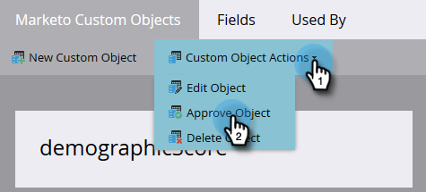

# Benutzerdefiniertes Objekt genehmigen {#approve-a-custom-object}

Sie müssen ein benutzerdefiniertes Objekt genehmigen, bevor Sie es verwenden können. Der Prozess unterscheidet sich geringfügig von dem für neue benutzerdefinierte Objekte und für Objekte, die Sie bearbeitet haben.

## Genehmigen eines neuen benutzerdefinierten Objekts {#approve-a-new-custom-object}

Sie haben ein brandneues benutzerdefiniertes Objekt erstellt. So validieren Sie es.

1. Navigieren Sie zum Bereich **[!UICONTROL Admin]**.

   

1. Klicken Sie auf **[!UICONTROL Benutzerdefinierte Marketo-Objekte]**.

   

1. Wählen Sie ein Objekt mit dem Status Entwurf aus.

   

1. Klicken Sie auf **[!UICONTROL Dropdown-Liste Benutzerdefinierte]** und wählen Sie **[!UICONTROL Objekt genehmigen]**.

   

1. Der Status ändert sich in [!UICONTROL Genehmigt].

   

   >[!NOTE]
   >
   >Ein benutzerdefiniertes Objekt, das in einer _1:n-Struktur_ verwendet wird, muss mindestens ein Deduplizierungsfeld, ein Verknüpfungsfeld, einen verknüpften Objektnamen und einen verknüpften Feldnamen aufweisen, damit es genehmigt werden kann.
   >
   >Ein benutzerdefiniertes Objekt, das in einer _n:n-Struktur_ verwendet wird **benötigt** ein Verknüpfungsfeld, einen verknüpften Objektnamen oder einen verknüpften Feldnamen, wenn Sie es genehmigen (da es im Zwischenobjekt lebt).
   >
   >Ein benutzerdefiniertes Objekt, das als _Zwischenobjekt_ verwendet wird, erfordert ein Verknüpfungsfeld, einen verknüpften Objektnamen und einen verknüpften Feldnamen, **jedoch** Deduplizierungsfeld.
   >
   >Weitere Informationen [ Sie unter „Grundlegendes ](/help/marketo/product-docs/administration/marketo-custom-objects/understanding-marketo-custom-objects.md) benutzerdefinierten Marketo-Objekten“.

Das ist alles! Jetzt können Sie Ihr benutzerdefiniertes Objekt in den Einschränkungen Ihrer Filter und Trigger auswählen, die in Ihren Kampagnen verwendet werden sollen.

## Genehmigen eines bearbeiteten benutzerdefinierten Objekts {#approve-an-edited-custom-object}

Nachdem Sie ein genehmigtes benutzerdefiniertes Objekt bearbeitet haben, müssen Sie den Entwurf genehmigen, um das benutzerdefinierte Objekt in einen genehmigten Status zurückzuversetzen.

1. Wenn Sie ein bereits genehmigtes benutzerdefiniertes Objekt bearbeiten, erhält es den Status [!UICONTROL Genehmigt mit Entwurf].

   

1. Wenn Sie bereit sind, den Entwurf zu genehmigen, klicken Sie auf die Dropdown **[!UICONTROL Liste Benutzerdefinierte]** und wählen Sie **[!UICONTROL Objekt genehmigen]**.

   

1. Eine Vorschau zeigt die Elemente an, die im Entwurf geändert wurden. Klicken Sie **[!UICONTROL Genehmigen]**.

   
