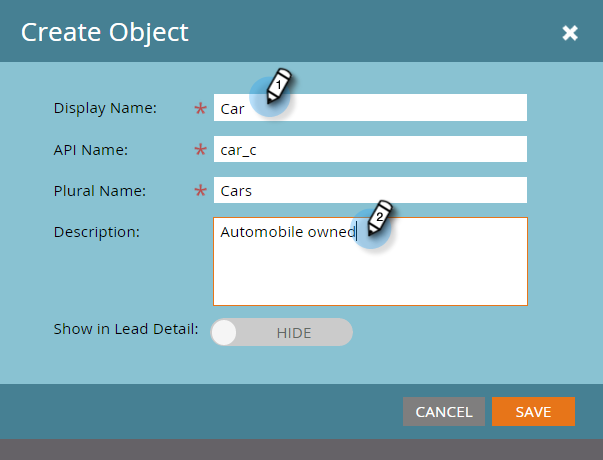

# Erstellen von Markierungen zu benutzerdefinierten Objekten {#create-marketo-custom-objects}

Verwenden Sie benutzerdefinierte Objekte in Marketing, um geschäftsspezifische Metriken zu verfolgen. Das kann alles sein, von Autos bis zu Kursen - was auch immer Sie in Marketo modellieren möchten, um Ihre Kampagnen zu führen.

>[!NOTE]
>
>Sie können benutzerdefinierte Objekte so einrichten, dass sie 1-zu-viele- oder viele-zu-viele-arbeiten. Sie erstellen das ursprüngliche Objekt auf dieselbe Weise, aber die Schritte unterscheiden sich, wenn Sie dem Objekt Felder hinzufügen, wenn Sie Beginn hinzufügen. Weitere Informationen finden Sie unter [Informationen zu &quot;Markieren zu benutzerdefinierten Objekten](understanding-marketo-custom-objects.md)&quot;.

>[!NOTE]
>
>Sie können ein Verknüpfungs- oder Deduplizierungsfeld nicht erstellen, bearbeiten oder löschen, nachdem das benutzerdefinierte Objekt genehmigt wurde.

## Benutzerdefiniertes Objekt für eine 1-zu-viele-Struktur {#create-a-custom-object-for-a-one-to-many-structure} erstellen

Dieses Beispiel zeigt ein benutzerdefiniertes Objekt für den Autokraftverkehr zur Verwendung in einer Eins-zu-viele-Struktur. Später erstellen Sie ein benutzerdefiniertes Kursobjekt und ein Intermediarobjekt, das in einer Viele-zu-viele-Struktur verwendet werden kann.

1. Klicken Sie auf **Admin** und wählen Sie in **Datenbankverwaltung** **Zu benutzerdefinierten Objekten** markieren.

   ** 

   **

1. Klicken Sie auf **Neues benutzerdefiniertes Objekt**.

   

   >[!NOTE]
   >
   >Auf der Registerkarte &quot;Zu benutzerdefinierten Objekten markieren&quot;werden alle benutzerdefinierten Objekte auf der rechten Seite sowie Details zu allen genehmigten Objekten angezeigt, einschließlich der Anzahl der Datensätze und Felder bei der letzten Aktualisierung.

1. Geben Sie einen Anzeigenamen ein. Der API-Name und der Plural-Name werden automatisch gefüllt. Geben Sie eine Beschreibung ein (optional).

   

   >[!NOTE]
   >
   >Sie können diese Felder beim Erstellen bearbeiten. Nach dem Speichern können Sie jedoch nur das Feld &quot;Plural-Name&quot;und den Schieberegler **In Interessentendetails anzeigen** bearbeiten.

1. Ziehen Sie den Schieberegler **In Interessentendetails anzeigen **auf, um **Anzeigen** anzuzeigen, wenn Sie benutzerdefinierte Objektdaten auf der Seite Interessentendatenbank Ansicht haben möchten. Klicken Sie auf **Speichern**.

   

1. Die benutzerdefinierten Objektinformationen zeigen den eingegebenen Inhalt an. Beachten Sie, dass es sich im Entwurfszustand befindet.

   

   Der nächste Schritt besteht darin, Felder zu [Ihr benutzerdefiniertes Objekt ](add-marketo-custom-object-fields.md) zu erstellen.

   >[!NOTE]
   >
   >Sie können &quot;Zu benutzerdefinierten Objekten markieren&quot;nur über einen Listen-Import oder die [API](http://developers.marketo.com/documentation/rest/) ausfüllen.

## Benutzerdefiniertes Objekt für eine Viele-zu-viele-Struktur {#create-a-custom-object-for-a-many-to-many-structure} erstellen

Dieses Beispiel zeigt ein kursspezifisches Objekt, mit dem Sie eine Viele-zu-viele-Beziehung zwischen Menschen/Firmen und Kursen erstellen können. Wenn Sie fertig sind, erstellen Sie ein Zwischenobjekt, um es mit den Personen oder Firmen in Ihrer Datenbank zu verbinden.

>[!NOTE]
>
>Für eine Viele-zu-viele-Beziehung müssen Sie keine Verknüpfung im benutzerdefinierten Objekt erstellen. Stattdessen fügen Sie dem intermediären Objekt zwei Links hinzu (siehe unten).

1. Klicken Sie auf **Admin** und wählen Sie in **Datenbankverwaltung** **Zu benutzerdefinierten Objekten** markieren.

   

1. Klicken Sie auf **Neues benutzerdefiniertes Objekt**.

   

1. Geben Sie einen Anzeigenamen ein. Der API-Name und der Plural-Name werden automatisch gefüllt. Geben Sie eine Beschreibung ein (optional).

   

   >[!NOTE]
   >
   >Sie können diese Felder beim Erstellen bearbeiten. Nach dem Speichern können Sie jedoch nur das Feld &quot;Plural-Name&quot;und den Schieberegler **In Interessentendetails anzeigen** bearbeiten.

1. Ziehen Sie den Schieberegler **In Interessentendetails anzeigen, um den Schieberegler Anzeigen anzuzeigen, wenn Sie benutzerdefinierte Objektdaten auf der Seite Interessentendatenbank Ansicht haben möchten. Klicken Sie auf **Speichern**.

   

1. Die benutzerdefinierten Objektinformationen zeigen den eingegebenen Inhalt an. Beachten Sie, dass es sich im Entwurfszustand befindet.

   

   >[!NOTE]
   >
   >Sie können &quot;Zu benutzerdefinierten Objekten markieren&quot;nur über einen Listen-Import oder die [API](http://developers.marketo.com/documentation/rest/) ausfüllen.

Der nächste Schritt besteht darin, dass Sie Ihr Zwischenobjekt erstellen (siehe unten). Aber bevor das geschieht, müssen Sie ein Feld erstellen, mit dem Sie eine Verbindung herstellen können.

## Zwischenobjekt {#create-an-intermediary-object} erstellen

Verwenden Sie ein intermediäres Objekt, um ein benutzerdefiniertes Objekt mit Personen oder Firmen zu verbinden. In diesem Beispiel wird es verwendet, um Kurse in Ihrem Kursobjekt mit Personen oder Firmen in Ihrer Datenbank zu verbinden.

>[!NOTE]
>
>Sie müssen kein Intermediarobjekt für eine 1-zu-viele benutzerdefinierte Objektstruktur erstellen.

1. Klicken Sie auf **Admin** und wählen Sie in **Datenbankverwaltung** **Markieren Sie die Option**.

   

1. Klicken Sie auf **Neues benutzerdefiniertes Objekt**.

   

1. Geben Sie einen Anzeigenamen ein. Der API-Name und der Plural-Name werden automatisch gefüllt. Geben Sie eine Beschreibung ein (optional).

   

   >[!NOTE]
   >
   >Sie können diese Felder beim Erstellen bearbeiten, aber nach dem Speichern können Sie nur das Feld &quot;Plural-Name&quot;und den Schieberegler &quot;In Interessentendetails anzeigen&quot;bearbeiten.

1. Ziehen Sie den Schieberegler **In Interessentendetails anzeigen**, um Anzeigen anzuzeigen, wenn Sie benutzerdefinierte Objektdaten auf der Seite &quot;Interessentendatenbank&quot;Ansicht haben möchten. Klicken Sie auf **Speichern**.

   

1. Die benutzerdefinierten Objektinformationen zeigen den eingegebenen Inhalt an. Beachten Sie, dass es sich im Entwurfszustand befindet.

   Der nächste Schritt besteht darin, dass Sie [Verknüpfungsfelder](add-marketo-custom-object-link-fields.md) hinzufügen, um Ihr Zwischenobjekt mit einer Person/Firma und einem benutzerdefinierten Objekt zu verbinden.

>[!MORELIKETHIS]
>
>* [hinzufügen &quot;Markieren in benutzerdefinierten Objektfeldern&quot;](add-marketo-custom-object-fields.md)
>* [hinzufügen &quot;Markieren in benutzerdefinierten Objektverknüpfungsfeldern&quot;](add-marketo-custom-object-link-fields.md)
>* [Erläuterungen zu benutzerdefinierten Objekten](understanding-marketo-custom-objects.md)

>

