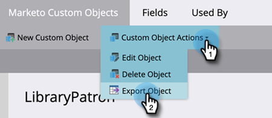

# Exportieren benutzerdefinierter Objektmetadaten {#custom-object-metadata-export}

Wenn Sie die SOAP-API oder [!DNL Munchkin]-API verwenden, kann das Metadatenschema für benutzerdefinierte Objekte exportiert werden. Gehen Sie wie folgt vor.

>[!AVAILABILITY]
>
>Nicht alle Marketo Engage-Benutzer haben diese Funktion erworben. Weitere Informationen erhalten Sie beim Adobe Account Team (Ihrem Account Manager).

1. Navigieren Sie zum Bereich **[!UICONTROL Admin]**.

   

1. Klicken Sie auf **[!UICONTROL Benutzerdefinierte Marketo-Objekte]**.

   

1. Wählen Sie das benutzerdefinierte Marketo-Objekt aus, das Sie exportieren möchten.

   

1. Klicken Sie auf die **[!UICONTROL Benutzerdefinierte Objektaktionen]** und wählen Sie **[!UICONTROL Objekt exportieren]**.

   

>[!NOTE]
>
>Das benutzerdefinierte Objekt muss sich im Status Genehmigt befinden, um exportiert werden zu können.

Jetzt verfügen Sie über eine Tabelle mit dem Schema des benutzerdefinierten Objekts in drei Registerkarten.

