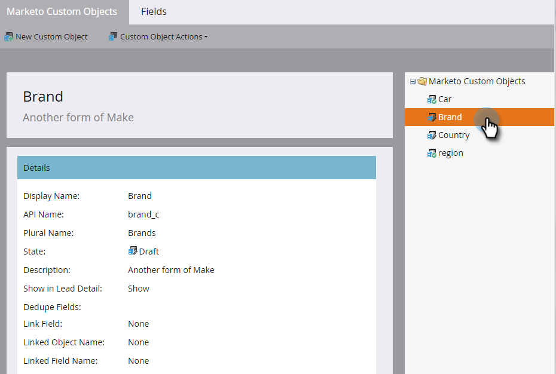

# Bearbeiten und Löschen eines benutzerdefinierten Marketo-Objekts {#edit-and-delete-a-marketo-custom-object}

>[!NOTE]
>
>Sie können kein Link- oder Deduplizierungsfeld erstellen, bearbeiten oder löschen, nachdem das benutzerdefinierte Objekt genehmigt wurde.

## Benutzerdefiniertes Objekt bearbeiten {#edit-a-custom-object}

Verwenden Sie das Menü Benutzerdefinierte Objektaktionen , um ein benutzerdefiniertes Objekt zu bearbeiten oder zu löschen.

1. Navigieren Sie zum Bereich **[!UICONTROL Admin]**.

   

1. Klicken Sie auf **[!UICONTROL Benutzerdefinierte Marketo-Objekte]**.

   

1. Wählen Sie rechts das benutzerdefinierte Objekt aus, das Sie bearbeiten möchten.

   

1. Klicken Sie auf **[!UICONTROL Registerkarte Benutzerdefinierte]** und dann auf **[!UICONTROL Objekt bearbeiten]**.

   

1. Nehmen Sie die gewünschten Änderungen vor. Ziehen Sie den Schieberegler, wenn Sie das Objekt auf der Seite Lead-Detail anzeigen möchten. Klicken Sie auf **[!UICONTROL Speichern]**.

   

1. Stellen Sie sicher, dass Sie [das bearbeitete Objekt](/help/marketo/product-docs/administration/marketo-custom-objects/approve-a-custom-object.md) genehmigen.

## Löschen eines benutzerdefinierten Objekts {#delete-a-custom-object}

Es ist einfach, ein benutzerdefiniertes Objekt zu löschen, aber Sie müssen vorsichtig sein. Benutzerdefinierte Objekte können mit anderen Objekten oder mit Smart-Listen verbunden sein. Daher werden Sie von Marketo gewarnt, bevor Sie auf &quot;**[!UICONTROL &quot;]** können.

>[!CAUTION]
>
>Ein benutzerdefiniertes Objekt kann nach dem Löschen nicht wiederhergestellt werden.

1. Navigieren Sie zum Bereich **[!UICONTROL Admin]**.

   

1. Klicken Sie auf **[!UICONTROL Benutzerdefinierte Marketo-Objekte]**.

   

1. Wählen Sie das Objekt aus, das Sie löschen möchten.

   

1. Klicken Sie auf **[!UICONTROL Benutzerdefinierte Objektaktionen]** und wählen Sie **[!UICONTROL Objekt löschen]**.

   

   >[!TIP]
   >
   >Alternativ können Sie mit der rechten Maustaste auf das Objekt klicken und **[!UICONTROL Objekt löschen]** auswählen.

1. Wenn das benutzerdefinierte Objekt im Entwurfsformat vorliegt und noch nicht genehmigt wurde, erhalten Sie diese Warnung. Wenn Sie sicher sind, klicken Sie auf **[!UICONTROL Löschen]**.

   

1. Wenn das benutzerdefinierte Objekt bereits genehmigt ist, besteht ein höheres Risiko, wenn Sie es löschen. Also, Sie bekommen eine ernstere Warnung. Geben Sie **[!UICONTROL Ich verstehe]** ein, aktivieren Sie das Kontrollkästchen **[!UICONTROL Nicht rückgängig machen]** und klicken Sie auf **[!UICONTROL Löschen]**.

   

   >[!NOTE]
   >
   >Wenn das benutzerdefinierte Objekt mit einem Zwischenobjekt verknüpft ist, müssen Sie das Zwischenobjekt zuerst löschen.

>[!MORELIKETHIS]
>
>[Benutzerdefiniertes Objekt genehmigen](/help/marketo/product-docs/administration/marketo-custom-objects/approve-a-custom-object.md)
