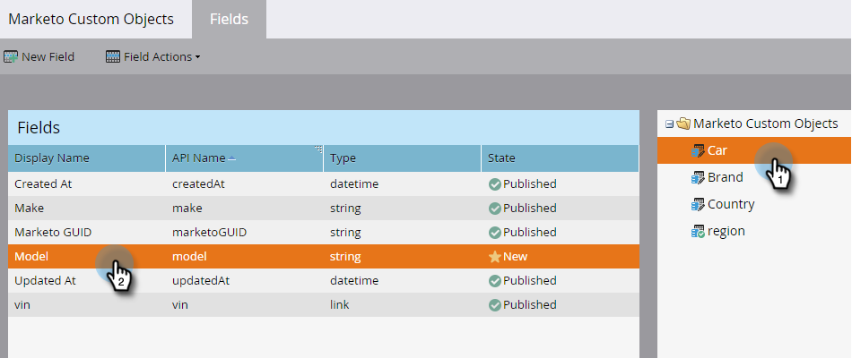
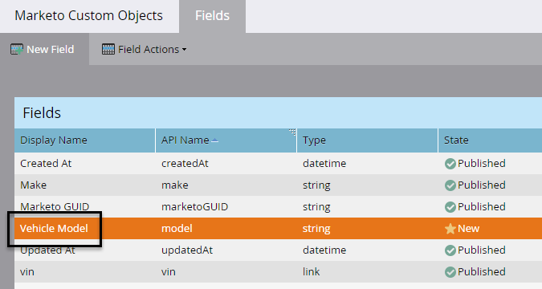
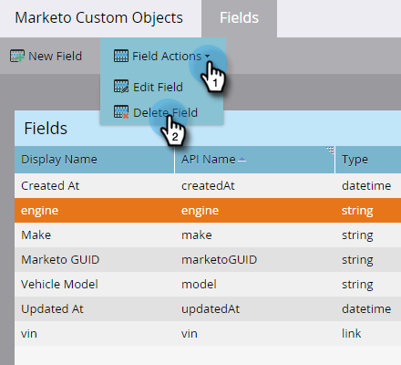
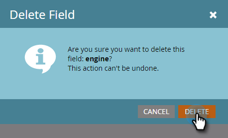
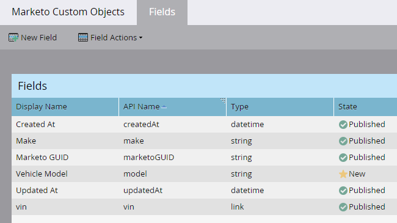

# Bearbeiten und Löschen von benutzerdefinierten Marketo-Objektfeldern {#edit-and-delete-marketo-custom-object-fields}

## Bearbeiten eines Felds {#edit-a-field}

Manchmal muss ein Feld bearbeitet werden, das noch nicht genehmigt ist.

1. Klicken Sie auf ein benutzerdefiniertes Objekt und das Feld, das Sie bearbeiten möchten.

   

1. Klicken Sie auf der [!UICONTROL Felder] auf **[!UICONTROL Feldaktionen]** und **[!UICONTROL Feld bearbeiten]**.

   

1. Nehmen Sie die gewünschten Änderungen vor und klicken Sie auf **[!UICONTROL Speichern]**.

   

   >[!NOTE]
   >
   >Der API-Name kann nicht bearbeitet werden.

1. Die Änderungen werden in der Liste **[!UICONTROL Felder]** angezeigt.

   

## Löschen eines Felds {#delete-a-field}

Wenn ein Feld in einem benutzerdefinierten Objekt nicht mehr benötigt wird, können Sie es löschen.

1. Klicken Sie auf der Registerkarte Felder auf **[!UICONTROL Feldaktionen]** und **[!UICONTROL Feld löschen]**.

   

1. Bestätigen Sie, dass Sie das Feld löschen möchten, bevor Sie fortfahren. Klicken Sie auf **[!UICONTROL Löschen]**.

   

Das Feld wird gelöscht.

>[!NOTE]
>
>[Benutzerdefinierte Marketo-Objektfelder hinzufügen](/help/marketo/product-docs/administration/marketo-custom-objects/add-marketo-custom-object-fields.md)
