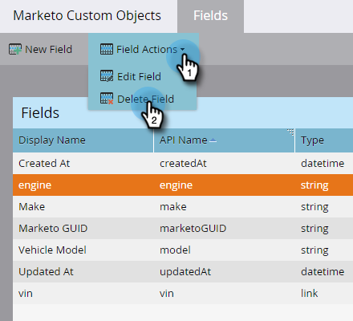

# Benutzerdefinierte Marketo-Objektfelder bearbeiten und löschen {#edit-and-delete-marketo-custom-object-fields}

## Feld bearbeiten {#edit-a-field}

Manchmal müssen Sie ein Feld bearbeiten, das noch nicht genehmigt wurde.

1. Klicken Sie auf ein benutzerdefiniertes Objekt und das Feld, das Sie bearbeiten möchten.

   

1. Klicken Sie auf der Registerkarte [!UICONTROL Felder] auf **[!UICONTROL Feldaktionen]** und **[!UICONTROL Feld bearbeiten]**.

   

1. Nehmen Sie Ihre Änderungen vor und klicken Sie auf **[!UICONTROL Speichern]**.

   

   >[!NOTE]
   >
   >Sie können den API-Namen nicht bearbeiten.

1. Die Änderungen werden in der Feldliste angezeigt.

   

## Feld löschen {#delete-a-field}

Wenn Sie ein Feld in einem benutzerdefinierten Objekt nicht mehr benötigen, können Sie es löschen.

1. Klicken Sie auf der Registerkarte &quot;Felder&quot;auf **[!UICONTROL Feldaktionen]** und **[!UICONTROL Feld löschen]**.

   

1. Stellen Sie sicher, dass Sie das Feld wirklich löschen möchten, bevor Sie den Trigger abrufen! Klicken Sie auf **[!UICONTROL Löschen]**.

   

Es ist weg!

>[!NOTE]
>
>[Benutzerdefinierte Marketo-Objektfelder hinzufügen](/help/marketo/product-docs/administration/marketo-custom-objects/add-marketo-custom-object-fields.md)
