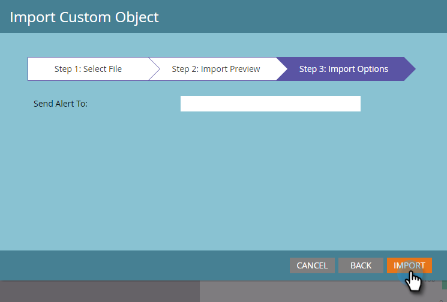

# Importieren von benutzerdefinierten Objektdaten {#import-custom-object-data}

Es ist einfach, benutzerdefinierte Objektdaten in Ihre Datenbank zu importieren. Wenn Sie benutzerdefinierte Objekte mit Unternehmen verwenden, finden Sie unter [Verwenden benutzerdefinierter Objekte mit Unternehmen](/help/marketo/product-docs/administration/marketo-custom-objects/understanding-marketo-custom-objects.md#using-custom-objects-with-companies) weitere Informationen.

1. Navigieren Sie in My Marketo zu **[!UICONTROL Datenbank]**.

   

1. Klicken Sie auf **[!UICONTROL Neu]** und wählen Sie **[!UICONTROL Benutzerdefinierte Objektdaten importieren]**.

   

1. Klicken Sie **[!UICONTROL Durchsuchen]**, um die Datendatei zu suchen. Wählen Sie das Dateiformat aus (in diesem Beispiel durch Komma getrennte Werte).

   

1. Wählen Sie Ihr [!UICONTROL benutzerdefiniertes Objekt] aus.

   

1. Wählen Sie [!UICONTROL Deduplizierungsmodus] aus der Dropdown-Liste aus. Klicken Sie auf **[!UICONTROL Weiter]**.

   

   >[!NOTE]
   >
   >Verwenden Sie Deduplizierungsfelder als eindeutige Kennungen, wenn Sie benutzerdefinierte Objektdatensätze erstellen oder aktualisieren. In diesem Beispiel wird das Feld Deduplizierung des benutzerdefinierten **car**-Objekts - VIN (Vehicle ID Number) verwendet. Wenn Sie nur benutzerdefinierte Objektdatensätze aktualisieren, können Sie die [!UICONTROL Marketo-GUID] als [!UICONTROL Deduplizierungsmodus] auswählen.

1. Ordnen Sie jede Spalte einem Marketo-Feld zu, indem Sie sie aus der Dropdown-Liste auswählen.

   

   >[!NOTE]
   >
   >Stellen Sie sicher, dass die Werte in Ihrer Datei mit dem Feldtyp übereinstimmen, mit dem Sie sie abgleichen (z. B. Text, Ganzzahl usw.), da die Datei sonst zurückgewiesen wird.

1. Klicken Sie auf **[!UICONTROL Weiter]**.

   

1. Klicken Sie **[!UICONTROL Importieren]**.

   

   >[!NOTE]
   >
   >Die Größenbeschränkung für benutzerdefinierte Objekte beträgt 100 MB.

   >[!TIP]
   >
   >Geben Sie Ihre E-Mail **[!UICONTROL Adresse in das Feld „Warnhinweis senden an]** ein. Marketo wird Ihnen eine E-Mail senden, wenn der Import abgeschlossen ist!

1. In der rechten oberen Ecke des Bildschirms wird eine Benachrichtigung angezeigt, während der Import ausgeführt wird, und die endgültigen Ergebnisse werden angezeigt, wenn er abgeschlossen ist.

   

   Juhu!

>[!MORELIKETHIS]
>
>[Grundlegendes zu benutzerdefinierten Marketo-Objekten](/help/marketo/product-docs/administration/marketo-custom-objects/understanding-marketo-custom-objects.md)
