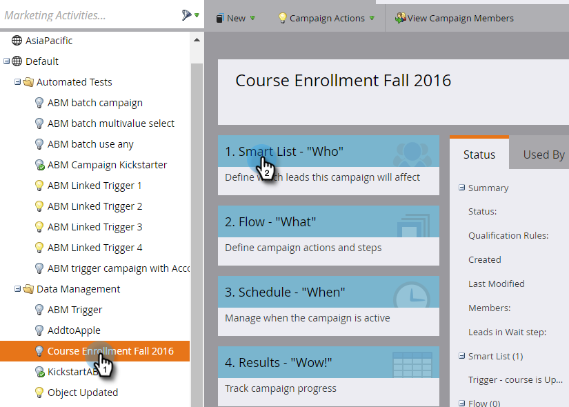
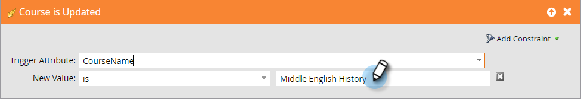

# Auslösen von Änderungen an benutzerdefinierten Objekten {#trigger-off-custom-object-changes}

>[!NOTE]
>
>Diese Funktion ist nur verfügbar:
>
>* Zur Verwendung nur mit benutzerdefinierten Marketo-Objekten, nicht mit benutzerdefinierten Objekten, die über die native [!DNL Salesforce]- oder [!DNL Microsoft Dynamics]-Integration synchronisiert werden
>
>* Als Trigger, nicht als Filter
>
>Wenden Sie sich an den [Marketo](https://nation.marketo.com/t5/support/ct-p/Support?profile.language=de)Support, um die Trigger für benutzerdefinierte Objektänderungen zu aktivieren.

In der Smart-Liste einer Smart-Kampagne können Sie eine Flussaktion mit Trigger versehen, wenn ein benutzerdefiniertes Objekt einer Person oder einem Unternehmen hinzugefügt wird. Sie können auch eine Smart-Liste erstellen, die eine _Änderung_ in einem benutzerdefinierten Objekt als Trigger verwendet. Verwenden Sie sie beispielsweise, um eine E-Mail zu senden, wenn ein Kursname aktualisiert wird.

>[!NOTE]
>
>Wenn ein benutzerdefinierter Objektdatensatz geändert wird, wird kein Aktivitätsprotokolleintrag erstellt.

1. Navigieren Sie in Marketo Engage zu **[!UICONTROL Marketing-Aktivitäten]**.

   

1. Erstellen oder öffnen Sie eine vorhandene Smart-Kampagne und wählen Sie die Smart-Liste aus.

   

1. Suchen Sie nach dem gewünschten Trigger und ziehen Sie ihn auf die Arbeitsfläche.

   

1. Wählen Sie das Attribut [!UICONTROL Trigger &#x200B;].

   

1. Legen Sie optional eine Einschränkung fest.

   

1. Die Änderung wird automatisch gespeichert.

   

   >[!NOTE]
   >
   >* [Erstellen einer Smart-Liste](/help/marketo/product-docs/core-marketo-concepts/smart-lists-and-static-lists/creating-a-smart-list/create-a-smart-list.md)
   >* [Grundlegendes zu benutzerdefinierten Marketo-Objekten](/help/marketo/product-docs/administration/marketo-custom-objects/understanding-marketo-custom-objects.md)
