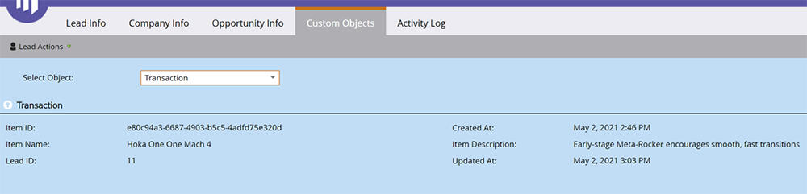

# Grundlegendes zu benutzerdefinierten Marketo-Objekten {#understanding-marketo-custom-objects}

Verwenden Sie benutzerdefinierte Objekte, um Metriken zu verfolgen, die für Ihr Unternehmen spezifisch sind.

>[!AVAILABILITY]
>
>Nicht alle Marketo Engage-Benutzer haben diese Funktion erworben. Weitere Informationen erhalten Sie vom Adobe Account Team (Ihrem Kundenbetreuer).

Verwenden Sie benutzerdefinierte Objekte als Filter und Trigger in Ihren Smart-Kampagnen. Beispiel:

* **Filter**: E-Mails nur an Inhaber einer bestimmten Fahrzeugmarke senden
* **Trigger**: Senden Sie eine E-Mail, wenn einer Person oder einem Unternehmen ein benutzerdefiniertes Objekt hinzugefügt wird.

Sie können benutzerdefinierte Objekte in einer Eins-zu-viele- oder einer n-zu-n-Beziehung einrichten. Beispiel:

* **Eins-zu-viele**: Eine Person besitzt mehrere Autos
* **Viele-zu-viele**: Mehrere Schüler/innen sind an mehreren Kursen aus einem Kurskatalog eingeschrieben.

Eine Eins-zu-viele-Struktur verwendet ein einzelnes Verknüpfungsfeld, um das benutzerdefinierte Objekt mit einer Person oder einem Unternehmen zu verbinden.

Viele zu viele benutzerdefinierte Objekte verwenden zwei Verknüpfungsfelder, die Teil eines Zwischen-Objekts sind. Ein Feld Link ist mit der Person oder Firma verbunden und ein anderes mit dem benutzerdefinierten Objekt, z. B. dem Kurskatalog. Dieses zwischengeschaltete Objekt kann zusätzliche benutzerdefinierte Felder enthalten, wie z. B. eine Kursstufe oder ein Anwesenheitsdatum, die die Art der Verbindung weiter definieren.

>[!TIP]
>
>Importieren Sie benutzerdefinierte Objekte mit kommagetrennten Werten (CSV) in die Benutzeroberfläche, um ein Datenbeispiel zu testen und zu validieren. Laden Sie dann alle Ihre Dateien mit einer API hoch.

>[!CAUTION]
>
>Benutzerdefinierte Objekte können nicht wiederhergestellt werden. Stellen Sie daher sicher, dass Sie sie nicht mehr benötigen, bevor Sie sie löschen.

## Zugriff auf benutzerdefinierte Marketo-Objekte {#accessing-marketo-custom-objects}

1. Navigieren Sie zum **[!UICONTROL Admin]**-Bereich.

   

1. Klicks **[!UICONTROL Benutzerdefinierte Marketo-Objekte]**.

   

1. Die Anzeige Benutzerdefinierte Marketo-Objekte listet alle Ihre benutzerdefinierten Objekte auf der rechten Seite auf, jedoch nur die genehmigten Objekte im Hauptraster.

   

   >[!NOTE]
   >
   >Das Raster zeigt den Objektnamen, die Anzahl der Datensätze, die Anzahl der Felder und das Datum der letzten Aktualisierung an.

   >[!TIP]
   >
   >Marketo aktualisiert diese Felder automatisch, Sie können die Anzeige jedoch aktualisieren, indem Sie auf das Symbol in der Spalte Datensätze klicken.

1. Klicken Sie rechts auf den Objektnamen, um die Detailseite zu öffnen.

   

## Anzeigen benutzerdefinierter Objekte, die einer Person zugeordnet sind {#view-custom-objects-associated-to-a-person}

Nachdem Sie die benutzerdefinierte Objektstruktur erstellt haben, werden die benutzerdefinierten Objekte beim Hochladen der spezifischen Objektdaten mithilfe des Linkfelds im benutzerdefinierten Objekt automatisch mit Personen in der Datenbank verknüpft. Sie können Informationen aus dem [!UICONTROL Benutzerdefinierte Objekte] auf der Seite mit den Personendetails.

1. Navigieren Sie zu **[!UICONTROL Datenbank]**.

   

1. Öffnen Sie Ihre Datenbank und klicken Sie auf **[!UICONTROL Personen]** Registerkarte. Doppelklicken Sie auf den Datensatz für eine Person, die Sie mit einem benutzerdefinierten Objekt verknüpft haben.

   

1. Klicken Sie auf der Personendetailseite auf die **[!UICONTROL Benutzerdefinierte Objekte]** Registerkarte. Wählen Sie das Objekt aus der Dropdownliste aus.

   

1. Jetzt können Sie eine Liste aller benutzerdefinierten Objekte dieses Typs anzeigen, die mit dieser Person verbunden sind.

   

## Verwenden benutzerdefinierter Objekte für Unternehmen {#using-custom-objects-with-companies}

Ein benutzerdefiniertes Objekt, das mit dem Unternehmen verknüpft ist, funktioniert am besten, wenn Sie Unternehmen aus dem CRM-System synchronisieren oder Unternehmen explizit mithilfe der API erstellen. Es wird außerdem empfohlen, die Firmen-ID als Linkfeld zu verwenden.

Wenn Sie in Marketo mehrere Personen haben, die Datensätze im CRM-System oder nur in Marketo enthalten sind, wird ein benutzerdefiniertes Objekt, das mit einem Unternehmen verknüpft ist, nicht mehr als einem Datensatz zugeordnet. Dies liegt daran, dass ein Unternehmen mit mehreren Personen darunter nur unterstützt wird, wenn Unternehmen aus dem CRM-System synchronisiert werden oder wenn Sie eine API verwenden, um explizit Unternehmen zu erstellen.

Benutzerdefinierte Objekte können nur direkt mit einem einzelnen Datensatz verknüpft werden. Wenn Ihr benutzerdefinierter Objekttyp nach Unternehmensfeld verknüpft ist, sollten Sie sicherstellen, dass Ihre Personendatensätze entweder mit einer Kontaktkonversion in Ihrem CRM-System oder mit dem Feld externalCompanyId verknüpft sind, wenn Sie Unternehmen verwalten, die REST-APIs von Marketo verwenden. Für Personendatensätze, die nicht explizit mit Firmendatensätzen verknüpft sind, werden benutzerdefinierte Objekte, die mit &quot;company&quot;verknüpft sind, zufällig mit einem einzigen Datensatz verknüpft, selbst wenn der Wert des Unternehmensfelds für viele Personen freigegeben ist.

Siehe [Benutzerdefinierte Objektdaten importieren](/help/marketo/product-docs/administration/marketo-custom-objects/import-custom-object-data.md) für weitere Informationen.

>[!MORELIKETHIS]
>
>* [Erstellen benutzerdefinierter Marketo-Objekte](/help/marketo/product-docs/administration/marketo-custom-objects/create-marketo-custom-objects.md)
>* [Genehmigen eines benutzerdefinierten Objekts](/help/marketo/product-docs/administration/marketo-custom-objects/approve-a-custom-object.md)
>* [Bearbeiten und Löschen eines benutzerdefinierten Marketo-Objekts](/help/marketo/product-docs/administration/marketo-custom-objects/edit-and-delete-a-marketo-custom-object.md)
>* [Benutzerdefinierte Marketo-Objektfelder hinzufügen](/help/marketo/product-docs/administration/marketo-custom-objects/add-marketo-custom-object-fields.md)
>* [Benutzerdefinierte Marketo-Objektfelder bearbeiten und löschen](/help/marketo/product-docs/administration/marketo-custom-objects/edit-and-delete-marketo-custom-object-fields.md)
>* [Benutzerdefinierte Objektdaten importieren](/help/marketo/product-docs/administration/marketo-custom-objects/import-custom-object-data.md)
