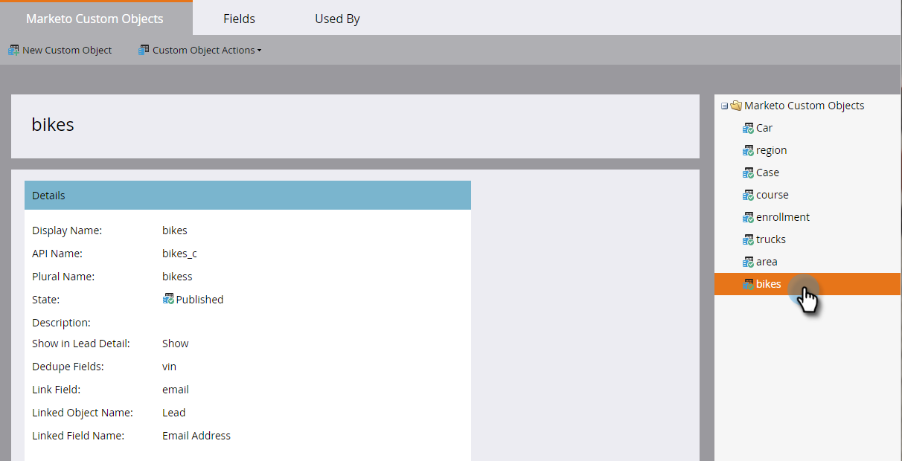

# Erläuterungen zu benutzerdefinierten Objekten {#understanding-marketo-custom-objects}

Verwenden Sie benutzerdefinierte Objekte, um unternehmensspezifische Metriken zu verfolgen.

>[!NOTE]
>
>**FYI**
>
>Marketo standardisiert nun die Sprache für alle Abonnements, sodass Sie möglicherweise Interessenten in Ihrem Abonnement und Personen/Personen in docs.marketo.com sehen können. Diese Begriffe bedeuten dasselbe. Es hat keine Auswirkungen auf die Artikelanweisungen. Es gibt auch noch einige andere Änderungen. [Weitere Informationen](http://docs.marketo.com/display/DOCS/Updates+to+Marketo+Terminology).

>[!NOTE]
>
>**Verfügbarkeit**
>
>Nicht alle Kunden haben diese Funktion erworben. Weitere Informationen erhalten Sie von Ihrem Vertriebsmitarbeiter.

Verwenden Sie benutzerdefinierte Objekte als Filter und Auslöser in Ihren intelligenten Kampagnen. Beispiel:

* **Filter**: E-Mails nur an Inhaber einer bestimmten Fahrzeugmarke senden
* **Auslöser**: Senden Sie eine E-Mail, wenn einer Person oder Firma ein benutzerdefiniertes Objekt hinzugefügt wird.

Sie können benutzerdefinierte Objekte in einer Eins-zu-viele- oder einer Viele-zu-viele-Beziehung einrichten. Beispiel:

* **Eins-zu-viele**: Eine Person besitzt mehrere Autos
* **Viele-zu-viele**: Mehrere Schüler/innen sind in mehreren Kursen aus einem Kurskatalog eingeschrieben

Eine Eins-zu-viele-Struktur verwendet ein einzelnes Verknüpfungsfeld, um das benutzerdefinierte Objekt mit einer Person oder einer Firma zu verbinden.

Viele zu viele benutzerdefinierte Objekte verwenden zwei Verknüpfungsfelder, die Teil eines Zwischenobjekts sind. Ein Feld &quot;Link&quot;ist mit der Person oder Firma verbunden und ein anderes mit dem benutzerdefinierten Objekt, z. B. dem Kurskatalog. Dieses intermediäre Objekt kann zusätzliche benutzerdefinierte Felder enthalten, z. B. eine Kursstufe oder ein Anwesenheitsdatum, die die Art der Verbindung weiter definieren.

>[!TIP]
>
>Importieren Sie benutzerdefinierte Objekte mit kommagetrennten Werten (CSV) in der Benutzeroberfläche, um ein Datenmuster zu testen und zu validieren. Laden Sie dann alle Dateien mit einer API hoch.

>[!CAUTION]
>
>Sie können benutzerdefinierte Objekte nicht wiederherstellen. Daher müssen Sie sie vor dem Löschen nicht mehr benötigen.

## Zugriff auf Marketing zu benutzerdefinierten Objekten {#accessing-marketo-custom-objects}

1. Klicken Sie zum Erstellen oder Bearbeiten benutzerdefinierter Objekte auf **Admin **und dann auf den Link **Zu benutzerdefinierten** Objekten markieren.

   

1. Die &quot;Zu benutzerdefinierenden Objekten markieren&quot;zeigen Listen für alle benutzerdefinierten Objekte auf der rechten Seite an, jedoch nur für die genehmigten Objekte im Hauptraster.

   

1. Das Raster zeigt den Objektnamen, die Anzahl der Datensätze, die Anzahl der Felder und das Datum der letzten Aktualisierung an.

   >[!TIP]
   >
   >Marketo aktualisiert diese Felder automatisch, Sie können die Anzeige jedoch aktualisieren, indem Sie auf das Symbol in der Spalte &quot;Datensätze&quot;klicken.

1. Klicken Sie auf den Objektnamen auf der rechten Seite, um die Detailseite zu öffnen.

   

## Benutzerdefinierte Objekte einer Ansicht {#view-custom-objects-associated-to-a-person}

Nachdem Sie die benutzerdefinierte Objektstruktur erstellt haben, werden die benutzerdefinierten Objekte beim Hochladen der spezifischen Objektdaten mithilfe des Linkfelds im benutzerdefinierten Objekt automatisch mit den Personen in der Datenbank verknüpft. Informationen zur Ansicht können Sie auf der Seite mit den Personendetails auf der Registerkarte &quot;Benutzerspezifische Objekte&quot;finden.

1. Wechseln Sie zur **Datenbank**.

   

1. Öffnen Sie die Datenbank und klicken Sie auf die Registerkarte **Personen** . Klicken Sie bei gedrückter Dublette auf den Datensatz für eine Person, die Sie einem benutzerdefinierten Objekt zugeordnet haben.

   

1. Klicken Sie auf der Seite mit den Personendetails auf die Registerkarte **Benutzerspezifische Objekte** . Wählen Sie das Objekt aus der Dropdownliste aus.

   

1. Jetzt können Sie eine Liste aller benutzerspezifischen Objekte dieses Typs, die mit dieser Person verbunden sind, Ansicht vornehmen.

   

## Verwenden benutzerdefinierter Objekte mit Firmen {#using-custom-objects-with-companies}

Ein benutzerdefiniertes Objekt, das mit der Firma verknüpft ist, funktioniert am besten, wenn Sie Firmen aus dem CRM-System synchronisieren oder explizit Firmen mit der API erstellen. Es wird außerdem empfohlen, die Firmen-ID als Linkfeld zu verwenden.

Wenn Sie mehrere Personen in Marketo haben, die Datensätze in den CRM- oder Nur-Marketing-Datensätzen enthalten, wird ein benutzerdefiniertes Objekt, das mit einer Firma verknüpft ist, nicht mehr als einem einzelnen Datensatz zugeordnet. Dies liegt daran, dass eine Firma, die mehrere Personen darunter hat, nur dann unterstützt wird, wenn Firmen aus dem CRM synchronisiert werden oder wenn Sie eine API verwenden, um explizit Firmen zu erstellen.

Benutzerdefinierte Objekte können nur direkt mit einem einzelnen Datensatz verknüpft werden. Wenn Ihr benutzerdefinierter Objekttyp nach Firma verknüpft ist, sollten Sie sicherstellen, dass Ihre Personendaten entweder mit einer Firma verknüpft sind, die die Kontaktkonversion in Ihrem CRM verwendet, oder mit dem Feld externalCompanyId, wenn Sie Firmen mit den REST-APIs von Marketo verwalten. Bei Personendatensätzen, die nicht explizit mit Firmen verknüpft sind, werden mit Firma verknüpfte benutzerdefinierte Objekte zufällig mit einem einzigen Datensatz verknüpft, selbst wenn der Wert des Felds &quot;Firma&quot;für viele Personen freigegeben wird.

Weitere Informationen finden Sie unter [Importieren benutzerdefinierter Objektdaten](import-custom-object-data.md) .

>[!MORELIKETHIS]
>
>* [Erstellen von Markierungen zu benutzerdefinierten Objekten](create-marketo-custom-objects.md)
>* [Benutzerdefiniertes Objekt genehmigen](approve-a-custom-object.md)
>* [Bearbeiten und Löschen eines Markierungen zu einem benutzerdefinierten Objekt](edit-and-delete-a-marketo-custom-object.md)
>* [hinzufügen &quot;Markieren in benutzerdefinierten Objektfeldern&quot;](add-marketo-custom-object-fields.md)
>* [Bearbeiten und Löschen von Markierungen in benutzerdefinierten Objektfeldern](edit-and-delete-marketo-custom-object-fields.md)
>* [Benutzerspezifische Objektdaten importieren](import-custom-object-data.md)

>

