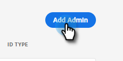
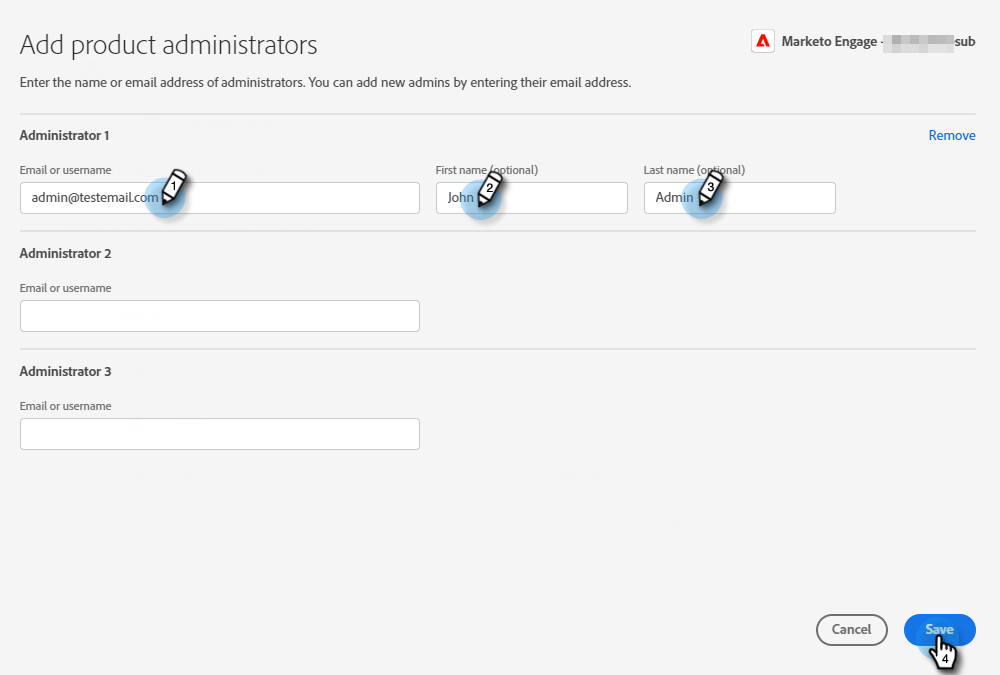
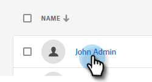

# Hinzufügen oder Entfernen von Produktadmins {#add-or-remove-a-product-admin}

>[!NOTE]
>
>**System** Admins werden nur auf Adobe-Organisationsebene erstellt. Wenn Sie glauben, dass Sie mehr als einen benötigen, wenden Sie sich an den [Marketo-Support](https://nation.marketo.com/t5/support/ct-p/Support).

## Hinzufügen eines Produktadministrators {#add-a-product-admin}

>[!IMPORTANT]
>
>Ein Administrator muss einem Produktprofil hinzugefügt werden, um Zugriff auf Marketo Engage zu erhalten.

1. Melden Sie sich bei der [Adobe Admin Console](https://adminconsole.adobe.com/){target="_blank"} an.

   

1. Auf **Marketo Engage**.

   

1. Wählen Sie das gewünschte Abonnement aus (wenn Sie mehrere haben).

   

1. Klicken Sie auf **[!UICONTROL Registerkarte]** Administratoren“.

   

1. Klicken Sie auf **[!UICONTROL Schaltfläche „Admin]**&quot;.

   

1. Geben Sie die E-Mail-Adresse oder den Benutzernamen des Administrators ein, den Sie hinzufügen möchten. Vor- und Nachname sind optional. Klicken Sie auf **[!UICONTROL Speichern]**.

   

1. Klicken Sie auf den Namen des Admins, den Sie soeben hinzugefügt haben.

   

1. Klicken Sie unter Produkte auf das Dreipunkt-Menü und wählen Sie **[!UICONTROL Bearbeiten]**.

   

1. Klicken Sie auf das **+**. Klicken Sie auf den Pfeil neben dem gewünschten Marketo Engage-Abonnement (wenn mehrere vorhanden sind) und wählen Sie das gewünschte Produktprofil aus.

   

1. Klicken Sie auf **[!UICONTROL Speichern]**.

   

Der Benutzer erhält dann zwei E-Mails. Die erste E-Mail benachrichtigt sie, dass ihnen Produktadministratorrechte für Marketo Engage gewährt wurden. Die zweite E-Mail lädt sie ein, sich bei Marketo Engage anzumelden.

>[!NOTE]
>
>Wenn Produktadministratorinnen und -Administratoren über die Adobe Admin Console zu Marketo Engage hinzugefügt werden, erhält die Person im Abonnement die Adobe-Produktadministratorrolle.

## Einen Administrator entfernen {#remove-a-user}

1. Melden Sie sich bei der [Adobe Admin Console](https://adminconsole.adobe.com/){target="_blank"} an.

   

1. Auf **Marketo Engage**.

   

1. Wählen Sie das gewünschte Abonnement aus (wenn Sie mehrere haben).

   

1. Klicken Sie auf **[!UICONTROL Registerkarte]** Administratoren“.

   

1. Wählen Sie den Administrator aus, den Sie entfernen möchten, und klicken Sie auf die Schaltfläche **[!UICONTROL Administrator entfernen]**.

   

1. Klicken Sie **[!UICONTROL Remove Admin]** zur Bestätigung.

   

Der/die Benutzende erhält dann eine E-Mail, in der er/sie darüber informiert wird, dass er/sie keinen Produktadministratorzugriff mehr auf Marketo Engage hat.
