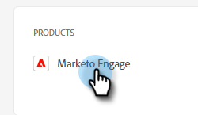

# Hinzufügen oder Entfernen von Benutzenden {#add-or-remove-a-user}

## Benutzer hinzufügen {#add-a-user}

1. Melden Sie sich bei der [Adobe Admin Console](https://adminconsole.adobe.com/){target="_blank"} an.

   

1. Auf **Marketo Engage**.

   

1. Wählen Sie das gewünschte Abonnement aus (wenn Sie mehrere haben).

   

1. Klicken Sie auf **[!UICONTROL Registerkarte]** Benutzer“.

   

1. Klicken Sie auf **[!UICONTROL Schaltfläche]** Benutzer hinzufügen“.

   

1. Geben Sie den Namen, die Benutzergruppe oder die E-Mail-Adresse des Benutzers ein, den Sie hinzufügen möchten. Vor- und Nachname sind optional.

   

1. Klicken Sie auf das Symbol **+** und wählen Sie das gewünschte Produktprofil aus.

   

   >[!IMPORTANT]
   >
   >Ein Benutzer _muss_ einem Produktprofil hinzugefügt werden, um Zugriff auf Marketo Engage zu erhalten.

1. Klicken Sie auf **[!UICONTROL Speichern]**.

   

Der/die Benutzende erhält dann eine E-Mail, um sich bei Marketo Engage anzumelden.

>[!NOTE]
>
>Wenn der/die Benutzende über die Adobe Admin Console zu Marketo Engage hinzugefügt wird, erhält er/sie im Standardarbeitsbereich des Abonnements die Rolle „Standardbenutzer“. Wenn die Rolle des Benutzers im Arbeitsbereich angepasst werden muss, geschieht dies in Marketo Engage ([ hier beschrieben](/help/marketo/product-docs/administration/users-and-roles/managing-user-roles-and-permissions.md){target="_blank"}.

## Benutzer entfernen {#remove-a-user}

>[!NOTE]
>
>Sie müssen Systemadministrator sein, um einen Benutzer entfernen zu können.

1. Melden Sie sich bei der [Adobe Admin Console](https://adminconsole.adobe.com/){target="_blank"} an.

   

1. Auf **Marketo Engage**.

   

1. Wählen Sie das gewünschte Abonnement aus (wenn Sie mehrere haben).

   

1. Klicken Sie auf **[!UICONTROL Registerkarte]** Benutzer“.

   

1. Wählen Sie den Benutzer aus, den Sie entfernen möchten, und klicken Sie auf die Schaltfläche **[!UICONTROL Entfernen]**.

   

1. Klicken Sie **[!UICONTROL Benutzer entfernen]** zur Bestätigung.

   

Der/die Benutzende erhält dann eine E-Mail, in der er/sie darüber informiert wird, dass er/sie keinen Zugriff mehr auf Marketo Engage hat.

>[!MORELIKETHIS]
>
>* [Adobe Admin Console-Benutzer](https://helpx.adobe.com/de/enterprise/using/users.html){target="_blank"}
>* [Benutzer einzeln verwalten](https://helpx.adobe.com/de/enterprise/using/manage-users-individually.html){target="_blank"}
