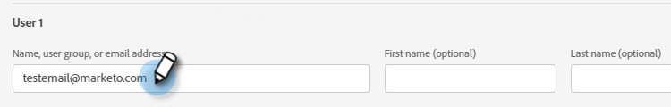

# Hinzufügen oder Entfernen von Benutzern {#add-or-remove-a-user}

## Hinzufügen von Benutzern {#add-a-user}

1. Melden Sie sich bei [Adobe Admin Console](https://adminconsole.adobe.com/) an.

   

1. Klicken Sie auf **Marketo Engage**.

   

1. Wählen Sie das gewünschte Abonnement aus (wenn Sie mehr als ein Abonnement haben).

   

1. Klicken Sie auf die Registerkarte **Benutzer** .

   

1. Klicken Sie auf die Schaltfläche **Benutzer hinzufügen** .

   

1. Geben Sie den Namen, die Benutzergruppe oder die E-Mail-Adresse des Benutzers ein, den Sie hinzufügen möchten. Vor- und Nachname sind optional.

   

1. Klicken Sie auf das Symbol **+** und wählen Sie das gewünschte Produktprofil aus.

   

1. Klicken Sie auf **Save**.

   

Der Benutzer erhält dann eine E-Mail, um sich bei Marketo anzumelden.

## Entfernen von Benutzern {#remove-a-user}

1. Melden Sie sich bei [Adobe Admin Console](https://adminconsole.adobe.com/) an.

   

1. Klicken Sie auf **Marketo Engage**.

   

1. Wählen Sie das gewünschte Abonnement aus (wenn Sie mehr als ein Abonnement haben).

   

1. Klicken Sie auf die Registerkarte **Benutzer** .

   

1. Wählen Sie den Benutzer aus, den Sie entfernen möchten, und klicken Sie auf die Schaltfläche **Entfernen** .

   

1. Klicken Sie zur Bestätigung auf **Benutzer entfernen** .

   

>[!MORELIKETHIS]
>
>* [Adobe Admin Console-Benutzer](https://helpx.adobe.com/enterprise/using/users.html)
>* [Benutzer einzeln verwalten](https://helpx.adobe.com/enterprise/using/manage-users-individually.html)

