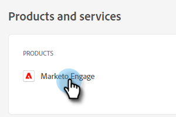

# Admin-Setup {#admin-setup}

Nachdem Sie als Adobe-Systemadministrator zu Marketo Engage in einer Adobe-Organisation hinzugefügt wurden, müssen Sie einige Schritte ausführen, um die Ersteinrichtung abzuschließen.

## Ersteinrichtung {#initial-setup}

1. Nachdem Sie als designierter Systemadministrator für Marketo Engage hinzugefügt wurden (in einer neuen oder etablierten Organisation), erhalten Sie eine Begrüßungs-E-Mail. Klicken Sie in dieser E-Mail auf **[!UICONTROL Erste Schritte]**.

   

1. Wenn Sie zuvor auf eine Anwendung mit einer Adobe ID zugegriffen haben, werden Sie direkt zur Adobe Admin Console weitergeleitet. Wenn nicht, [richten Sie Ihre Adobe ID ein](https://helpx.adobe.com/manage-account/using/create-update-adobe-id.html){target="_blank"}.

   

## Erstellen eines Produktprofils {#create-a-product-profile}

Nachdem der Systemadministrator auf die Admin Console zugegriffen hat, ist es an der Zeit, ein Produktprofil zu erstellen. Auf diese Weise erhalten Ihre Benutzer und Administratoren Zugriff auf Marketo Engage.

1. Klicken Sie auf **[!UICONTROL Seite]**&#x200B;Übersicht“ unter **[!UICONTROL Produkte und]** Services auf **Marketo Engage**.

   

1. Wählen Sie das gewünschte Abonnement aus. Wenn Sie nur über eine verfügen, fahren Sie mit dem nächsten Schritt fort.

   

   >[!NOTE]
   >
   >Wenn Sie mehrere Abonnements haben, müssen diese Schritte für jedes einzelne befolgt werden.

1. Klicken Sie auf **[!UICONTROL Schaltfläche „Neues]**&quot;.

   

1. Geben Sie Ihrem Produktprofil einen Namen (Anzeigename und Beschreibung sind optional) und klicken Sie auf **[!UICONTROL Weiter]**.

   

1. Es müssen keine Services ausgewählt werden. Klicken Sie auf **[!UICONTROL Speichern]**.

>[!NOTE]
>
>Wenn Sie mehrere Produktprofile einrichten, haben Benutzende denselben Zugriff auf Marketo, unabhängig davon, welchem Profil sie hinzugefügt werden.

>[!MORELIKETHIS]
>
>[Hinzufügen oder Entfernen eines Produktadministrators](/help/marketo/product-docs/administration/users-and-roles/add-or-remove-a-product-admin.md){target="_blank"}
