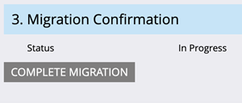
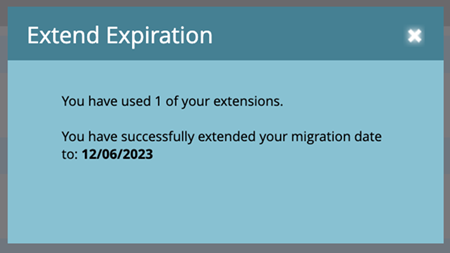
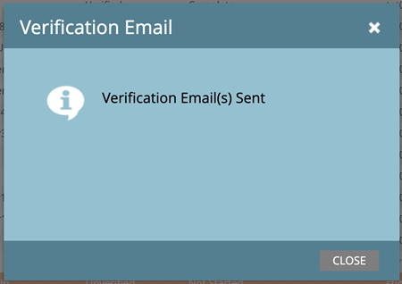
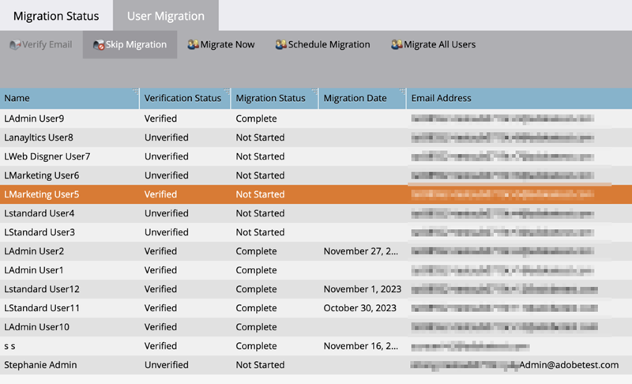
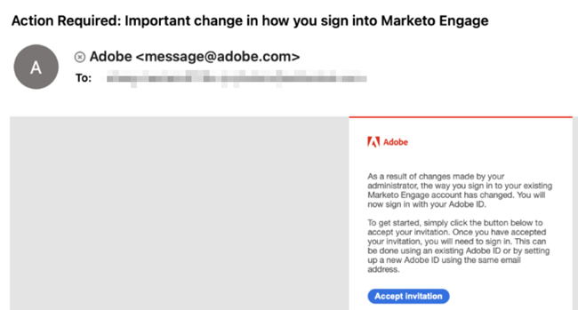

# Migrieren zu Adobe Identity {#migrating-to-adobe-identity}

Wenn Adobe die Benutzermigration eines Abonnements plant, erhalten Marketo Engage-Produktadmins Zugriff auf die Migrationskonsole. Diese befindet sich im Navigationsmenü im Bereich „Administrator“ unter „Integration“.

## Vormigration {#pre-migration}

Vor Beginn der Migration kann eine bzw. ein Admin das Startdatum der Benutzermigration für das Abonnement ändern, indem sie bzw. er in der Migrationskonsole zum Bildschirm „Vormigration“ navigiert. Um das Datum zu ändern, kann die bzw. der Admin auf die Schaltfläche **Bearbeiten** klicken.

Die bzw. der Admin kann ein Datum zwischen 8 und 30 Tagen in der Zukunft auswählen. Nach Auswahl eines Datums muss die bzw. der Admin auf **Speichern** klicken, um die Änderung anzuwenden.

>[!NOTE]
>
>Um ein Datum anzufordern, das weniger als 8 Tage oder länger als 30 Tage in der Zukunft liegt, oder um das Datum nach Sperren der Vormigrationskonsole anzupassen, senden Sie eine E-Mail an `marketocares@marketo.com`.

## Migrationen zu Adobe Identity {#migrations-to-adobe-identity}

Alle Marketo-Abonnements mit einer Zeitzone in den USA werden ab Mitternacht (Pacific Standard Time) des Startdatums der Benutzermigration migriert. Die Benutzermigration für alle anderen Abonnements beginnt um Mitternacht der für das Abonnement festgelegten Zeitzone. Nach Beginn der Benutzermigration eines Abonnements ist die Benutzerverwaltung nicht mehr im Bereich „Administrator“ von Marketo verfügbar, sondern kann nur noch in der Adobe Admin Console vorgenommen werden. Die Rollenverwaltung sowie die lokale Benutzerverwaltung (nur API) sind weiterhin auf der Registerkarte „Benutzer und Rollen“ im Bereich „Administrator“ von Marketo verfügbar.

Adobe migriert zuerst automatisch alle Marketo-Admins (mit einer standardmäßigen Admin-Rolle) mit verifizierten E-Mails. Wenn Marketo-Admins zu Adobe Identity migriert werden, werden sie als Produktadmins für das Marketo-Abonnement zur Adobe Admin Console des Abonnements hinzugefügt. Sie erhalten innerhalb der Marketo-Anwendung die Rolle „Adobe-Produktadmin“ (zusammen mit allen anderen Rollen, die sie zuvor innehatten) sowie ihre Adobe ID-Berechtigung für das Abonnement. Die Admins erhalten zwei E-Mails. Eine informiert darüber, dass sie als Admin Console-Produktadmins zugewiesen werden, und die andere, dass ihre Adobe ID für das Marketo-Produkt berechtigt ist.

>[!IMPORTANT]
>
>Sie müssen in der Berechtigungs-E-Mail auf die Schaltfläche **Einladung annehmen** klicken, um mit Ihrer Adobe ID auf Marketo Engage zugreifen zu können.

**Marketo-Produktadmin-E-Mail**

**Marketo-Berechtigungs-E-Mail**

**Wenn Ihr Marketo-Abonnement in Marketo und/oder Ihrer Adobe-Organisation kein SSO verwendet**, migriert Adobe die restlichen Benutzenden automatisch. Dieser Workflow soll ein Höchstmaß an Automatisierung bieten. Es ist keine zusätzliche Handlung erforderlich, um die Migration auszuführen. Nach Abschluss der Migration wird die Marketo-Migrationskonsole nicht mehr im Navigationsbereich „Administrator“ von Marketo angezeigt und alle Benutzenden greifen über eine Adobe ID auf Marketo zu.

**Wenn Ihr Marketo-Abonnement in Marketo und/oder Ihrer Adobe-Organisation SSO verwendet**, erhalten Marketo-Admins beim Beginn der Benutzermigration Zugriff auf das Self-Service-Tool für die Benutzermigration in der Migrationskonsole und werden über ein Banner bei der Anmeldung auf der Seite „Mein Marketo“ benachrichtigt. Die bzw. der Admin ist für den Abschluss der Benutzermigration über das Self-Service-Tool für die Benutzermigration verantwortlich.

## Marketo-Self-Service-Benutzermigration {#marketo-self-service-user-migration}

Das Marketo-Self-Service-Tool für die Benutzermigration in der Migrationskonsole verfügt über zwei Registerkarten.

* **Registerkarte „Migrationsstatus“**
* **Registerkarte „Benutzermigration“**

Es sind drei Hauptschritte erforderlich, um eine Self-Service-Migration abzuschließen.

1. Migrieren aller gewünschten, berechtigten Benutzenden mit einer verifizierten E-Mail-Adresse (Registerkarte „Benutzermigration“)
1. Überspringen aller nicht berechtigten Benutzenden und aller berechtigten, jedoch nicht gewünschten Benutzenden (Registerkarte „Benutzermigration“)
1. Bestätigen der Migration nach Abschluss der Schritte 1 und 2 (Registerkarte „Migrationsstatus“)

### Registerkarte „Migrationsstatus“ {#migration-status-tab}

Die Registerkarte „Migrationsstatus“ enthält allgemeine Metriken zum Fortschritt der erforderlichen E-Mail-Überprüfung der Benutzenden, zur Migration und Aktivierung der Benutzenden und zum Abschluss der Abonnementmigration.

Oben in der Registerkarte „Migrationsstatus“ werden der Ablauf der Abonnementmigration und die Schaltfläche zur Verlängerung des Ablaufs angezeigt. Weitere Informationen zum Ablauf der Migration finden Sie im [Abschnitt „Ablauf der Benutzermigration“](#user-migration-expiration).

Im nächsten Abschnitt der Registerkarte „Migrationsstatus“ befinden sich zwei Fortschrittsbalken. Der erste Fortschrittsbalken zeigt den Fortschritt der E-Mail-Überprüfung der Benutzenden an. Der zweite Fortschrittsbalken zeigt den Fortschritt der Benutzermigration an.

Darunter werden der bzw. dem Admin drei Abschnitte zum Status angezeigt.

* **E-Mail-Überprüfung der Benutzenden**: Überprüfungsstatus der Benutzenden im Abonnement.
* **Benutzermigration und -aktivierung**: Status der Benutzermigration und -aktivierung (Migration und Berechtigung für das Produkt Marketo Engage) der Benutzenden im Abonnement.
* **Migrationsbestätigung**: Status des Migrationsabschlusses des Abonnements.

#### E-Mail-Überprüfung der Benutzenden {#user-email-verification}

Im Abschnitt „E-Mail-Überprüfung“ für die Benutzenden können Admins den aktuellen Status der E-Mail-Überprüfung für die Benutzenden im Abonnement vor der Migration zu Adobe Identity einsehen.

Admins können den E-Mail-Überprüfungsstatus des Abonnements, den Prozentsatz der Benutzenden im Abonnement, die die E-Mail-Überprüfung abgeschlossen haben, und die Anzahl der Benutzenden anzeigen, die als „Übersprungen“ markiert wurden. Der Status wird über den E-Mail-Überprüfungsstatus aller Benutzenden im Abonnement gemeldet. Die bzw. der Admin kann auf die Anzahl der übersprungenen Benutzenden klicken und zur Registerkarte „Benutzermigration“ navigieren, um die übersprungenen Benutzenden anzuzeigen.

Die Überprüfungs-E-Mail kann von einer bzw. einem Admin auf der Registerkarte „Benutzermigration“ der Migrationskonsole und auf der Registerkarte „Benutzer und Rollen“ im Bereich „Administrator“ von Marketo oder von der Benutzerin bzw. dem Benutzer über die Kontoeinstellungen erneut gesendet werden. Wie bei Einladungs-E-Mails für Benutzende läuft der Link in der Überprüfungs-E-Mail nach 3 Tagen ab. Weitere Informationen zur E-Mail-Überprüfung finden Sie in der [Community](https://nation.marketo.com/) und in der [Dokumentation zur E-Mail-Überprüfung](/help/marketo/product-docs/administration/users-and-roles/email-verification.md).

>[!IMPORTANT]
>
>Wenn Marketo Engage-Benutzende ihre E-Mail-Adresse nicht verifizieren, können sie nicht zu einer Adobe ID migriert werden und verlieren den Zugriff auf das Marketo-Abonnement nach Abschluss der Migration. Um den Zugriff wiederzuerlangen, muss eine bzw. ein Marketo-Produktadmin sie als neue Benutzende hinzufügen.

#### Benutzermigration und -aktivierung {#user-migration-and-activation}

Im Abschnitt „Benutzermigration und -aktivierung“ kann eine bzw. ein Admin den aktuellen Status der gesamten Benutzermigration und der Berechtigung für das Identitäts-Management-System von Adobe einsehen.

Eine bzw. ein Admin kann den Prozentsatz der Benutzenden in ihrem Abonnement anzeigen, die zu einer Adobe ID migriert oder als „Übersprungen“ markiert wurden. Der Status wird über den Status der Migration zu einer Adobe ID aller Benutzenden im Abonnement oder der als „Übersprungen“ markierten und nicht migrierten Benutzenden gemeldet. Wenn Benutzende migriert werden und die Berechtigung für Marketo Engage erhalten oder wenn sie übersprungen werden, wird dieser Status aktualisiert.

#### Migrationsbestätigung {#migration-confirmation}

Im Abschnitt „Migrationsbestätigung“ muss eine bzw. ein Admin bestätigen, dass die Benutzermigration für das Abonnement abgeschlossen ist.

Sobald alle Benutzenden im Abonnement berücksichtigt (migriert oder übersprungen) wurden, wird die Schaltfläche „Vollständige Migration“ angezeigt.

Die bzw. der Admin, die bzw. der die Migration durchführt, muss die Migration durch Klicken auf die Schaltfläche **Vollständige Migration** bestätigen. Sie werden zum **Bestätigen** aufgefordert.

Nachdem der Abschluss der Benutzermigration bestätigt wurde, wird die Migrationskonsole aus dem Navigationsmenü im Bereich „Administrator“ entfernt.

### Ablauf der Benutzermigration {#user-migration-expiration}

Adobe verlangt, dass Kundinnen und Kunden Self-Service-Migrationen innerhalb von 30 Tagen abschließen. Admins werden nach Überschreiten des Ablaufdatums nicht daran gehindert, Benutzende zu migrieren oder die Migration abzuschließen. Sie können dann jedoch nur noch Benutzende nach Bedarf migrieren. Wenn Admins mehr Zeit benötigen, können sie das Ablaufdatum des Abonnements verlängern.

Nach Klicken auf die Schaltfläche **Ablauf verlängern** wird das Datum auf eine Woche später aktualisiert. Admins können den Ablauf bis zu dreimal verlängern.

Adobe setzt sich mit Ihnen in Verbindung, wenn Sie die Migration nicht bis zum Ablaufdatum abschließen.

### Registerkarte „Benutzermigration“ {#user-migration-tab}

Die Registerkarte „Benutzermigration“ bietet Admins die Tools, mit denen sie die Benutzermigration vollständig steuern können.

Admins haben folgende Möglichkeiten:

* Auslösen von Überprüfungs-E-Mails für nicht verifizierte Benutzende über die Schaltfläche „E-Mail bestätigen“
* Überspringen der Benutzermigration für Benutzende über die Schaltfläche „Migration überspringen“, von denen Admins wissen, dass sie ihre E-Mail nicht verifizieren können/werden, oder die nicht migriert werden sollten
* Migrieren von ausgewählten Benutzenden nach Bedarf über die Schaltfläche „Jetzt migrieren“
* Planen der Benutzermigration für ausgewählte Benutzende an einem bestimmten Datum über die Schaltfläche „Migration planen“
* Migrieren aller berechtigten Benutzenden nach Bedarf (keine Benutzerauswahl erforderlich) über die Schaltfläche „Alle Benutzenden migrieren“

**Verifizieren der E-Mail-Adresse**

Eine E-Mail-Überprüfung ist erforderlich, damit Benutzende zu einer Adobe ID migriert werden können. Wenn Benutzende vorhanden sind, die ihre E-Mail-Adresse nicht verifiziert haben und migriert werden müssen, kann die bzw. der Admin veranlassen, dass die Überprüfungs-E-Mail erneut an die Benutzenden gesendet wird. Bei Auswahl nicht verifizierter Benutzender wird die Schaltfläche „E-Mail bestätigen“ klickbar.

Wenn die bzw. der Admin auf die Schaltfläche **E-Mail bestätigen** klickt, erhält sie bzw. er eine Benachrichtigung, dass die E-Mail gesendet wurde.

**Überspringen und Aufheben des Überspringens der Benutzermigration**

Während der Benutzermigration müssen alle Benutzenden entweder migriert oder übersprungen werden. Adobe verlangt, dass Admins bestätigen, wenn eine Benutzerin bzw. ein Benutzer nicht migriert wird, und dass sie die Benutzerin bzw. den Benutzer als „Übersprungen“ markieren. Wenn dies nicht geschieht, kann der Abschluss der Benutzermigration nicht bestätigt werden. Alle übersprungenen Benutzenden verlieren den Zugriff auf Marketo, sobald die Benutzermigration abgeschlossen ist.

>[!IMPORTANT]
>
>Eine bzw. ein Admin muss alle Benutzenden mit nicht verifizierten E-Mail-Adressen überspringen. Wenn es Benutzende gibt, die ihre E-Mail-Adresse verifiziert haben, die bzw. der Admin sie jedoch aus irgendeinem Grund nicht migrieren möchte, sollten sie als „Übersprungen“ markiert werden.

Um Benutzende zu überspringen, kann die bzw. der Admin die gewünschten Benutzenden auswählen. Die Schaltfläche „Migration überspringen“ wird klickbar. Nach Klicken auf **Migration überspringen** wird die Seite aktualisiert und der Überprüfungs- und Migrationsstatus der ausgewählten Benutzerin bzw. des ausgewählten Benutzers werden zu „Übersprungen“ aktualisiert.

Eine bzw. ein Admin kann das Überspringen von zuvor übersprungenen Benutzenden aufheben, wenn festgestellt wird, dass die Benutzenden migriert werden müssen.

Um das Überspringen für Benutzende aufzuheben, kann die bzw. der Admin die gewünschten Benutzenden auswählen. Die Schaltfläche „Migration nicht überspringen“ wird klickbar. Nach Klicken auf die Schaltfläche **Migration nicht überspringen** wird die Seite aktualisiert.  Der Überprüfungsstatus der ausgewählten Benutzerin bzw. des ausgewählten Benutzers wird auf den aktuellen Status aktualisiert („Verifiziert“ oder „Nicht verifiziert“) und der Migrationsstatus auf „Nicht gestartet“.

>[!NOTE]
>
>Die Schaltfläche „Migration nicht überspringen“ ist nur aktiv, wenn alle ausgewählten Benutzenden über den Migrationsstatus „Übersprungen“ verfügen.

### Migrieren von Marketo-Benutzenden zu Adobe IDs {#migrating-marketo-users-to-adobe-ids}

Marketo-Produktadmins können wählen, ob sie Benutzende in Batches oder alle berechtigten Benutzenden gleichzeitig migrieren möchten. Nach Auswahl der Benutzenden stehen Admins die Optionen „Jetzt migrieren“ oder „Migration planen“ (für einen späteren Zeitpunkt) zur Verfügung. Dadurch sind Admins flexibel und haben Kontrolle darüber, welche Benutzenden migriert werden und wann dies geschieht. Admins wird außerdem die Option „Alle Benutzenden migrieren“ (in einem Abonnement) angezeigt.

Beispielsweise kann eine bzw. ein Admin eine Gruppe von „Hauptbenutzenden“ auswählen, die zuerst migriert werden soll. Sobald diese Benutzermigrationen erfolgreich abgeschlossen sind, können sie verschiedene Benutzergruppen basierend auf Variablen wie Arbeitsbereich/Unternehmen oder Funktion/Rolle auswählen, um weitere Benutzermigrationen in Batches durchzuführen. Oder sie können sich entscheiden, nach Erfolg des ersten Batches die restlichen Benutzenden in den Abonnements zu migrieren. Ziel ist es, den Benutzenden die größte Flexibilität bei der Einführung von Adobe IDs zu bieten.

Alle Benutzermigrationen finden gleichzeitig statt und sollten innerhalb von sechzig Sekunden erfolgreich abgeschlossen sein. Während die Benutzermigration für eine bestimmte Benutzerin bzw. einen bestimmten Benutzer erfolgt, kann die Person für bis zu 1 Minute den Zugriff verlieren. Dies geschieht nur, wenn die Person bei der Anwendung angemeldet ist. Nach Abschluss der Benutzermigration erhalten Benutzende eine E-Mail mit der Anleitung, wie die Anmeldung bei Marketo Engage mit einer Adobe-Identität funktioniert. Benutzende müssen die Einladung über den Link auf der Schaltfläche in der E-Mail annehmen, _bevor_ sie sich mit einer Adobe ID anmelden können. Eine Anleitung zur Anmeldung bei Marketo Engage mit einer Adobe ID [finden Sie hier](/help/marketo/product-docs/administration/marketo-with-adobe-identity/user-sign-in-with-adobe-id.md).

Benutzermigrationen werden unabhängig voneinander verarbeitet. Wenn eine Benutzermigration fehlschlägt, verarbeitet Adobe also weiterhin andere Benutzermigrationen. Wenn eine Benutzermigration fehlschlägt, ist kein Eingreifen von einer bzw. einem Admin erforderlich. Die bzw. der Admin erhält eine E-Mail-Benachrichtigung über den Fehler und wird darauf hingewiesen, dass Adobe an der sofortigen Behebung des Problems arbeitet. Wenn die Migration einer Benutzerin bzw. eines Benutzers fehlschlägt und diese Person bei Marketo Engage angemeldet ist, verliert die Benutzerin bzw. der Benutzer möglicherweise für bis zu zwei Minuten den Zugriff, während es erneut zu Migrationsversuchen kommt. Wenn die Migration einer Benutzerin bzw. eines Benutzers fehlschlägt, kann die Person weiterhin mit ihrer Marketo-Identität auf Marketo Engage zugreifen, bis sie per E-Mail über die erfolgreiche Migration informiert und dazu aufgefordert wird, sich mit einer Adobe ID anzumelden.

**Jetzt migrieren**

Eine bzw. ein Admin kann eine oder mehrere Personen nach Bedarf für die Migration auswählen. Dadurch wird die Benutzermigration sofort ausgelöst. Um eine oder mehrere Personen zu migrieren, kann die bzw. der Admin die gewünschten Personen auswählen. Dadurch wird die Schaltfläche „Jetzt migrieren“ klickbar.

>[!NOTE]
>
>Die Schaltfläche „Jetzt migrieren“ ist nur aktiv, wenn alle ausgewählten Benutzenden den Überprüfungsstatus „Verifiziert“ haben.

Nach Klicken auf die Schaltfläche **Jetzt migrieren** wird die bzw. der Admin aufgefordert, die Migration der ausgewählten Benutzenden zu bestätigen. Wenn dies von der bzw. dem Admin bestätigt wird, beginnt die Verarbeitung der Benutzermigrationen so bald wie möglich.

**Migration planen**

Eine bzw. ein Admin kann eine Person oder mehrere Personen auswählen, um deren Migration für einen späteren Zeitpunkt zu planen. Um die Migration für eine oder mehrere Personen zu planen, wählt die bzw. der Admin die gewünschten Personen aus. Dadurch wird die Schaltfläche „Migration planen“ klickbar.

>[!NOTE]
>
>Die Schaltfläche „Migration planen“ ist nur aktiv, wenn alle Benutzenden den Überprüfungsstatus „Verifiziert“ und den Migrationsstatus „Nicht gestartet“ oder „Adobe ID erstellt“ haben.

Nach Klicken auf die Schaltfläche **Migration planen** wird die bzw. der Admin aufgefordert, das gewünschte Migrationsdatum für die ausgewählten Benutzenden auszuwählen. Die bzw. der Admin kann nur Daten auswählen, die vor dem Ablaufdatum der Migration des Abonnements liegen. Nach Bestätigung der bzw. des Admins wird der Beginn der Verarbeitung der Benutzermigrationen für das ausgewählte Datum geplant.

>[!NOTE]
>
>Alle Marketo-Abonnements mit einer Zeitzone in den USA werden ab Mitternacht (Pacific Standard Time) des Startdatums der Migration migriert. Die Benutzermigration für alle anderen Abonnements beginnt um Mitternacht der für das Abonnement festgelegten Zeitzone.

**Alle Benutzenden migrieren**

Eine bzw. ein Admin kann sich jederzeit dazu entscheiden, alle berechtigten Benutzenden eines Abonnements zu migrieren. Dadurch wird die Migration der berechtigten Benutzenden sofort ausgelöst. Berechtigte Benutzende sind Benutzende mit verifizierten E-Mail-Adressen, die noch nicht migriert wurden.

Nach Klicken auf die Schaltfläche **Alle Benutzenden migrieren** wird die bzw. der Admin aufgefordert, die Migration der berechtigten Benutzenden zu **bestätigen**. Sobald dies von der bzw. dem Admin bestätigt wird, beginnt die Verarbeitung der Benutzermigrationen so bald wie möglich.

