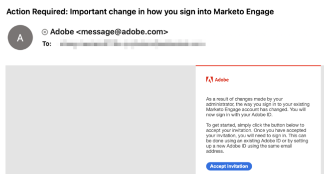

# Migrieren zu Adobe Identity {#migrating-to-adobe-identity}

Wenn Adobe die Benutzermigration eines Abonnements plant, erhalten Marketo Engage-Produktadministratoren Zugriff auf die Migrationskonsole, die im Navigationsmenü im Admin-Bereich unter „Integration“ zu finden ist.

## Vormigration {#pre-migration}

Vor Beginn der Migration kann ein Administrator das Startdatum der Benutzermigration für sein Abonnement ändern, indem er in der Migrationskonsole zum Bildschirm vor der Migration navigiert. Um das Datum zu ändern, kann der Administrator auf die Schaltfläche **Bearbeiten** klicken.

Der Administrator kann ein Datum zwischen 8 und 30 Tagen in der Zukunft auswählen. Wenn ein Datum ausgewählt ist, muss der Administrator auf **Speichern** klicken, um die Änderung vorzunehmen.

>[!NOTE]
>
>Um ein Datum anzufordern, das vor acht Tagen oder älter als 30 ist, oder um das Datum anzupassen, das nach der Sperrung der Konsole vor der Migration erforderlich ist, senden Sie eine E-Mail an `marketocares@marketo.com`.

## Migrationen zur Adobe-Identität {#migrations-to-adobe-identity}

Alle Marketo-Abonnements mit einer Zeitzone in den USA werden ab Mitternacht (Pacific Standard Time) des Startdatums der Benutzermigration migriert. Die Benutzermigration für alle anderen Abonnements beginnt um Mitternacht in der angegebenen Zeitzone des Abonnements. Wenn die Benutzermigration eines Abonnements beginnt, ist die Benutzerverwaltung nicht mehr im Marketo-Admin-Bereich verfügbar und erfolgt nur noch in der Adobe Admin Console. Die Rollenverwaltung verbleibt auf der Registerkarte „Benutzer und Rollen“ im Marketo-Administratorbereich sowie auf der lokalen Benutzerverwaltung (nur API).

Adobe migriert automatisch alle Marketo-Administratoren (mit der standardmäßigen Administratorrolle) mit verifizierten E-Mails. Wenn Marketo-Administrierende zur Adobe Identity migriert werden, werden sie als Produktadministrator für das Marketo-Abonnement zum Adobe Admin Console des Abonnements hinzugefügt und erhalten innerhalb des Marketo-Programms die Adobe-Produktadministratorrolle (zusammen mit allen anderen Rollen, die sie zuvor hatten) und haben ihre Adobe ID-Berechtigung für das Abonnement. Die Administratoren erhalten zwei E-Mails. Eine gibt an, dass sie als Admin Console-Produktadministrator zugewiesen werden, und die andere gibt an, dass ihre Adobe ID zum Marketo-Produkt berechtigt sind.

>[!IMPORTANT]
>
>Sie müssen in der Berechtigungs **E-Mail auf die Schaltfläche** Einladung annehmen“ klicken, um mit Ihrer Adobe ID auf Marketo Engage zugreifen zu können.

**E-Mail an Marketo-Produktadministrator**

**E-Mail zu Marketo-Berechtigungen**

**Wenn Ihr Marketo-Abonnement in Marketo und/oder Ihrer Adobe-Organisation nicht über SSO**, migriert Adobe automatisch die restlichen Benutzenden. Dieser Workflow soll ein Höchstmaß an Automatisierung bieten, und es ist keine Aktion erforderlich, um die Migration auszuführen. Nach Abschluss der Migration wird die Marketo-Migrationskonsole nicht mehr im Marketo Admin-Navigationsbereich angezeigt und alle Benutzenden greifen über eine Adobe ID auf Marketo zu.

**Wenn Ihr Marketo-Abonnement SSO in Marketo und/oder Ihrer Adobe-Organisation** enthält, erhalten Marketo-Administratoren beim Beginn der Benutzermigration Zugriff auf das Self-Service-Benutzermigrations-Tool der Migrationskonsole und werden über ein Banner bei der Anmeldung auf der Seite Mein Marketo benachrichtigt. Der Administrator ist für den Abschluss der Benutzermigration mithilfe des Self-Service-Tools für die Benutzermigration verantwortlich.

## Marketo Self-Service-Benutzermigration {#marketo-self-service-user-migration}

Das Marketo Self-Service-Tool für die Benutzermigrationskonsole besteht aus zwei Registerkarten.

* **Registerkarte Migrationsstatus**
* **Registerkarte „Benutzermigration“**

Es sind drei Hauptschritte erforderlich, um eine Self-Service-Migration abzuschließen.

1. Alle gewünschten, für eine E-Mail-Adresse verifizierten Benutzer migrieren (Registerkarte Benutzermigration)
1. Alle nicht zulässigen Benutzer und alle unerwünschten zulässigen Benutzer überspringen (Registerkarte Benutzermigration )
1. Nachdem die Schritte 1 und 2 abgeschlossen sind, schließen Sie die Migrationsbestätigung ab (Registerkarte Migrationsstatus )

### Registerkarte Migrationsstatus {#migration-status-tab}

Die Registerkarte Migrationsstatus enthält allgemeine Metriken zum Fortschritt der erforderlichen E-Mail-Verifizierung der Benutzer, zur Migration und Aktivierung der Benutzer und zum Abschluss der Abonnementmigration.

Oben im Migrationsstatus werden der Ablauf der Abonnementmigration und die Schaltfläche zur Verlängerung des Ablaufs angezeigt. Weitere Informationen zum Ablauf der Migration finden Sie im [Abschnitt Ablauf der Benutzermigration](#user-migration-expiration).

Im nächsten Abschnitt der Registerkarte Migrationsstatus gibt es zwei Fortschrittsbalken. Die erste Fortschrittsleiste zeigt den Fortschritt der Benutzer-E-Mail-Bestätigung an. Die zweite Fortschrittsleiste zeigt den Fortschritt der Benutzermigration an.

Als Nächstes gibt es drei Abschnitte des Status, der dem Administrator angezeigt wird.

* **Benutzer-E-Mail**&#x200B;Überprüfung: Überprüfungsstatus von Benutzern im Abonnement.
* **Benutzermigration und -aktivierung**: Benutzermigrations- und -aktivierungsstatus (Migration und Berechtigung für das Marketo Engage-Produkt) der Benutzenden im Abonnement.
* **Migrationsbestätigung**: Abschlussstatus der Migration des Abonnements.

#### Benutzer-E-Mail-Überprüfung {#user-email-verification}

Im Abschnitt E-Mail-Verifizierung für Benutzer kann ein Administrator den aktuellen Status der E-Mail-Verifizierung für die Benutzer im Abonnement vor der Migration zu Adobe Identity feststellen.

Ein Administrator kann den E-Mail-Überprüfungsstatus des Abonnements, den Prozentsatz der Benutzer im Abonnement, die die E-Mail-Überprüfung abgeschlossen haben, und die Anzahl der Benutzer, die als übersprungen markiert wurden, einsehen. Der Status wird über den Status des E-Mail-Bestätigungsstatus aller Benutzer im Abonnement gemeldet. Der Administrator kann auf die Anzahl der übersprungenen Benutzer klicken und zur Registerkarte Benutzermigration navigieren, um die übersprungenen Benutzer anzuzeigen.

Die Verifizierungs-E-Mail kann von einem Administrator auf der Registerkarte „Benutzermigration“ der Migrationskonsole und auf der Registerkarte „Benutzer und Rollen“ im Bereich &quot;Marketo Admin“ bzw. von dem Benutzer in den Kontoeinstellungen erneut gesendet werden. Wie bei E-Mails mit Benutzereinladungen läuft der Link in der Verifizierungs-E-Mail in 3 Tagen ab. Weitere Informationen zur E-Mail-Überprüfung finden Sie in der [Community](https://nation.marketo.com/) und in der [Dokumentation zur E-Mail-Überprüfung](/help/marketo/product-docs/administration/users-and-roles/email-verification.md).

>[!IMPORTANT]
>
>Wenn Marketo Engage-Benutzende ihre E-Mail-Adresse nicht verifizieren, können sie nicht zu einer Adobe ID migriert werden und verlieren den Zugriff auf das Marketo-Abonnement, nachdem die Migration abgeschlossen ist. Um den Zugriff wiederzuerlangen, muss ein Marketo-Produktadministrator sie als neuen Benutzer hinzufügen.

#### Benutzermigration und Aktivierung {#user-migration-and-activation}

Im Abschnitt „Benutzermigration und Aktivierung“ kann ein Administrator den aktuellen Status der gesamten Benutzermigration und die Berechtigung für das Adobe Identity Management-System finden.

Ein Administrator kann den Prozentsatz der Benutzenden in ihrem Abonnement anzeigen, die zu einer Adobe ID migriert wurden oder als „Übersprungen“ markiert sind. Der Status wird beim Status des Migrationsstatus aller Benutzer zu einer Adobe ID im Abonnement gemeldet oder als „Übersprungen“ gekennzeichnet und wird nicht migriert. Wenn Benutzende migriert werden, die Berechtigung für Marketo Engage haben oder übersprungen werden, wird dieser Status aktualisiert.

#### Migrationsbestätigung {#migration-confirmation}

Im Abschnitt Migrationsbestätigung muss ein Administrator bestätigen, dass die Benutzermigration für das Abonnement abgeschlossen ist.

Sobald alle Benutzenden im Abonnement berücksichtigt (migriert oder übersprungen) wurden, wird die Schaltfläche „Migration abschließen“ angezeigt.

Der Administrator, der die Migration durchführt, muss die Migrationsbestätigung durch Klicken auf die Schaltfläche **Migration**. Sie werden aufgefordert, Folgendes zu **Bestätigen**.

Nachdem der Abschluss der Benutzermigration bestätigt wurde, wird die Migrationskonsole aus dem Admin-Navigationsmenü entfernt.

### Ablauf der Benutzermigration {#user-migration-expiration}

Adobe verlangt, dass Kunden Self-Service-Migrationen innerhalb von 30 Tagen durchführen. Administratoren werden nicht daran gehindert, Benutzer zu migrieren oder die Migration abzuschließen, wenn das Ablaufdatum überschritten ist. Sie können jedoch nur Benutzer nach Bedarf migrieren. Wenn ein Administrator mehr Zeit benötigt, kann er das Ablaufdatum des Abonnements verlängern.

Nach dem Klicken auf **Schaltfläche** verlängern wird das Datum auf eine Woche später aktualisiert. Ein Administrator kann die Gültigkeit bis zu dreimal verlängern.

Adobe wird sich mit Ihnen in Verbindung setzen, wenn Sie die Migration nicht bis zum Ablaufdatum abschließen.

### Registerkarte „Benutzermigration“ {#user-migration-tab}

Die Registerkarte Benutzermigration bietet Admins die Tools, um die Benutzermigration vollständig steuern zu können.

Administratoren haben folgende Möglichkeiten:

* E-Mails zur Benutzerüberprüfung für nicht verifizierte Trigger über die Schaltfläche „E-Mail überprüfen“
* Benutzermigration überspringen für Benutzer, von denen der Administrator weiß, dass sie ihre E-Mail verifizieren können/werden, oder die nicht über die Schaltfläche „Migration überspringen“ migriert werden sollten
* Ausgewählte(n) Benutzer bei Bedarf über die Schaltfläche „Jetzt migrieren“ migrieren
* Benutzermigration für ausgewählten Benutzer für ein bestimmtes Datum über die Schaltfläche „Migration planen“ planen
* Alle berechtigten Benutzer bei Bedarf migrieren (keine Benutzerauswahl erforderlich) über die Schaltfläche „Alle Benutzer migrieren“

**E-Mail überprüfen**

Eine E-Mail-Überprüfung ist erforderlich, damit Benutzende zu einer Adobe ID migriert werden können. Wenn Benutzer vorhanden sind, die ihre E-Mail-Adresse nicht verifiziert haben und migriert werden müssen, kann der Administrator die Verifizierungs-E-Mail an den Trigger senden, um sie erneut zu senden. Wenn Sie einen nicht verifizierten Benutzer auswählen, kann der Button „E-Mail überprüfen“ angeklickt werden.

Wenn der Administrator auf die Schaltfläche **E-Mail überprüfen** klickt, erhält er eine Benachrichtigung, dass die E-Mail gesendet wurde.

**Benutzermigration überspringen und**

Während der Benutzermigration müssen alle Benutzer entweder migriert oder übersprungen werden. Adobe erfordert, dass Administratoren bestätigen, dass ein Benutzer nicht migriert wird, und ein Administrator muss den Benutzer als übersprungen markieren. Wenn der Administrator dies nicht tut, kann er den Abschluss der Benutzermigration nicht bestätigen. Alle übersprungenen Benutzer verlieren den Zugriff auf Marketo, sobald die Benutzermigration abgeschlossen ist.

>[!IMPORTANT]
>
>Ein Administrator muss alle Benutzer mit nicht verifizierten E-Mails überspringen. Wenn es Benutzer gibt, die ihre E-Mails überprüft haben, der Administrator sie jedoch aus irgendeinem Grund nicht migrieren möchte, sollten sie als übersprungen markiert werden.

Um einen Benutzer zu überspringen, kann der Administrator den/die gewünschten Benutzer auswählen. Die Schaltfläche „Migration überspringen“ wird anklickbar. Nach dem Klicken auf **Migration überspringen** wird die Seite aktualisiert und der Verifizierungsstatus und Migrationsstatus des ausgewählten Benutzers werden in „Übersprungen“ aktualisiert.

Ein Administrator kann einen zuvor übersprungenen Benutzer überspringen, wenn festgestellt wird, dass der Benutzer migriert werden muss.

Um die Überspringungsvorgänge für Benutzer aufzuheben, kann der Administrator den gewünschten Benutzer auswählen. Die Schaltfläche „Migration überspringen“ wird anklickbar. Wenn Sie auf die Schaltfläche **Migration** nicht überspringen) klicken, wird die Seite aktualisiert.  Der Überprüfungsstatus des ausgewählten Benutzers wird auf den aktuellen Status aktualisiert, entweder auf „Verifiziert“ oder „Nicht verifiziert“, und der Migrationsstatus des Benutzers wird auf „Nicht gestartet“ aktualisiert.

>[!NOTE]
>
>Die Schaltfläche „Migration überspringen“ ist nur aktiv, wenn alle ausgewählten Benutzer über den Migrationsstatus „Übersprungen“ verfügen.

### Migrieren von Marketo-Benutzern zu Adobe IDs {#migrating-marketo-users-to-adobe-ids}

Produktadministratoren von Marketo können Benutzende auswählen, die stapelweise migriert werden sollen, oder alle berechtigten Benutzenden gleichzeitig. Sobald Benutzer ausgewählt sind, haben Administratoren die Möglichkeit, „Jetzt migrieren“ oder „Migration planen“ für einen späteren Zeitpunkt, sodass Administratoren flexibel entscheiden können, welche Benutzer wann migriert werden. Admins wird außerdem die Option „Alle Benutzer migrieren“ in einem Abonnement angezeigt.

Beispielsweise kann ein Administrator eine Gruppe von „Hauptbenutzern“ auswählen, die zuerst migriert werden sollen. Sobald diese Benutzermigrationen erfolgreich abgeschlossen sind, können sie verschiedene Benutzergruppen basierend auf Variablen wie Arbeitsbereich/Unternehmen oder Funktion/Rolle auswählen, um weitere Batch-Benutzermigrationen durchzuführen. Oder sie können sich entscheiden, die restlichen Benutzenden in den Abonnements nach dem Erfolg des ersten Batches zu migrieren. Ziel ist es, den Benutzern die größte Flexibilität beim Rollout von Adobe IDs zu bieten.

Alle Benutzermigrationen finden gleichzeitig statt und sollten innerhalb von sechzig Sekunden erfolgreich abgeschlossen werden. Während die Benutzermigration für eine bestimmte Benutzerin oder einen bestimmten Benutzer erfolgt, kann die Benutzerin oder der Benutzer für bis zu 1 Minute den Zugriff verlieren, und zwar nur, wenn die Benutzerin oder der Benutzer bei der Anwendung angemeldet ist. Nach Abschluss der Benutzermigration erhält der/die Benutzende eine E-Mail, in der beschrieben wird, wie er/sie sich mit einer Adobe-Identität bei Marketo Engage anmeldet. Der Benutzer muss die Einladung über den Button-Link in der E-Mail annehmen _bevor_ sich mit einer Adobe ID anmelden können. Eine Anleitung zur Anmeldung bei Marketo Engage mit einem Adobe ID [finden Sie hier](/help/marketo/product-docs/administration/marketo-with-adobe-identity/user-sign-in-with-adobe-id.md).

Benutzermigrationen werden unabhängig verarbeitet. Wenn eine Benutzermigration fehlschlägt, verarbeitet Adobe also weiterhin andere Benutzermigrationen. Wenn die Benutzermigration fehlschlägt, ist keine Aktion von einem Administrator erforderlich. Der Administrator erhält eine E-Mail-Benachrichtigung über den Fehler und wird darauf hingewiesen, dass Adobe daran arbeitet, das Problem sofort zu beheben. Wenn die Migration einer Benutzerin oder eines Benutzers fehlschlägt und diese Person bei Marketo Engage angemeldet ist, kann die Benutzerin oder der Benutzer den Zugriff für bis zu zwei Minuten verlieren, während es erneut zu Migrationsversuchen kommt. Wenn die Migration einer Benutzerin oder eines Benutzers fehlschlägt, kann die Person weiterhin mit ihrer Marketo-Identität auf Marketo Engage zugreifen, bis sie per E-Mail darüber informiert wird, dass die Migration erfolgreich war, und sie bzw. er aufgefordert wird, sich mit einer Adobe ID anzumelden.

**Jetzt migrieren**

Ein Administrator kann bei Bedarf einen oder mehrere Benutzer für die Migration auswählen. Dadurch wird die Benutzermigration sofort Trigger. Um einen oder mehrere Benutzer zu migrieren, kann der Administrator die gewünschten Benutzer auswählen, und die Schaltfläche „Jetzt migrieren“ wird anklickbar.

>[!NOTE]
>
>Die Schaltfläche „Jetzt migrieren“ ist nur aktiv, wenn alle ausgewählten Benutzer einen „Verifizierten“ Verifizierungsstatus haben.

Beim Klicken auf **Schaltfläche** Jetzt migrieren“ wird der Administrator aufgefordert, die Migration der ausgewählten Benutzer zu bestätigen. Sobald dies vom Administrator bestätigt wird, beginnen die Benutzermigrationen so bald wie möglich mit der Verarbeitung.

**Migration planen**

Ein Administrator kann einen oder mehrere Benutzer auswählen, um die Migration für einen späteren Zeitpunkt zu planen. Um die Migration für einen oder mehrere Benutzer zu planen, wählt der Administrator die gewünschten Benutzer aus, und die Schaltfläche „Migration planen“ wird angeklickt.

>[!NOTE]
>
>Die Schaltfläche „Geplante Migration“ ist nur aktiv, wenn alle Benutzenden den Überprüfungsstatus „Geprüft“ und den Migrationsstatus „Nicht gestartet“ oder &quot;Adobe ID erstellt“ haben.

Beim Klicken auf **Migration planen** wird der Administrator aufgefordert, das gewünschte Migrationsdatum für die ausgewählten Benutzer auszuwählen. Der Administrator kann nur Daten vor dem Ablaufdatum der Migration des Abonnements auswählen. Sobald die Administratorin bzw. der Administrator dies bestätigt, ist geplant, dass die Benutzermigration(en) am ausgewählten Datum verarbeitet wird bzw. werden.

>[!NOTE]
>
>Alle Marketo-Abonnements mit einer Zeitzone in den USA werden ab Mitternacht (Pacific Standard Time) des Migrationsstartdatums migriert. Die Benutzermigration für alle anderen Abonnements beginnt um Mitternacht in der angegebenen Zeitzone des Abonnements.

**Alle Benutzer migrieren**

Ein Administrator kann auswählen, ob alle berechtigten Benutzer eines Abonnements jederzeit migriert werden sollen. Dadurch wird die Migration der berechtigten Benutzenden sofort zu einem Trigger. Berechtigte Benutzer sind Benutzer mit verifizierten E-Mails, die noch nicht migriert wurden.

Wenn Sie auf die Schaltfläche **Alle Benutzer migrieren** klicken, wird der Administrator aufgefordert, die **aller** Benutzer zu bestätigen. Wenn der Administrator dies bestätigt, beginnen die Benutzermigrationen so bald wie möglich zu verarbeiten.

