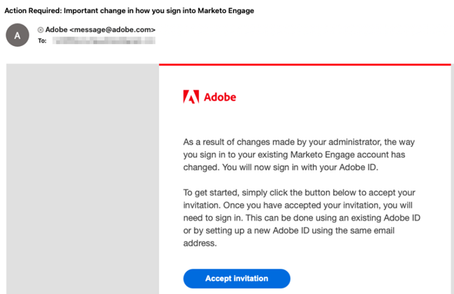

# Migration zur Adobe Identity {#migrating-to-adobe-identity}

Wenn Adobe die Benutzermigration eines Abonnements plant, erhalten Marketo Engage-Produkt-Administratoren Zugriff auf die Migrationskonsole, die im Navigationsmenü im Admin-Bereich unter &quot;Integration&quot;zu finden ist.

## Vormigration {#pre-migration}

Vor Beginn der Migration kann ein Administrator das Startdatum der Benutzermigration für sein Abonnement ändern, indem er zum Bildschirm &quot;Vormigration&quot;in der Migrationskonsole navigiert. Um das Datum zu ändern, kann der Administrator auf die **Bearbeiten** Schaltfläche.

Der Administrator kann ein Datum zwischen 8 und 30 Tagen in der Zukunft wählen. Bei der Auswahl eines Datums muss der Administrator auf **Speichern** , um die Änderung vorzunehmen.

>[!NOTE]
>
>Wenn Sie ein Datum vor 8 Tagen oder nach 30 Tagen anfordern oder das Datum nach der Sperrung der Vormigrationskonsole anpassen möchten, senden Sie eine E-Mail an `marketocares@marketo.com`.

## Migration zur Adobe Identity {#migrations-to-adobe-identity}

Alle Marketo-Abonnements mit einer US-Zeitzone werden ab Mitternacht (Pacific Standard Time) des Startdatums der Benutzermigration migriert. Die Benutzermigration für alle anderen Abonnements beginnt um Mitternacht der angegebenen Zeitzone des Abonnements. Wenn die Benutzermigration eines Abonnements beginnt, ist die Benutzerverwaltung nicht mehr im Marketo Admin-Bereich verfügbar und wird nur in der Adobe Admin Console durchgeführt. Die Rollenverwaltung verbleibt auf der Registerkarte &quot;Benutzer und Rollen&quot;im Marketo-Admin-Bereich sowie in der lokalen (nur API) Benutzerverwaltung.

Adobe migriert automatisch alle Marketo-Administratoren mit verifizierten E-Mails. Wenn Marketo-Administratoren zu Adobe Identity migriert werden, werden sie zum Adobe Admin Console des Abonnements als Produktadministrator für das Marketo-Abonnement hinzugefügt und erhalten in der Marketo-Anwendung die Adobe Product Admin-Rolle (zusammen mit allen anderen Rollen, die sie zuvor hatten) und haben eine Berechtigung für das Abonnement. Die Administratoren erhalten zwei E-Mails. Eine weist darauf hin, dass sie als Adobe-Produktadministrator zugewiesen wurde, und die andere gibt an, dass ihr Adobe ID über eine Berechtigung für das Marketo-Produkt verfügt.

**Marketo Product Administrator-E-Mail**

**Marketo Entitlement Email**

**Wenn Ihr Marketo-Abonnement weniger als 75 Benutzer hat**, migriert Adobe automatisch den Rest Ihrer Benutzer. Dieser Workflow soll ein Höchstmaß an Automatisierung liefern, und es ist keine Aktion erforderlich, um die Migration auszuführen. Nach Abschluss der Migration wird die Marketo Migration Console nicht mehr im Marketo Admin-Navigationsbereich angezeigt und alle Benutzer greifen über eine Adobe ID auf Marketo zu.

**Wenn Ihr Marketo-Abonnement 75 oder mehr Benutzer hat**, erhalten Marketo-Produktadministratoren beim Beginn der Benutzermigration Zugriff auf das Self-Service-Benutzermigrationstool der Migrationskonsole und werden bei der Anmeldung auf der Seite My Marketo über ein Banner benachrichtigt. Der Administrator ist für den Abschluss der Benutzermigration mithilfe des Self-Service-Tools für die Benutzermigration verantwortlich.

## Marketo-Selbstbedienungs-Benutzermigration {#marketo-self-service-user-migration}

Das Marketo Self-Service-Tool zur Benutzermigration Console besteht aus zwei Registerkarten.

* **Registerkarte &quot;Migrationsstatus&quot;**
* **Registerkarte &quot;Benutzermigration&quot;**

### Registerkarte &quot;Migrationsstatus&quot; {#migration-status-tab}

Der Tab Migrationsstatus enthält allgemeine Metriken zum Fortschritt der E-Mail-Verifizierung durch Benutzer, zur Migration und Aktivierung von Benutzern sowie zum Abschluss der Abonnementmigration.

Oben im Migrationsstatus werden der Ablauf der Abonnementmigration und die Schaltfläche zum Erweitern des Ablaufs angezeigt. Weitere Informationen zum Migrationsablauf finden Sie im [Abschnitt zum Ablauf der Benutzermigration](#user-migration-expiration).

Im nächsten Abschnitt der Registerkarte &quot;Migrationsstatus&quot;gibt es zwei Fortschrittsbalken. Der erste Fortschrittsbalken zeigt den Fortschritt der E-Mail-Verifizierung des Benutzers. Die zweite Fortschrittsleiste zeigt den Fortschritt der Benutzermigration.

Als Nächstes werden dem Administrator drei Abschnitte des Status angezeigt.

* **E-Mail-Verifizierung für Benutzer**: Überprüfungsstatus der Benutzer innerhalb des Abonnements.
* **Benutzermigration und -aktivierung**: Benutzermigration und Aktivierung (Migration und Berechtigung zum Marketo Engage-Produkt) des Benutzerstatus innerhalb des Abonnements.
* **Migrationsbestätigung**: Migrationsstatus des Abonnements.

**E-Mail-Verifizierung für Benutzer**

Im Abschnitt &quot;Verifizierung von E-Mails durch Benutzer&quot;kann ein Administrator den aktuellen Status der E-Mail-Verifizierung für die Benutzer im Abonnement vor der Migration zu Adobe Identity ermitteln.

Ein Administrator kann den E-Mail-Überprüfungsstatus des Abonnements, den Prozentsatz der Benutzer im Abonnement, die die E-Mail-Verifizierung abgeschlossen haben, und die Anzahl der Benutzer anzeigen, die als übersprungen gekennzeichnet wurden. Der Status wird über den Status der E-Mail-Verifizierung aller Benutzer im Abonnement berichtet. Der Administrator kann auf die Anzahl der übersprungenen Benutzer klicken und wird zur Registerkarte Benutzermigration navigiert, um die übersprungenen Benutzer anzuzeigen.

Die Bestätigungs-E-Mail kann von einem Administrator auf der Registerkarte Benutzermigration der Migrationskonsole und der Registerkarte Benutzer und Rollen im Marketo Admin-Bereich oder vom Benutzer in den Kontoeinstellungen erneut gesendet werden. Wie Einladungs-E-Mails läuft der Link in der Verifizierungs-E-Mail nach 3 Tagen ab. Weitere Informationen zur E-Mail-Verifizierung finden Sie im [Community](https://nation.marketo.com/) und im [Dokumentation zur E-Mail-Verifizierung](/help/marketo/product-docs/administration/users-and-roles/email-verification.md).

>[!IMPORTANT]
>
>Wenn ein Marketo Engage-Benutzer seine E-Mail-Adresse nicht verifiziert, kann er nicht zu einer Adobe ID migriert werden und verliert nach Abschluss der Migration den Zugriff auf das Marketo-Abonnement. Um wieder Zugriff zu erhalten, muss ein Marketo-Produktadministrator sie als neuen Benutzer hinzufügen.

**Benutzermigration und -aktivierung**

Im Abschnitt Benutzermigration und -aktivierung kann ein Administrator den aktuellen Status der Gesamtbenutzermigration und -berechtigungen für das Adobe Identity Management-System ermitteln.

Ein Administrator kann den Prozentsatz der Benutzer in seinem Abonnement anzeigen, die zu einer Adobe ID migriert oder als übersprungen markiert wurden. Der Status wird über den Status des Migrationsstatus aller Benutzer in eine Adobe ID im Abonnement gemeldet oder als Übersprungen markiert und nicht migriert. Wenn Benutzer migriert und berechtigt sind, Marketo Engage oder übersprungen zu werden, wird dieser Status aktualisiert.

**Migrationsbestätigung**

Im Abschnitt Migrationsbestätigung muss ein Administrator bestätigen, dass die Benutzermigration für das Abonnement abgeschlossen ist.

Sobald alle Benutzer im Abonnement berücksichtigt wurden (entweder migriert oder übersprungen), wird die Schaltfläche &quot;Migration abschließen&quot;angezeigt.

Der für die Migration verantwortliche Administrator muss die Migrationsbestätigung durch Klicken auf die Schaltfläche **Vollständige Migration** Schaltfläche. Sie werden aufgefordert, **Bestätigen**.

Nachdem der Abschluss der Benutzermigration bestätigt wurde, wird die Migrationskonsole aus dem Admin-Navigationsmenü entfernt.

### Ablauf der Benutzermigration {#user-migration-expiration}

Adobe erfordert, dass Kunden innerhalb von 30 Tagen Self-Service-Migrationen durchführen. Administratoren werden nicht daran gehindert, Benutzer zu migrieren oder die Migration abzuschließen, wenn das Ablaufdatum verstrichen ist. Sie können jedoch nur Benutzer nach Bedarf migrieren. Wenn ein Administrator mehr Zeit benötigt, kann er das Ablaufdatum des Abonnements verlängern.

Beim Klicken auf **Ablauf erweitern** auf, wird das Datum auf eine Woche später aktualisiert. Administratoren können ihre Gültigkeit bis zu dreimal verlängern.

Adobe wird kontaktiert, wenn Sie die Migration nicht bis zum Ablaufdatum abgeschlossen haben.

### Registerkarte &quot;Benutzermigration&quot; {#user-migration-tab}

Die Registerkarte Benutzermigration bietet Administratoren die Tools, mit denen sie die Benutzermigration vollständig steuern können.

Administratoren haben die Möglichkeit:

* E-Mails zur Überprüfung von Triggern für nicht verifizierte Benutzer über die Schaltfläche &quot;E-Mail überprüfen&quot;
* Überspringen Sie die Benutzermigration für Benutzer, von denen der Administrator weiß, dass sie ihre E-Mail nicht verifizieren können/werden oder nicht über die Schaltfläche &quot;Migration überspringen&quot;migriert werden sollten.
* Migrieren Sie ausgewählte Benutzer nach Bedarf über die Schaltfläche &quot;Jetzt migrieren&quot;.
* Über die Schaltfläche &quot;Migration planen&quot;können Sie die Benutzermigration für ausgewählte Benutzer für ein bestimmtes Datum planen
* Migrieren Sie alle berechtigten Benutzer nach Bedarf (keine Benutzerauswahl erforderlich) über die Schaltfläche &quot;Alle Benutzer migrieren&quot;

**Email überprüfen**

Die E-Mail-Verifizierung ist erforderlich, damit ein Benutzer in eine Adobe ID migriert werden kann. Wenn Benutzer vorhanden sind, die ihre E-Mail-Adresse nicht verifiziert haben und migriert werden müssen, kann der Administrator die Bestätigungs-E-Mail erneut an den Benutzer senden, um sie Trigger. Durch Auswahl eines nicht verifizierten Benutzers wird die Schaltfläche &quot;E-Mail überprüfen&quot;angeklickt.

Wenn der Administrator auf die **Email überprüfen** auf, erhalten sie eine Benachrichtigung, dass die E-Mail gesendet wurde.

**Benutzermigration überspringen und aufheben**

Bei der Benutzermigration müssen alle Benutzer entweder migriert oder übersprungen werden. Adobe erfordert, dass Administratoren bestätigen, dass ein Benutzer nicht migriert wird und ein Administrator den Benutzer als übersprungen markieren muss. Andernfalls kann der Administrator den Abschluss der Benutzermigration nicht bestätigen. Alle übersprungenen Benutzer verlieren nach Abschluss der Benutzermigration den Zugriff auf Marketo.

>[!IMPORTANT]
>
>Ein Administrator muss alle Benutzer mit nicht geprüften E-Mails überspringen. Wenn es Benutzer gibt, die ihre E-Mails verifiziert haben, aber der Administrator sie aus irgendeinem Grund nicht migrieren möchte, sollten sie als übersprungen markiert werden.

Um einen Benutzer zu überspringen, kann der Administrator die gewünschten Benutzer auswählen. Die Schaltfläche &quot;Migration überspringen&quot;wird angeklickt werden können. Beim Klicken auf **Migration überspringen** -Schaltfläche wird die Seite aktualisiert und der Überprüfungsstatus des ausgewählten Benutzers sowie der Migrationsstatus werden auf &quot;Übersprungen&quot;aktualisiert.

Ein Administrator kann das Überspringen eines zuvor übersprungenen Benutzers aufheben, wenn festgestellt wird, dass der Benutzer migriert werden muss.

Um das Überspringen eines Benutzers aufzuheben, kann der Administrator den gewünschten Benutzer auswählen. Die Schaltfläche &quot;Migration rückgängig machen&quot;wird angeklickt. Beim Klicken auf **Migration aufheben** -Schaltfläche, wird die Seite aktualisiert.  Der Überprüfungsstatus des ausgewählten Benutzers wird auf den aktuellen Status aktualisiert, entweder &quot;Verifiziert&quot;oder &quot;Nicht verifiziert&quot;, und der Migrationsstatus des Benutzers wird auf &quot;Nicht gestartet&quot;aktualisiert.

>[!NOTE]
>
>Die Schaltfläche &quot;Migration aufheben&quot;ist nur aktiv, wenn alle ausgewählten Benutzer den Migrationsstatus &quot;Übersprungen&quot;haben.

### Migrieren von Marketo-Benutzern zu Adobe-IDs {#migrating-marketo-users-to-adobe-ids}

Diejenigen, die während des Benutzermigrationsprozesses mehr Kontrolle benötigen, unterstützt Marketo einen Self-Service-Ansatz für Abonnements mit 75 oder mehr Benutzern. Marketo-Produktadministratoren können Benutzer auswählen, die in Batches migriert werden sollen, oder alle berechtigten Benutzer gleichzeitig auswählen. Sobald Benutzer ausgewählt sind, haben Administratoren die Möglichkeit, &quot;Jetzt migrieren&quot;oder &quot;Migration planen&quot;für einen späteren Zeitpunkt festzulegen, wodurch Administratoren flexibel sind und steuern können, welche Benutzer wann migriert werden. Administratoren erhalten außerdem die Option &quot;Alle Benutzer migrieren&quot;in einem Abonnement.

Beispielsweise könnte ein Administrator eine Gruppe von &quot;Power Users&quot;auswählen, die er zuerst migrieren möchte. Nach erfolgreichem Abschluss der Benutzermigration können sie verschiedene Gruppen basierend auf Variablen wie Arbeitsbereich/Geschäftsfunktion/Rolle auswählen, um die Batch-Benutzermigration fortzusetzen. Oder sie können die übrigen Benutzer in den Abonnements nach dem Erfolg des ersten Batches migrieren. Das Ziel besteht darin, die Adobe-IDs so flexibel wie möglich für Benutzer bereitzustellen.

Alle Benutzermigrationen erfolgen gleichzeitig und sollten innerhalb von 60 Sekunden erfolgreich abgeschlossen werden. Während die Benutzermigration für einen bestimmten Benutzer stattfindet, kann der Benutzer den Zugriff für bis zu 1 Minute verlieren, und zwar nur, wenn der Benutzer bei der Anwendung angemeldet ist. Nach Abschluss der Benutzermigration erhält der Benutzer eine E-Mail, wie er sich mit einer Adobe-Identität bei Marketo Engage anmelden kann. Der Benutzer muss die Einladung über den Button-Link in der E-Mail annehmen. Nachdem der Benutzer die Einladung angenommen hat, sollte er sich mit einer Adobe ID anmelden. Anleitung zur Anmeldung bei der Marketo Engage mit einer Adobe ID [finden Sie hier .](/help/marketo/product-docs/administration/marketo-with-adobe-identity/user-sign-in-with-adobe-id.md).

Benutzermigrationen werden unabhängig voneinander verarbeitet. Wenn also die Benutzermigration fehlschlägt, verarbeitet Adobe weiterhin andere Benutzermigrationen. Wenn ein Benutzermigrationsfehler auftritt, ist für einen Administrator keine Aktion erforderlich. Der Administrator wird per E-Mail über den Fehler benachrichtigt und darauf hingewiesen, dass Adobe sofort daran arbeitet, das Problem zu beheben. Wenn die Migration eines Benutzers fehlschlägt und dieser Benutzer bei der Marketo Engage angemeldet ist, kann der Benutzer bis zu zwei Minuten lang den Zugriff verlieren, während erneute Migrationsversuche unternommen werden. Wenn die Migration eines Benutzers fehlschlägt, kann der Benutzer weiterhin mit seiner Marketo-Identität auf die Marketo Engage zugreifen, bis er eine E-Mail-Benachrichtigung erhält, dass die Migration erfolgreich war. Zudem wird er aufgefordert, sich bei einer Adobe ID anzumelden.

**Jetzt migrieren**

Ein Administrator kann einen oder mehrere Benutzer auswählen, die bei Bedarf migriert werden sollen. Dadurch wird die Benutzermigration sofort Trigger. Um einen oder mehrere Benutzer zu migrieren, kann der Administrator den/die gewünschten Benutzer auswählen. Daraufhin wird die Schaltfläche &quot;Jetzt migrieren&quot;angeklickt.

>[!NOTE]
>
>Die Schaltfläche &quot;Jetzt migrieren&quot;ist nur aktiv, wenn alle ausgewählten Benutzer einen Verifizierungsstatus haben.

Beim Klicken auf **Jetzt migrieren** auf, wird der Administrator aufgefordert, die Migration der ausgewählten Benutzer zu bestätigen. Sobald der Administrator dies bestätigt hat, werden die Benutzermigrationen so bald wie möglich verarbeitet.

**Migration planen**

Ein Administrator kann einen oder mehrere Benutzer auswählen, um die Migration zu einem späteren Zeitpunkt zu planen. Um die Migration für einen oder mehrere Benutzer zu planen, wählt der Administrator die gewünschten Benutzer aus und die Schaltfläche &quot;Migration planen&quot;wird angeklickt.

>[!NOTE]
>
>Die Schaltfläche &quot;Migration planen&quot;ist nur aktiv, wenn alle ausgewählten Benutzer den Überprüfungsstatus &quot;Verifiziert&quot;haben.

Beim Klicken auf **Migration planen** -Schaltfläche wird der Administrator aufgefordert, das gewünschte Migrationsdatum für die ausgewählten Benutzer auszuwählen. Der Administrator kann nur Daten auswählen, die vor dem Migrationsablaufdatum des Abonnements liegen. Wenn der Administrator dies bestätigt, wird geplant, die Verarbeitung der Benutzermigration(en) am ausgewählten Datum zu starten.

>[!NOTE]
>
>Alle Marketo-Abonnements mit einer US-Zeitzone werden ab Mitternacht (Pacific Standard Time) des Migrationsstartdatums migriert. Die Benutzermigration für alle anderen Abonnements beginnt um Mitternacht der angegebenen Zeitzone des Abonnements.

**Migration aller Benutzer**

Ein Administrator kann jederzeit auswählen, ob alle in einem Abonnement zugelassenen Benutzer migriert werden sollen. Dadurch wird die Migration der berechtigten Benutzer sofort Trigger. Berechtigte Benutzer sind Benutzer mit verifizierten E-Mails, die noch nicht migriert wurden.

Beim Klicken auf **Migration aller Benutzer** -Schaltfläche, wird der Administrator aufgefordert, **Bestätigen** Migration aller in Frage kommenden Benutzer. Wenn der Administrator dies bestätigt, werden die Benutzermigrationen so bald wie möglich verarbeitet.

