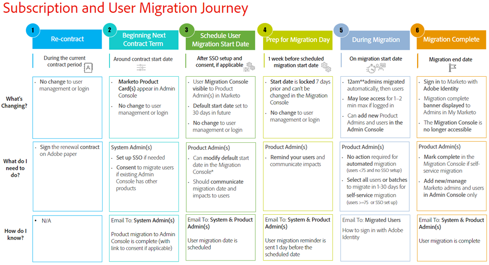

# Grundlegendes zu Marketo-Abonnements und Benutzermigration zur Adobe Admin Console {#understanding-marketo-subscription-and-user-migration-to-the-adobe-admin-console}

Adobe verbessert die Verwaltung Ihrer Adobe Marketo Engage-Abonnements und -Benutzer und steigert dadurch Ihre Produktivität. Im Rahmen dieser Änderung migriert Adobe Ihre Marketo Engage-Abonnements und -Benutzer auf die Adobe Admin Console. Dies ist eine erforderliche Migration und hat keine Auswirkungen auf Marketing-Workflows, Inhalte, Integrationen oder Assets.

>[!TIP]
>
>Erfahren Sie mit dem „Enterprise and Teams Admin Guide“, wie Sie die Adobe Admin Console verwenden können, um Ihre Adobe[Berechtigungen für Ihr gesamtes Unternehmen ](https://helpx.adobe.com/de/enterprise/admin-guide.html){target="_blank"} verwalten.

## Was ändert sich? {#what-is-changing}

Im Rahmen der Migration werden Ihr Abonnement und Ihre Benutzerverwaltung von der Marketo-Anwendung zur Adobe Admin Console verschoben.

* **Systemadministratoren verwalten Abonnements auf Adobe Admin Console**. Alle Adobe-Produkte in einer Konsole anzeigen.

* **Produktadministratoren verwalten Benutzer und deren Zugriff auf Adobe Admin Console**. Fügen Sie Benutzer für alle Adobe-Abonnements hinzu und entfernen Sie sie. Die Adobe Admin Console unterstützt nicht die Gültigkeit des benutzerbasierten Zugriffs. Benutzende mit Marketo Engage-Zugriff, der nach der Migration ablaufen soll, werden weiterhin migriert und erhalten weiterhin unwiderruflichen Zugriff. Nach der Migration müssen sie am (oder vor) gewünschten Ablaufdatum manuell entfernt werden.

* **Benutzer melden sich mit Adobe Identity an**. Adobe migriert bestehende Benutzerinnen und Benutzer zur Adobe Admin Console. Benutzende melden sich mit ihrer neuen Adobe-Identität - entweder Adobe ID oder Adobe Federated ID (SSO) - bei ihren Marketo-Abonnements an.

* **URLs sehen nach der Migration anders**. Marketo Engage wird von experience.adobe.com an Adobe Experience Cloud übermittelt und die URLs haben das folgende Format: `https://experience.adobe.com/#/@tenantID/so:XXX-XXX-XXX/marketo-engage/classic/` (die XXXs stellen die Munchkin-ID dar und @tenantID stammt aus Ihrer Adobe-Organisation). Auf die Zulassungsliste setzen Sie müssen mit Ihrem IT-Team zusammenarbeiten, um alle aufgelisteten Adobe-Domains [am Anfang dieses Artikels) ](/help/marketo/getting-started/initial-setup/configure-protocols-for-marketo.md){target="_blank"}, um eine Unterbrechung des Marketo Engage-Zugriffs zu verhindern.

Die ID-Nummern Ihrer Assets bleiben gleich. Und vorherige Links und Lesezeichen zu Marketo Engage-Assets auf der Domain engage-xx.marketo.com _funktionieren_. Sie müssen sich jedoch zuerst bei der Marketo Engage-Instanz für die URL anmelden, zu der Sie navigieren. Um beispielsweise zu einem Lesezeichen für eine Smart-Campaign-Instanz mit der Munchkin-ID 123-ABC-456 zu navigieren, müssen Sie sich zuerst mit der Munchkin-ID 123-ABC-456 bei der Marketo Engage-Instanz anmelden.

Auch wenn dies nicht geplant ist, können zukünftige Entwicklungsarbeiten diese Umleitungsfunktion beschädigen. Um unerwartete Unterbrechungen zu vermeiden, wird empfohlen, Lesezeichen so schnell wie möglich zu aktualisieren.

## Was ändert sich nicht? {#what-is-not-changing}

* **Die Verwaltung aller anderen Funktionen, einschließlich der Verwaltung von Funktionen** Benutzerrollen, Arbeitsbereichen, Funktionen und Verhaltensweisen, innerhalb des Marketo Engage-Programms selbst ändert sich nicht. Die lokale Benutzerverwaltung (nur API) verbleibt auf der Registerkarte _Benutzer und Rollen_ im Marketo-Administratorbereich.

## Zeitleiste für die Migration von Journey {#migration-journey-timeline}

Adobe migriert zuerst Ihre Marketo Engage-Abonnements auf Adobe Admin Console und dann alle bestehenden Benutzer mit verifizierten E-Mail-Adressen. Wenn Sie System- oder Marketo-Produktadministrator sind, erhalten Sie E-Mails, die Sie durch die Migrations-Journey führen. Hier ist eine Zeitleiste dessen, was Sie erwarten können:

{width="800" zoomable="yes"}

### Abonnement-Migration abgeschlossen {#subscription-migration-complete}

Systemadministratoren erhalten eine E-Mail, wenn die Abonnementmigration auf Adobe Admin Console abgeschlossen ist.

Systemadministratoren müssen möglicherweise einige erforderliche Schritte ausführen, bevor die Benutzermigration beginnt, um die Auswirkungen auf Marketo-Benutzer zu minimieren:

* Wenn sich Ihre Marketo-Benutzer derzeit mit SSO anmelden, müssen Sie SSO auf der Adobe Admin Console einrichten, damit sich Ihre Benutzer weiterhin mit SSO anmelden können. Wenn Ihre Marketo-Benutzenden derzeit SSO nicht verwenden, es jedoch auf Adobe Admin Console einrichten möchten, können Sie dies an dieser Stelle auf der Migrations-Journey tun.

* Wenn Sie bereits andere Adobe-Produkte in Ihrer Adobe Admin Console verwalten, kann Adobe Ihre Zustimmung einholen, Benutzer automatisch in Ihre bestehende Konsole zu migrieren. Klicken Sie in der E-Mail auf „Erste Schritte“, um zur Einverständnisseite zu navigieren.

An der Benutzerverwaltung ändert sich derzeit nichts. Obwohl Marketo-Produkte in der Admin Console angezeigt werden, verwalten Marketo-Administratoren weiterhin Benutzende im Marketo-Administratorbereich. Benutzende melden sich weiterhin mit ihrer Marketo-Identität an, bis die Benutzermigration abgeschlossen ist. Während dieser Zeit können Marketo-Produkte erst dann in Admin Console verwaltet werden, wenn die Benutzermigration beginnt. Dazu gehört die Dynamic Chat-Instanz, die mit dem Abonnement verknüpft ist.

>[!NOTE]
>
>Wenn Sie SSO derzeit nicht verwenden, aber über dessen Implementierung nachdenken, empfehlen wir, dies vor der Benutzermigration zu tun. Wenn Sie Single Sign-On implementieren möchten und Ihr Abonnement in Adobe Identity integriert wurde, ohne dass SSO in der Adobe-Organisation implementiert ist, senden Sie ein Ticket an den [Marketo-Support](https://nation.marketo.com/){target="_blank"} und geben Sie das Thema als &quot;Marketo auf Admin Console, Implementierung von SSO“ an.

### Benutzermigration planen {#schedule-user-migration}

Nachdem Ihr Systemadministrator die im vorherigen Abschnitt beschriebenen Voraussetzungen erfüllt hat, plant Adobe Ihre Benutzermigration automatisch für 30 Tage und kommuniziert mit Marketo-Produktadministratoren, um die Benutzermigration zu verwalten.

Marketo-Produktadministratoren werden:

* Sie erhalten eine E-Mail mit dem geplanten Startdatum der Benutzermigration 30 Tage vor dem .

* Erhalten Sie Zugriff auf die Marketo-Migrationskonsole, die sich im Marketo-Administratorbereich befindet, wo Sie die Möglichkeit haben, das Migrationsdatum eines Abonnements zu ändern.

>[!NOTE]
>
>Aufgrund der Komplexität der Migration sind Datumsänderungen auf maximal 30 Tage nach dem geplanten Datum beschränkt. Senden Sie eine E-Mail an `marketocares@marketo.com`, wenn Sie ein späteres Datum benötigen.

* In meinem Marketo wird ein Banner mit einem Countdown bis zum Startdatum der Benutzermigration angezeigt.

* Sie erhalten eine Erinnerungs-E-Mail am Tag vor dem Startdatum der Benutzermigration.

### Vorbereitung der Benutzer auf den Migrationstag {#prepare-users-for-migration-day}

Als Marketo-Produktadministrator sollten Sie sicherstellen, dass alle Benutzenden auf den Migrationstag vorbereitet sind.

* Überprüfen Sie [ Status ](/help/marketo/product-docs/administration/users-and-roles/email-verification.md){target="_blank"}E-Mail-Überprüfung) für alle Benutzenden im Marketo Admin-Bereich. Bitten Sie Benutzer, die ihre E-Mail-Adresse nicht verifiziert haben, dies zu tun, und helfen Sie Benutzern, alle Herausforderungen beim Abschluss des Verifizierungsprozesses zu lösen.

* Durchsuchen Sie Ihren E-Mail-Posteingang nach „Gesperrte“ Benutzerbenachrichtigungen. Weisen Sie Benutzende, die gesperrt wurden, darauf hin, ihr Kennwort zurückzusetzen, um den Zugriff auf Marketo Engage vor dem Migrationstag wiederherzustellen.

* Bereiten Sie alle Benutzer auf die bevorstehende Migration zu Adobe Identity vor.

>[!IMPORTANT]
>
>Wenn ein Marketo Engage-Benutzer seine E-Mail-Adresse nicht verifiziert oder zum Zeitpunkt der Benutzermigration gesperrt ist, wird er nicht in eine Adobe ID migriert und verliert nach Abschluss der Migration für das Abonnement den Zugriff auf das Marketo-Abonnement. Um den Zugriff wiederzuerlangen, muss ein Marketo-Produktadministrator sie als neuen Benutzer hinzufügen.

### Was am Migrationstag zu erwarten ist {#what-to-expect-on-migration-day}

Alle Marketo-Abonnements mit einer Zeitzone in den USA werden ab Mitternacht (Pacific Standard Time) des Migrationsstartdatums migriert. Die Benutzermigration für alle anderen Abonnements beginnt um Mitternacht in der angegebenen Zeitzone des Abonnements.

**Adobe migriert zuerst automatisch Marketo-Administratoren (mit einer Standard-Administratorrolle)**. Wenn Marketo-Administratoren mit der Rolle eines Admin Console-Produktadministrators in die Adobe Identity migriert werden, wird ihnen innerhalb des Marketo-Programms die Rolle eines Adobe-Produktadministrators zugewiesen, zusammen mit allen anderen Rollen, die sie zuvor hatten.

**Wenn Ihr Marketo-Abonnement in Marketo und/oder Ihrer Adobe-Organisation nicht über SSO**, migriert Adobe automatisch die restlichen Benutzenden. Dieser Workflow zielt darauf ab, ein Höchstmaß an Automatisierung zu bieten, um den Overhead für Benutzende von Adobe Marketo zu minimieren. Es ist keine Aktion Ihrerseits erforderlich, um die Migration auszuführen.

**Wenn Ihr Marketo-Abonnement SSO in Marketo und/oder Ihre Adobe-Organisation**, erhalten Marketo-Administratoren Zugriff auf den Bereich „Self-Service-Benutzermigration“ der Marketo-Migrationskonsole, der sich im Marketo-Administratorbereich befindet. Diejenigen, die während der Benutzermigration mehr Kontrolle benötigen, können Marketo-Administratoren Benutzer auswählen, die stapelweise oder gleichzeitig migriert werden sollen. Sobald Benutzer ausgewählt sind, haben Administratoren die Möglichkeit, „Jetzt migrieren“ oder „Migration planen“ für einen späteren Zeitpunkt, sodass Administratoren die ultimative Flexibilität und Kontrolle darüber haben, welche Benutzer wann migriert werden.

>[!NOTE]
>
>Während der Benutzermigration erfolgt kein Verlust des Zugriffs auf das Produkt. Wenn ein(e) Benutzende(r) während der Migration angemeldet ist, wird der/die Benutzende abgemeldet und aufgefordert, sich nach Abschluss der Migration innerhalb von Minuten mithilfe von Adobe Identity erneut anzumelden. Der Benutzer muss die Einladung annehmen, indem er auf den Link in der Berechtigungs-E-Mail klickt, die am Ende einer erfolgreichen Benutzermigration gesendet wurde.

Wenn Benutzerinnen und Benutzer migriert werden, erhalten sie eine E-Mail von Adobe, in der sie über die Änderung der Art und Weise, wie sie sich bei Marketo anmelden, informiert werden. Benutzende **müssen** eine Einladung zur erstmaligen Anmeldung mit Adobe Identity annehmen, entweder durch Anmeldung mit einer bestehenden Adobe ID oder durch Einrichtung einer neuen Adobe ID mit derselben E-Mail-Adresse.

Weitere Informationen finden Sie unter [Migrieren zur Adobe Identity](/help/marketo/product-docs/administration/marketo-with-adobe-identity/subscription-and-user-migration/migrating-to-adobe-identity.md){target="_blank"}, [Benutzeranmeldung mit Adobe](/help/marketo/product-docs/administration/marketo-with-adobe-identity/user-sign-in-with-adobe-id.md){target="_blank"} und [Häufig gestellte Fragen zu Adobe Identity Management](/help/marketo/product-docs/administration/marketo-with-adobe-identity/faq.md){target="_blank"}.

## Benutzermigration abgeschlossen {#user-migration-complete}

Adobe benachrichtigt alle System- und Produktadministrierenden per E-Mail, sobald alle Administratoren und Benutzenden migriert wurden. Derzeit melden sich alle Marketo-Benutzenden für dieses Abonnement mithilfe von Adobe Identity bei Marketo an, und Produktadministratoren verwalten Benutzende nur auf Adobe Admin Console.

## Support erhalten {#get-support}

Wenn Sie zusätzliche Unterstützung bei Ihrem Abonnement oder bei der Benutzermigration benötigen, senden Sie eine E-Mail an `marketocares@marketo.com`.

>[!MORELIKETHIS]
>
>* [Migration zu Adobe Identity - Übersicht](/help/marketo/product-docs/administration/marketo-with-adobe-identity/subscription-and-user-migration/migrating-to-adobe-identity.md){target="_blank"}
>* [Benutzeranmeldung mit Adobe](/help/marketo/product-docs/administration/marketo-with-adobe-identity/user-sign-in-with-adobe-id.md){target="_blank"}
>* [Häufig gestellte Fragen zu Adobe Identity Management](/help/marketo/product-docs/administration/marketo-with-adobe-identity/faq.md){target="_blank"}
>* [Tutorial zur Migration zu Adobe Identity Management](https://experienceleague.adobe.com/en/docs/marketo-learn/tutorials/fundamentals/migrating-to-adobe-identity-management){target="_blank"}
