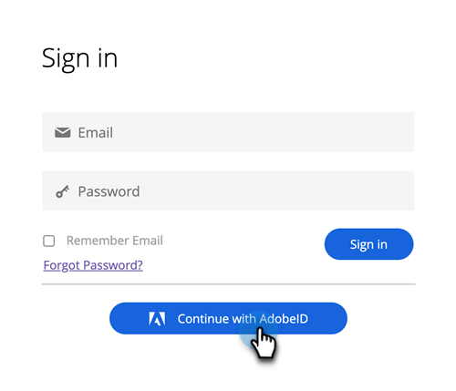

# Benutzeranmeldung bei Adobe ID {#user-sign-in-with-adobe-id}

Wenn sich ein Benutzer mit Adobe Identity bei der Marketo Engage App anmelden muss, muss er sich über den Adobe ID-Anmelde-Link und die typische Anmeldung auf der Marketo-Anmeldeseite anmelden. Nach dem Klicken auf den Link wird der Benutzer zur Marketo Engage App geleitet.

1. Klicken Sie auf **Mit Adobe ID anmelden** auf der Marketo-Anmeldeseite.

   

1. Geben Sie Ihre Adobe-Anmeldedaten ein und klicken Sie auf **Weiter**.

   

Nach erfolgreicher Anmeldung werden Sie zur Marketo Engage App weitergeleitet.
