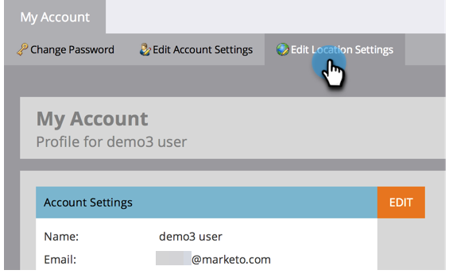
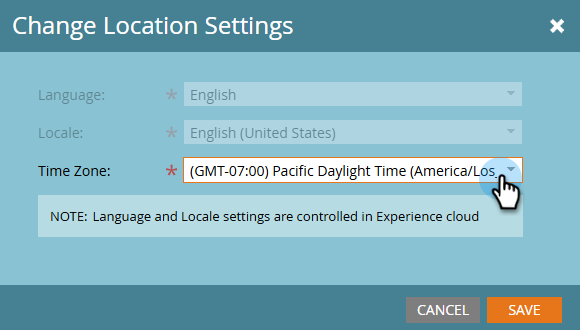

# Zeitzone ändern {#change-time-zone}

Erfahren Sie, wie Sie die Zeitzone in Ihrem Marketo Engage-Abonnement ändern.

1. Navigieren Sie zum Bereich **[!UICONTROL Admin]**.

   

1. Wählen Sie **[!UICONTROL Mein Konto]** aus.

   

1. Klicken Sie auf **[!UICONTROL Registerkarte Standorteinstellungen]**.

   

1. Ein modales Fenster wird angezeigt. Klicken Sie auf **[!UICONTROL Zeitzone]** und wählen Sie aus.

   

   >[!NOTE]
   >
   >_Sprache_ und _Gebietsschema_ sind ausgegraut, da diese Einstellungen in Ihrem [Adobe-Kontoprofil aufgerufen werden &#x200B;](https://account.adobe.com/profile){target="_blank"}.

1. Klicken Sie auf **[!UICONTROL Speichern]**.
