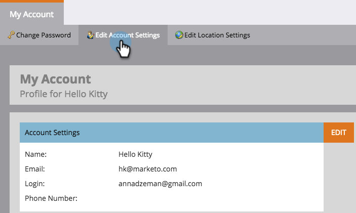

# Kontoeinstellungen bearbeiten {#edit-account-settings}

Müssen Sie die E-Mail-Adresse, den Namen oder die Telefonnummer des Kontos ändern? Hier erfahren Sie mehr.

>[!NOTE]
>
>**Administratorberechtigungen erforderlich**

1. Gehen Sie zu **Admin**.

   

1. Wählen Sie **Mein Konto**.

   

1. Wählen Sie **Kontoeinstellungen bearbeiten**.

   

1. Nehmen Sie Ihre Änderungen vor und klicken Sie auf **Speichern**.

   

   Ta-da! Informationen aktualisiert.

