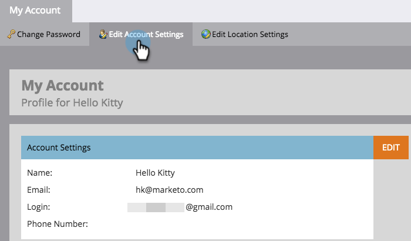

# Bearbeiten der Kontoeinstellungen {#edit-account-settings}

Möchten Sie die E-Mail-Adresse, den Namen oder die Telefonnummer des Kontos ändern? Weitere Informationen dazu finden Sie unten.

>[!NOTE]
>
>**Administratorberechtigungen erforderlich**

1. Navigieren Sie zum Bereich **[!UICONTROL Admin]**.

   

1. Wählen Sie **[!UICONTROL Mein Konto]** aus.

   

1. Wählen **[!UICONTROL Kontoeinstellungen bearbeiten]** aus.

   

1. Nehmen Sie die gewünschten Änderungen vor und klicken Sie auf **[!UICONTROL Speichern]**.

   
