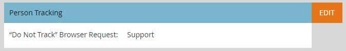

# Bearbeiten der Browser-Support-Einstellungen „Do Not Track“ {#edit-do-not-track-browser-support-settings}

„Do Not Tracking“ ist eine Browser-Anfrage, die in Systemen wie Marketo nicht verfolgt werden soll. Sie können diese Anfrage mit den folgenden Schritten erfüllen.

>[!NOTE]
>
>**Administratorberechtigungen erforderlich**

>[!NOTE]
>
>„Nicht verfolgen“ ist standardmäßig auf **[!UICONTROL Ignorieren]** festgelegt, sodass Sie in diesem Fall keine Schritte ausführen müssen.

1. Klicken Sie auf **[!UICONTROL Admin]**.

   

1. Auf **[!UICONTROL Munchkin]**.

   

1. Klicken **[!UICONTROL unter &quot;]**&quot; auf **[!UICONTROL Bearbeiten]**.

   

1. Wählen Sie **[!UICONTROL Support]** und klicken Sie auf **[!UICONTROL Speichern]**.

   

   Nachdem Sie die Änderungen gespeichert haben, wird die Aktualisierung angezeigt.

   

   >[!NOTE]
   >
   >Best Practice ist es, die Funktion „Do Not Track“ zu unterstützen. In Europa ist es das Gesetz!

   >[!TIP]
   >
   >Weitere Informationen zu „Do Not Track“ und seiner Funktionsweise finden Sie auf [dieser Seite](https://en.wikipedia.org/wiki/Do_Not_Track).
