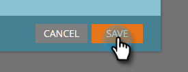

# Einstellungen der Landingpage bearbeiten {#edit-landing-page-settings}

Sie können Ihren Domänennamen und Ihre Fallback-Seite bearbeiten, das Vorausfüllen von Formularen aktivieren oder deaktivieren, Missbrauch bei Landingpages verhindern und vieles mehr. So geht es.

>[!NOTE]
>
>**Erforderliche Administratorberechtigungen**

1. Navigieren Sie zum **Admin**-Bereich.

   

1. Klicken Sie auf **Landing Pages**.

   

1. Im **Landing Pages** Abschnitt, klicken Sie auf **Bearbeiten**.

   

1. Geben Sie Ihre Domäne und Seiteninformationen ein.

   

   | Begriff | Definition |
   |---|---|
   | Domänenname für Landingpages | Dies ist Ihr CNAME. Ein CNAME ist der erste Teil der URL, die Sie Personen für Landingpages geben. Beispiel: in `https://go.yourCompany.com`, ist das Wort &quot;go&quot;der CNAME. Sie können mehrere haben, aber die meisten verwenden nur die. |
   | Fallback-Seite | Hier können Sie einsteigen, wenn die Landingpage nicht vorhanden oder nicht vorhanden ist. Weitere Informationen [Fallback-Seiten](/help/marketo/product-docs/administration/settings/set-a-fallback-page.md). |
   | Startseite | Geben Sie Ihre Unternehmens-Site-URL ein. |

1. Überprüfen Sie die **Vorab ausfüllen** aktivieren, damit Formulare Informationen für bekannte (Cookies) Personen vorbefüllen können. Deaktivieren Sie die Option zum Blockieren.

   

1. Wenn Sie verhindern möchten, dass eine böswillige Site Ihren Inhalt anscheinend hostet, überprüfen Sie die **Marketo-Seiten dürfen nicht in externe Webseiten eingebettet werden** aktivieren.

   

   >[!NOTE]
   >
   >Wenn Sie die Vorbefüllung vornehmen möchten `<script>` -Tag, das am Ende der `<head>` -Tag im Code, überprüfen Sie die **Skript zum Vorfüllen am Ende des Kopfes injizieren** ankreuzen. Lassen Sie die Option deaktiviert, wenn sie am Anfang angezeigt werden soll.
   >
   >Überprüfen **Standardmäßige Favicon-Links entfernen** um zu verhindern, dass Marketo Favicon-Links in den Code einfügt.

1. Nachdem Sie Ihre Auswahl getroffen haben, klicken Sie auf **Speichern.**

   

   Großartig gemacht! Ihre Landingpages verfügen jetzt über die richtigen Informationen und sollten sofort mit der Arbeit beginnen.
