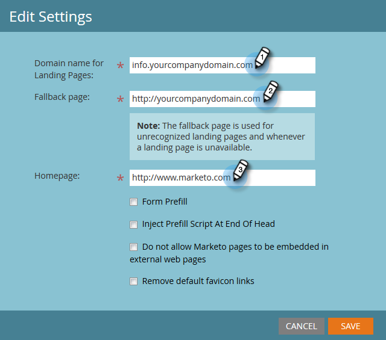

# Einstellungen für Landingpages bearbeiten {#edit-landing-page-settings}

Sie können Ihren Domänennamen und Ihre Ausweichseite bearbeiten, das Vorausfüllen von Formularen aktivieren oder deaktivieren, Missbrauch Ihrer Landingpage verhindern und vieles mehr. So geht es.

>[!NOTE]
>
>**Administratorberechtigungen erforderlich**

1. Klicken Sie unter **Admin** auf **Landingpages**.

   

1. Klicken Sie im Abschnitt **Landingpages** auf **Bearbeiten**.

   

1. Geben Sie Ihre Domäne und Seiteninformationen ein.

   | Begriff | Definition |
   |---|---|
   | Domänenname für Landingpages | Das ist Ihr CNAME. Ein CNAME ist der erste Teil der URL, die Sie Personen für Landingpages angeben. Beispiel: In `http://go.yourCompany.com` ist das Wort &quot;go&quot;der CNAME. Man kann mehrere haben, aber die meisten Leute verwenden nur das eine. |
   | Fallback-Seite | Hier muss man gehen, wenn die Landingpage nicht existiert oder nicht da ist. Erfahren Sie mehr über [Ausweichseiten](/help/marketo/product-docs/administration/settings/set-a-fallback-page.md). |
   | Homepage | Geben Sie Ihre Unternehmens-Site-URL ein. |

   

1. Markieren Sie das Kontrollkästchen **Formularvorausfüllung**, damit Formulare Informationen für bekannte (Cookie-)Personen vorab ausfüllen können. Deaktivieren, um zu blockieren.

   

1. Wenn Sie verhindern möchten, dass böswillige Seiten Ihren Inhalt scheinbar hosten, aktivieren Sie das Kontrollkästchen **Marketo-Seiten nicht in externe Webseiten** einbetten lassen.

   

   >[!NOTE]
   >
   >Wenn das Tag &quot;`<script>`&quot;am Ende des Tags &quot;`<head>`&quot;im Code angezeigt werden soll, markieren Sie das Kontrollkästchen &quot;**Skript zum Vorausfüllen am Ende der Überschrift**&quot;einfügen. Lassen Sie das Kontrollkästchen deaktiviert, wenn es am Anfang erscheinen soll.
   >
   >Markieren Sie **Entfernen Sie die standardmäßigen Favicon-Links**, um zu verhindern, dass Marketo Favicon-Links in den Code einfügt.

1. Klicken Sie nach der Auswahl auf **Speichern.**

   

   Gute Arbeit! Ihre Landingpages haben jetzt die richtigen Informationen und sollten Beginn sofort arbeiten.
