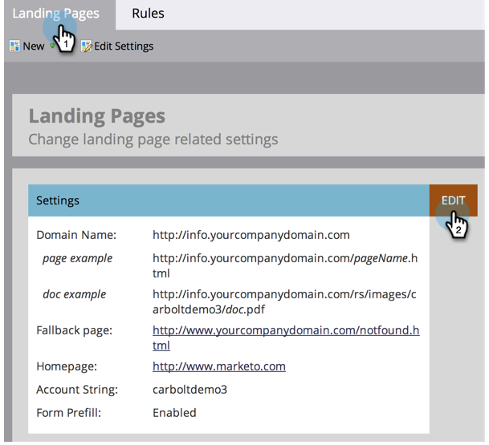

# Bearbeiten der Landingpage-Einstellungen {#edit-landing-page-settings}

Sie können Ihren Domain-Namen und die Fallback-Seite bearbeiten, das Vorbefüllen von Formularen aktivieren oder deaktivieren, einen Missbrauch Ihrer Landingpage verhindern und vieles mehr. Und so geht das.

>[!NOTE]
>
>**Administratorberechtigungen erforderlich**

1. Navigieren Sie zum Bereich **[!UICONTROL Admin]**.

   

1. Klicken Sie auf **[!UICONTROL Landingpages]**.

   

1. Klicken Sie **[!UICONTROL Abschnitt &quot;]**&quot; auf **[!UICONTROL Bearbeiten]**.

   

1. Geben Sie Ihre Domain- und Seiteninformationen ein.

   

   | Begriff | Definition |
   |---|---|
   | [!UICONTROL Domain-Name für Landingpages] | Dies ist Ihr CNAME. Ein CNAME ist der erste Teil der URL, die Sie Personen für Landingpages geben. In `https://go.yourCompany.com` ist beispielsweise das Wort „go“ der CNAME. Man kann mehrere haben, aber die meisten Leute benutzen nur den einen. |
   | [!UICONTROL Fallback-Seite] | Hier geht es, wenn die Landingpage nicht vorhanden oder ausgefallen ist. Weitere Informationen zu [Fallback-Seiten](/help/marketo/product-docs/administration/settings/set-a-fallback-page.md). |
   | [!UICONTROL Startseite] | Geben Sie die URL Ihrer Unternehmens-Site ein. |

1. Aktivieren Sie das **[!UICONTROL Formular vorbefüllen]**, damit Formulare Informationen für bekannte (Cookie-)Personen vorbefüllen können. Deaktivieren Sie diese Option, um zu blockieren.

   

   >[!NOTE]
   >
   >Wenn das Tag `<script>` Vorbefüllungs-Code am Ende des `<head>`-Tags im Code angezeigt werden soll, aktivieren Sie das Kontrollkästchen **[!UICONTROL Vorbefüllungs-Skript am Ende des]** einfügen. Deaktivieren Sie diese Option, wenn sie am Anfang angezeigt werden soll.
   >
   >Aktivieren Sie **[!UICONTROL Standard-Favicon-Links entfernen]**, um zu verhindern, dass Marketo Favicon-Links in den Code einfügt.

1. Klicken Sie nach der Auswahl auf **[!UICONTROL Speichern]**.

   

   Gut gemacht! Ihre Landingpages verfügen jetzt über die richtigen Informationen und sollten sofort mit der Arbeit beginnen.
