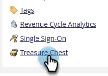
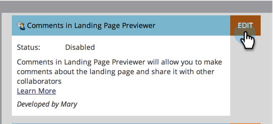

# Aktivieren oder Deaktivieren von Schatzkisten-Funktionen {#enable-or-disable-treasure-chest-features}

Die Schatztruhe enthält experimentelle Funktionen, die nicht vollständig unterstützt werden.

>[!NOTE]
>
>**Admin-Berechtigungen erforderlich**

1. Navigieren Sie zum Bereich **[!UICONTROL Admin]**.

   

1. Klicken Sie **[!UICONTROL Schatztruhe]**.

   

1. Klicken Sie **[!UICONTROL Bearbeiten]** für die Funktion, die Sie aktivieren oder deaktivieren möchten.

   

1. Aktivieren Sie das **[!UICONTROL Aktiviert]**, um es zu aktivieren, oder deaktivieren Sie es, und klicken Sie auf **[!UICONTROL Speichern]**.

   

   >[!TIP]
   >
   >Sie müssen sich möglicherweise ab- und wieder bei Marketo anmelden, damit die Änderungen wirksam werden.
