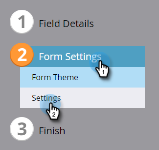

# Globale Formularvalidierungsregeln {#global-form-validation-rules}

Mit dieser Funktion können Sie verhindern, dass bestimmte Domänen an Marketo Engage-Formulare gesendet werden.

## Aktivieren des Zugriffs {#how-to-enable-access}

Bevor Sie diese Funktion verwenden können, müssen Sie ihre Berechtigung für jede gewünschte Rolle aktivieren.

1. Klicken Sie in Marketo auf **[!UICONTROL Admin]**.

   

1. Klicken Sie auf **[!UICONTROL Benutzer und Rollen]**.

   

1. Klicken Sie auf die Registerkarte **[!UICONTROL Rollen]**.

   

1. Doppelklicken Sie auf die Rolle, der Sie Berechtigungen gewähren möchten.

   

1. Klicken Sie auf das Symbol **+** neben &quot;Zugriff auf Admin&quot;.

   

1. Scrollen Sie nach unten, wählen Sie **[!UICONTROL Auf Formularvalidierungsregeln zugreifen]** und klicken Sie auf **[!UICONTROL Speichern]**.

   

## Neue Formularvalidierungsregel erstellen {#create-new-form-validation-rule}

>[!IMPORTANT]
>
>Diese Regeln gelten für alle Formulare in Ihren Marketo Engage-Abonnements.

1. Klicken Sie in Marketo auf **[!UICONTROL Admin]**.

   

1. Klicken Sie auf **[!UICONTROL Regel für die globale Formularüberprüfung]**.

   

1. Klicken Sie auf **[!UICONTROL Neue Formularvalidierungsregel]**.

   

   >[!NOTE]
   >
   >In der Dropdown-Liste Aktionen für Formularvalidierungsregeln können Sie vorhandene Regeln löschen oder bearbeiten.

1. Benennen Sie Ihre Regel, geben Sie ihr eine optionale Beschreibung und geben Sie die Fehlermeldung ein, die Ihre Formular-Besucher sehen sollen. Geben Sie die Domäne(n) ein, die blockiert werden soll(n), wählen Sie **[!UICONTROL Regel aktivieren]** und klicken Sie auf **[!UICONTROL Erstellen]**.

   

>[!NOTE]
>
>Marketo Engage verfügt über eine definierte Blockierungsliste kostenloser E-Mail-Domains, die blockiert werden, wenn die &quot;Consumer Email Domain pre-Domain&quot;-Regel verwendet wird, die von Auf die Blockierungsliste setzen geladen wird. [Zeigen Sie diese Liste hier an](/help/marketo/product-docs/administration/settings/assets/freemaildomains.csv).

## Deaktivieren des Zugriffs pro Formular{#how-to-disable-access-per-form}

Nach der Aktivierung gelten Regeln für alle Formulare. Wenn Sie jedoch ein Formular mit bestimmten Anforderungen haben und nichts zurückgewiesen werden soll, können Sie [!UICONTROL Regeln für die globale Formularüberprüfung] in den Einstellungen des Formulars deaktivieren.

1. Klicken Sie in dem gewünschten Formular auf **[!UICONTROL Formulareinstellungen]** und dann auf **[!UICONTROL Einstellungen]**.

   

1. Klicken Sie auf das Dropdown-Menü **[!UICONTROL Regeln für die globale Formularüberprüfung]** und wählen Sie **[!UICONTROL Deaktiviert]** aus.

   

Wenn Sie Ihr Formular genehmigen und posten, werden Ihre [!UICONTROL Regeln zur globalen Formularüberprüfung] ignoriert.
