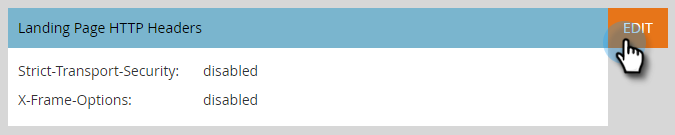

# Kopfzeilen der Landingpage {#landing-page-headers}

Gehen Sie wie folgt vor, um einige HTTP-Kopfzeilen in den Domains Ihrer Landingpage anzupassen.

1. Klicken Sie in Marketo auf **[!UICONTROL Admin]**.

   

1. Klicken Sie auf **[!UICONTROL Landingpages]**.

   

1. Klicken Sie **[!UICONTROL Bearbeiten]** neben Landingpage-HTTP-Kopfzeilen.

   

1. Wählen Sie die gewünschten Einstellungen aus und klicken Sie **[!UICONTROL auf &quot;]**&quot;.

   

<table>
 <tr>
  <td><strong>[!UICONTROL Strict-Transport-Security]</strong></td>
  <td>Hiermit können Sie garantieren, dass Verbindungen zu Landingpages immer über HTTPS bereitgestellt werden (sollte nur für Abonnements mit durch SSL gesicherten Landingpages festgelegt werden).</td>
 </tr>
 <tr>
  <td><strong>[!UICONTROL X-Frame-Options]</strong></td>
  <td>Ermöglicht die Definition, ob gehostete Marketo Engage-Assets in externe Web-Seiten eingebettet werden können</td>
 </tr>
</table>

>[!CAUTION]
>
>Es ist wichtig, diese Einstellungen mit Ihrem IT-Team zu überprüfen, um zu bestimmen, auf welche Richtlinie Ihre Organisation eingestellt werden soll. Falsche Einstellungen können dazu führen, dass einige Besucher nicht auf Ihre Landingpages zugreifen können.
