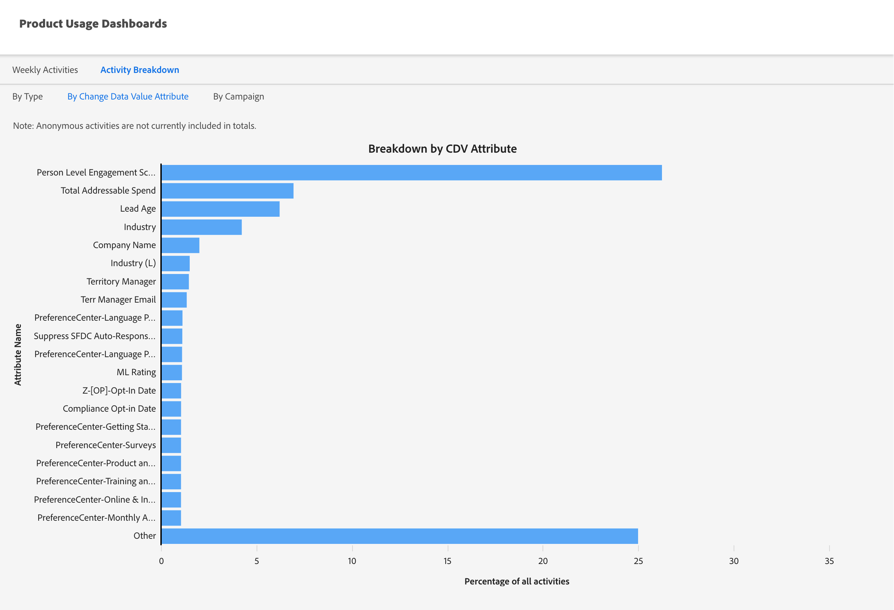
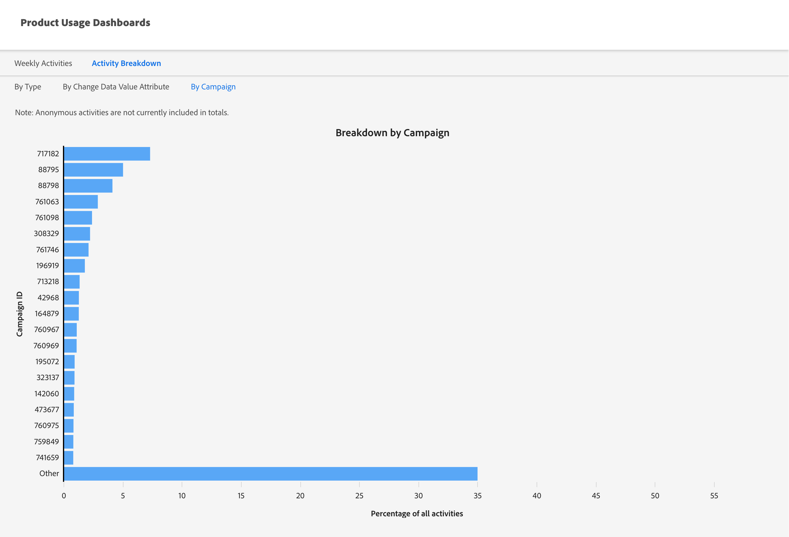

# Produktnutzungs-Dashboards {#product-usage-dashboards}

Marketo Engage-Produktnutzungs-Dashboards bieten die Möglichkeit, die Produkt- und Plattformnutzung anhand bestimmter Beschränkungen oder Rückstände des Datendurchsatzes, der Nutzung im Hinblick auf das tägliche Kontingent und der Schlüsselmetriken in Ihrem Abonnement anzuzeigen. Die Infrastruktur wird zugewiesen, um Leistungsgrenzen bereitzustellen, die für Produktebenen für bestimmte Attribute definiert sind. Einige dieser Beschränkungen, z. B. die API-Nutzung, sind vertraglich festgelegte Beschränkungen, die als Teil Ihres Pakets oder Ihrer Produktebene erworben werden.

## Zugriff {#how-to-access}

1. Klicken Sie in Marketo Engage auf **Admin**.

   

1. Scrollen Sie in der Baumstruktur auf der linken Seite nach unten und wählen Sie **Produktnutzungs-Dashboards** aus.

   

## Aktivitätsnutzungs-Dashboard {#activity-usage-dashboard}

### Durchschnittliche wöchentliche Aktivitäten {#average-weekly-activities}

Das Dashboard zur wöchentlichen Aktivitätsnutzung zeigt eine wöchentliche Anzahl der Aktivitätstypen über einen rollierenden Zeitraum von 52 Wochen an. Wöchentlich durchgeführte Aktivitäten sind ein guter Indikator dafür, wie viel Marketing Sie in Marketo Engage betreiben. Aktivitäten dienen als Proxy für die verschiedenen Systemprozesse und verfolgbaren Ereignisse, die in Marketo stattfinden.

Aktivitätstypen umfassen sowohl die Anzahl der Aktivitäten, die erfasst werden, wenn Personen/Leads mit Marketing-Ereignissen interagieren, als auch systembasierte Aktivitäten, die durch Fluss-Aktionen ausgelöst werden. Beispiele für von Personen initiierte Aktivitäten sind das Öffnen einer E-Mail durch einen Empfänger oder das Klicken auf einen Link in einer E-Mail. Ein Beispiel für eine systembasierte Aktivität, die von einer Flussaktion ausgelöst wird, ist _An SFDC senden_ wenn der Trigger initiiert wird.

>[!TIP]
>
>Um eine Anzahl von Aktivitätstypen für eine bestimmte Woche anzuzeigen, bewegen Sie den Mauszeiger über die gewünschte Woche, und die Anzahl wird angezeigt.

{width="800" zoomable="yes"}

#### FAQs {#faq}

**Welche Aktivitätstypen werden gezählt?**

Es hängt davon ab, welche Aktivitäten in der Pipeline enthalten sind.

**Sind sowohl bekannte als auch anonyme Personen-/Lead-Aktivitäten enthalten?**

Nur bekannte Personen/Leads.

**Wie oft werden die Daten aktualisiert?**

Aktivitätszähler werden jeden Morgen aktualisiert.

## Aktivitätsverteilung {#activity-breakdown}

Hier erhalten wir Zahlen der Aktivitäten der letzten sieben Tage basierend auf aussagekräftigen Teilen der Daten. Gruppieren Sie Aktivitäten nach den häufigsten Aktivitätstypen der letzten sieben Tage. Dies kann Kategorien wie _Datenwert ändern_, _Zu Liste hinzufügen_ oder _E-Mail senden_ umfassen. Auf diese Weise können Sie sehen, welche Aktivitäten im System am häufigsten ausgeführt werden. Die Verwendung des Aktivitätstyps ist ein wichtiger Indikator für die Bestimmung des Wachstums oder für den Fall, dass Optimierungen zur Verringerung der Nutzung erforderlich sind.

>[!NOTE]
>
>* Bei allen unten aufgeführten Aufschlüsselungen handelt es sich um eine rollierende 7-Tage-Summe, bei der **nicht** den aktuellen Tag eingeschlossen ist. Stellen Sie es sich also wie „Gestern + sechs Tage davor“ vor.
>
>* Das Dashboard zeigt nur die 20 wichtigsten Aktivitätstypen an, während die übrigen in eine Kategorie mit dem Titel „Sonstige“ sortiert sind.

Die Aktivitätsnutzung zeigt an, wie viel Marketing durchgeführt wird, und hilft, das Wachstum anhand der für die vertraglich vereinbarte Produktebene identifizierten Produkte zu visualisieren. Dashboards können auch als Anleitung verwendet werden, um zu bestimmen, wie viel Optimierung durch Reduzieren der zu aktualisierenden Felder durchgeführt werden kann/sollte.

### Nach Typ {#by-type}

Gruppieren Sie Aktivitäten nach den häufigsten Aktivitätstypen der letzten sieben Tage. Dies kann Kategorien wie _Datenwert ändern_, _Zu Liste hinzufügen_ oder _E-Mail senden_ umfassen. Auf diese Weise können Sie sehen, welche Aktivitäten in Ihrem Marketo Engage-Konto am häufigsten ausgeführt werden.

{width="600" zoomable="yes"}

### Durch Datenwertattribut ändern {#by-change-data-value-attribute}

_Datenwert ändern_ ist der häufigste Aktivitätstyp. Es zeigt an, wann eine Information zu einem Personen-/Lead-Datensatz aktualisiert wird. Hier gruppieren wir nach den Feldern, die am häufigsten geändert werden, damit Sie feststellen können, welche Informationen für Ihre Marketing-Vorgänge nützlich sind, ob Möglichkeiten zur Optimierung der Plattformnutzung vorhanden sind usw.

{width="600" zoomable="yes"}

### Nach Kampagne {#by-campaign}

Gruppe, nach der die Kampagnen die meisten Aktivitäten produzieren. Auf diese Weise können Sie sehen, ob besonders laute Kampagnen vorhanden sind, die mehr Aktivität als nötig erzeugen. Schnelles Erfahren Sie mehr über Kampagnen, die eingestellt werden sollten, oder über Kampagnen, die mehr Arbeit leisten als beabsichtigt.

{width="600" zoomable="yes"}
