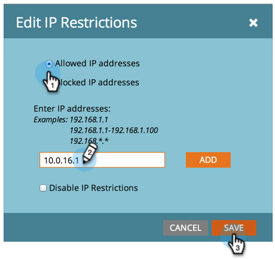

# Beschränken von Marketo-Anmeldungen auf Grundlage von IP-Adressen {#restrict-marketo-logins-based-on-ip}

Sie können den Zugriff von Benutzenden auf Marketo anhand ihrer IP-Adressen einschränken oder aktivieren. Gehen Sie wie folgt vor.

>[!NOTE]
>
>**Admin-Berechtigungen erforderlich**

>[!IMPORTANT]
>
>Adobe Admin Console (AAC) unterstützt [IP-basierte Zugriffssteuerung](https://helpx.adobe.com/enterprise/using/ip-based-access.html){target="_blank"}. Um einen reibungslosen Übergang zu gewährleisten, werden bestehende IP-Beschränkungen für Marketo Engage aktiv, einschließlich Adobe ID-Benutzender bis zum 1. Quartal 2027 in Abonnements, in denen diese Funktion aktiviert ist.
>
>* Sie können den AAC-IP-basierten Zugriff jederzeit konfigurieren.
>* Einschränkungen von AAC und Marketo Engage können gleichzeitig ausgeführt werden. Verwenden Sie dieselbe IP-Zulassungsliste für Kompatibilität.
>
>Nach dem 1. Quartal 2027 werden Marketo Engage-IP-Beschränkungen eingestellt. Der IP-basierte Zugriff wird ausschließlich über AAC verwaltet und muss so konfiguriert sein, dass Anmeldebeschränkungen erzwungen werden. Ein endgültiges Übergangsdatum wird zu einem späteren Zeitpunkt bekannt gegeben.

1. Navigieren Sie zum Bereich **[!UICONTROL Admin]**.

   

1. Klicken Sie **[!UICONTROL Anmeldeeinstellungen]**.

   

1. Klicken Sie **[!UICONTROL IP-Einschränkungen bearbeiten]**.

   

1. Wählen Sie aus, ob **Adressen zugelassen** **blockiert** sollen, geben Sie eine oder mehrere Adressen ein und klicken Sie auf **[!UICONTROL Speichern]**.

   >[!NOTE]
   >
   >**Definition**
   >
   >* **[!UICONTROL Zulässige IP-Adressen]**: Das Hinzufügen zulässiger IP-Adressen erfolgt inklusiv. Es enthält alle angegebenen IP-Adressen und schließt alles andere aus.
   >* **[!UICONTROL IP-Adressen blockieren]**: Verhindert den Zugriff bestimmter IPs auf Marketo.
   >* **[!UICONTROL IP-Einschränkungen deaktivieren]**: Wenn Sie diese Option aktivieren, funktionieren keine/alle Einschränkungsregeln mehr. Verwenden Sie dies zu Testzwecken.

   >[!NOTE]
   >
   >Sie können mehrere Einschränkungen hinzufügen, sie können jedoch nur ALLE zulässig oder ALLE blockiert sein. Zulässige und blockierte Adressen können nicht kombiniert werden.

   
