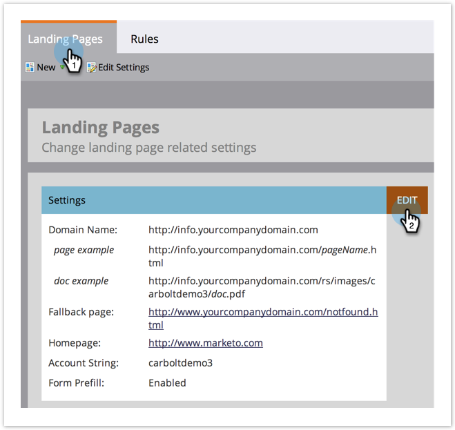

# Fallback-Seite {#set-a-fallback-page} festlegen

Fallback-Seiten sind die letzte Verteidigungslinie, wenn Ihre Landingpage offline ist oder nicht gefunden wird. Sieh zu, dass du eins hast.

>[!NOTE]
>
>**Administratorberechtigungen erforderlich**

1. Klicken Sie unter **Admin** auf **Landingpages**.

   

1. Klicken Sie unter der Registerkarte **Landingpages** auf **Bearbeiten**.

   

1. Geben Sie eine **Fallback-Seite** in das Dialogfeld ein und klicken Sie auf **Speichern**.

   

Voilà! Sie haben gerade eine Ausweichseite hinzugefügt! Keine 404 Seiten mehr.
